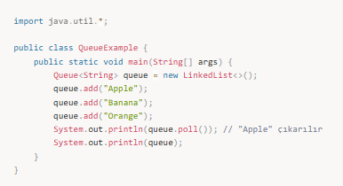
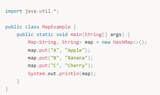
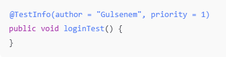
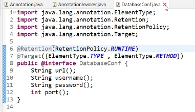
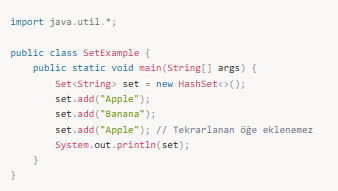

# 🧩 Java Annotations

## 🎯 Annotation Nedir?
Annotation, Java’da sınıf, metot, değişken veya parametreler hakkında
**ek bilgi (metadata)** vermek için kullanılan yapılardır.

Annotation’lar doğrudan iş mantığı içermez.
Derleyici, framework veya runtime tarafından okunur.

---

## 🧠 Neden Önemlidir?
- Kod tekrarını azaltır
- Okunabilirliği artırır
- Framework’lerin (Spring, JUnit) temelini oluşturur
- XML yerine kod üzerinden konfigürasyon sağlar

---

## 🧩 Annotation Türleri

### 1️⃣ Built-in (Hazır) Annotations

Java ile birlikte gelen annotation’lardır.

- `@Override`  
  Bir metodun üst sınıftaki metodu override ettiğini belirtir.

- `@Deprecated`  
  Kullanımı önerilmeyen kodu işaretler.

- `@SuppressWarnings`  
  Derleyici uyarılarını bastırır.

#### Örnek
```java
@Override
public String toString() {
    return "User";
}

2️⃣ Meta-Annotations

Annotation’ların nasıl kullanılacağını belirler.

@Target
Annotation’ın nerede kullanılacağını belirtir
(class, method, field vb.)

@Retention
Annotation’ın ne zamana kadar geçerli olduğunu belirtir.

@Documented
Javadoc içerisine eklenmesini sağlar.

@Inherited
Alt sınıflara miras kalmasını sağlar.

Örnek


⏱ Retention Policy

Annotation’ın yaşam süresini belirler.

SOURCE
Sadece yazım sırasında vardır, compile sonrası silinir.

CLASS
Compile edilir ama runtime’da erişilemez.

RUNTIME
Çalışma zamanında erişilebilir.

Spring annotation’ları genellikle RUNTIME kullanır.

🛠 Custom Annotation (Özel Annotation)

Geliştirici kendi annotation’ını yazabilir.

Örnek



Kullanımı



🌱 Spring Framework’te Annotation Kullanımı

Spring, annotation tabanlı çalışır.

@Component
Spring tarafından yönetilen bir bean tanımlar.

@Service
İş mantığı içeren sınıflar için kullanılır.

@Repository
Veritabanı katmanını temsil eder.

@Controller
MVC controller sınıflarında kullanılır.

@RestController
REST API geliştirmek için kullanılır.

@Autowired
Dependency Injection sağlar.

@GetMapping
GET isteklerini karşılar.

Örnek


⚠️ Sık Yapılan Hatalar

Annotation ile iş mantığı yazmak

Yanlış RetentionPolicy seçmek

Her yere @Autowired eklemek

Annotation’ın ne zaman okunduğunu bilmemek

✅ Özet

Annotation’lar, Java ve Spring dünyasında
konfigürasyonu sadeleştiren ve kodu okunabilir hale getiren yapılardır.
Doğru yerde kullanıldığında hem geliştirme hem test süreçlerini kolaylaştırır.



