# Koleksiyonlar

## 📌 Java Koleksiyonları (Collections) Nedir?
Java Koleksiyon Framework'ü, farklı veri yapıları ve algoritmalar sunarak verilerin yönetilmesini sağlar. Koleksiyonlar, genellikle veri eklemek, silmek, sıralamak, aramak gibi işlemleri yapmamıza olanak tanır.

Java Koleksiyonları, List, Set, Queue ve Map gibi veri yapılarından oluşur.

---

## 📌 Koleksiyon Framework’ü (Collections Framework)
Java Koleksiyon Framework’ü, verilerin düzenlenmesi ve işlenmesi için çeşitli sınıflar ve arayüzler sunar. Bu framework içerisinde birkaç ana arayüz bulunur:

- **Collection Interface:**  
  Bu arayüz, tüm koleksiyonları temsil eder. Diğer alt arayüzler (Set, List, Queue) bu arayüzü implement eder.

- **List Interface:**  
  Elemanların sırasının önemli olduğu koleksiyonları temsil eder. Aynı öğe birden fazla kez eklenebilir.

- **Set Interface:**  
  Elemanların sırasının önemli olmadığı ve her elemanın yalnızca bir kez eklenebileceği koleksiyonları temsil eder.

- **Queue Interface:**  
  Elemanları FIFO (First In, First Out) sırasıyla işleyen koleksiyonları temsil eder.

- **Map Interface:**  
  Anahtar-değer çiftlerini tutan koleksiyonları temsil eder.

---

## 📌 Koleksiyon Türleri

### 1. List Interface (Liste)
List arayüzü, verilerin sıralı bir şekilde tutulduğu ve tekrarlanan öğelere izin verilen koleksiyonlardır. İndeksleme ile elemanlara erişim sağlanabilir.

**Özellikler:**
- Elemanlar sıralıdır.
- Aynı öğe birden fazla kez eklenebilir.
- İndeks ile erişilebilir.

**Örnek Implementasyonlar:**
- **ArrayList:** Dinamik bir dizi gibi çalışır ve elemanlar sıralıdır. Hızlı rastgele erişim sağlar.
- **LinkedList:** Çift yönlü bağlı listedir ve daha hızlı ekleme/çıkarma işlemleri sağlar.

**Örnek Kullanım:**

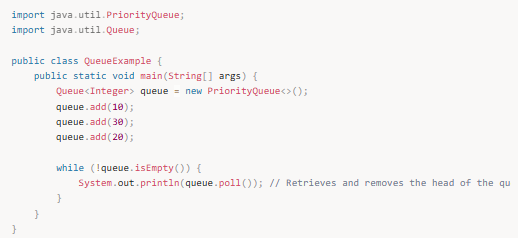

---

### 2. Set Interface (Küme)
Set arayüzü, öğelerin yalnızca bir kez bulunduğu ve sırasının önemli olmadığı koleksiyonları temsil eder. Set, tekrarlayan öğelere izin vermez.

**Özellikler:**
- Aynı öğe birden fazla kez eklenemez.
- Sıra garantisi yoktur.

**Örnek Implementasyonlar:**
- **HashSet:** Hızlı öğe ekleme ve arama sağlar, ancak sırasızdır.
- **LinkedHashSet:** Ekleme sırasını korur ve öğeler benzersizdir.
- **TreeSet:** Sıralı bir küme sağlar ve otomatik olarak öğeleri sıralar.

**Örnek Kullanım:**

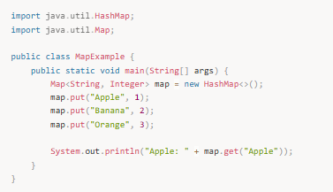

---

### 3. Queue Interface (Kuyruk)
Queue arayüzü, verilerin FIFO (First In, First Out) sırasıyla işlendiği koleksiyonları temsil eder. Genellikle veri akışlarını temsil eden yapılar kullanılır.

**Özellikler:**
- FIFO sırasıyla veri ekler ve çıkarır.
- Elemanlar sıraya eklenir ve sıradan çıkarılır.

**Örnek Implementasyonlar:**
- **LinkedList:** FIFO sırasına göre çalışan ve çok yönlü bağlı liste olarak işlev görür.
- **PriorityQueue:** Elemanları öncelik sırasına göre işler.

**Örnek Kullanım:**

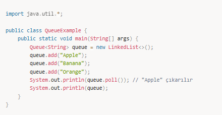

---

### 4. Map Interface (Harita)
Map arayüzü, anahtar-değer çiftlerini saklar. Her anahtar yalnızca bir değerle ilişkilendirilebilir. Anahtarlar benzersizdir.

**Özellikler:**
- Anahtar-değer çiftlerini tutar.
- Anahtarlar benzersizdir.
- Sıra garantisi yoktur.

**Örnek Implementasyonlar:**
- **HashMap:** Hızlı anahtar-değer eşlemesi sağlar, sırasızdır.
- **LinkedHashMap:** Eklenme sırasını korur.
- **TreeMap:** Anahtarları sıralar.

**Örnek Kullanım:**

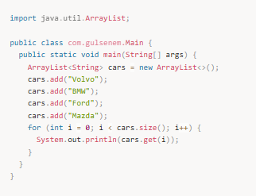

---

## 📌 Koleksiyonların Avantajları ve Dezavantajları

### Avantajlar
- **Dinamik Veri Yönetimi:**  
  Koleksiyonlar, veri eklemek, çıkarmak ve erişmek için esnek yapılar sağlar.
- **Özelleştirilebilir Yapılar:**  
  Farklı veri yapıları (List, Set, Map) ihtiyaca göre kullanılabilir.
- **Algoritma Desteği:**  
  Java Koleksiyon Framework’ü, veri işlemleri için hazır algoritmalar sunar (örneğin sıralama, arama, vs.).
- **Kapsayıcılık:**  
  Büyük veri kümelerini ve bağlantılı veri yapılarının yönetilmesi için uygun.

### Dezavantajlar
- **Bellek Kullanımı:**  
  Bazı koleksiyonlar, özellikle büyük veri kümelerinde fazla bellek kullanabilir.
- **Performans:**  
  Özellikle LinkedList gibi bazı koleksiyonlar, sabit süreli erişim sağlayamazlar.

---

## 📌 Mülakat Soruları ve Cevapları

### 1️⃣ List, Set ve Map arasındaki farklar nelerdir?
- **List:** Elemanlar sıralıdır ve tekrarlanabilir. İndeks ile erişim yapılabilir.
- **Set:** Elemanlar sırasızdır ve tekrarlanamaz.
- **Map:** Anahtar-değer çiftlerini tutar. Anahtarlar benzersizdir.

### 2️⃣ HashSet ve LinkedHashSet arasındaki fark nedir?
- **HashSet:** Elemanları sırasız olarak tutar ve hızlı erişim sağlar.
- **LinkedHashSet:** Elemanları eklenme sırasına göre tutar.

### 3️⃣ HashMap ve TreeMap arasındaki fark nedir?
- **HashMap:** Anahtar-değer çiftlerini sırasız olarak saklar ve hızlı erişim sağlar.
- **TreeMap:** Anahtarları sıralı bir şekilde saklar.

### 4️⃣ Queue ve Stack arasındaki fark nedir?
- **Queue:** FIFO (First In First Out) sırasına göre çalışır.
- **Stack:** LIFO (Last In First Out) sırasına göre çalışır.

### 5️⃣ ArrayList ile LinkedList arasındaki fark nedir?
- **ArrayList:** Hızlı rastgele erişim sağlar ancak ekleme ve çıkarma işlemleri daha yavaştır.
- **LinkedList:** Daha hızlı ekleme ve çıkarma işlemleri sağlar, ancak rastgele erişim daha yavaştır.

---

## 📌 Özet
- **Koleksiyonlar** veri yapılarıdır ve verilerin organize edilmesinde önemli bir yer tutar.
- **List, Set, Queue, Map** gibi temel koleksiyon türleri bulunur.
- **List** sıralı ve tekrarlanabilir veriler için,  
  **Set** sırasız ve benzersiz veriler için,  
  **Map** anahtar-değer çiftleri için kullanılır.
- **Koleksiyonlar**, performans ve bellek yönetimi açısından dikkat edilmesi gereken yapılardır.

---

# Koleksiyonlar

Koleksiyonlar arkada bir diziyi yönetirler.

## ArrayList

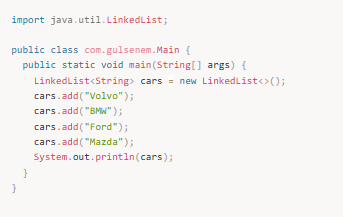

ArrayListin elemanlarına ulaşabilmem için obje olarak tutmam gerekiyor.

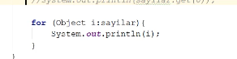

## Type-Safe ArrayList
(ArrayList’i tip güvenli hale getirme)

## HashMap

# Collection Framework

## 📌 Collection Framework Nedir?

Java'da **Collection Framework**, veri yapılarını oluşturmak ve bu yapılar üzerinde işlem yapmak için kullanılan sınıflar ve arayüzlerin bir koleksiyonudur. **Collection**, bir grup nesne tutmanın ortak bir yoludur. Koleksiyonlar, genellikle veri tutma ve veri manipülasyonu için kullanılır. Java koleksiyonları **List**, **Set**, **Queue** gibi farklı yapıları içerir ve bu yapıların her biri farklı gereksinimleri karşılamak için optimize edilmiştir.

## 📌 Koleksiyon Çerçevesi'nin Temel Bileşenleri

### 1. Collection Arayüzü
Bu, Java koleksiyonlarının ana arayüzüdür. Tüm koleksiyon türleri bu arayüzü uygular. List, Set, Queue gibi yapılar bu arayüzün alt sınıflarıdır.

### 2. List Arayüzü
Verilerin sıralı bir koleksiyonudur ve aynı öğe birden fazla kez tutulabilir. ArrayList, LinkedList gibi sınıflar List arayüzünü uygular.

### 3. Set Arayüzü
Bu koleksiyon türü, sırasız ve tekrarsız veri saklar. HashSet, LinkedHashSet ve TreeSet gibi sınıflar Set arayüzünü uygular.

### 4. Queue Arayüzü
Kuyruk yapısı sağlar. PriorityQueue, LinkedList gibi sınıflar Queue arayüzünü uygular.

### 5. Map Arayüzü
Anahtar-değer çiftleri şeklinde veriler saklar. HashMap, LinkedHashMap ve TreeMap gibi sınıflar Map arayüzünü uygular.

---

## 📌 Koleksiyon Sınıfları ve Kullanım Alanları

### 1. List

List koleksiyonu sıralı bir koleksiyondur ve elemanların eklenme sırasını korur.  
Aynı öğe birden fazla kez eklenebilir.  
En yaygın List implementasyonları: ArrayList, LinkedList  

ArrayList Örneği:

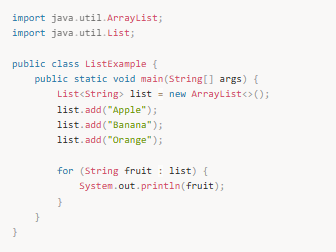

**Önemli Noktalar:**
- **ArrayList** dinamik bir dizidir ve sıralıdır. Elemanlara indeksle erişilebilir.
- **LinkedList**, elemanları bağlı listelerde tutar, bu nedenle ekleme ve silme işlemleri daha hızlıdır, ancak arama işlemleri daha yavaştır.

---

### 2. Set

Set koleksiyonu, tekrarlayan öğeleri kabul etmez.  
HashSet (sırasız), LinkedHashSet (eklenme sırasına göre sıralı), TreeSet (doğal sıralama ya da Comparator ile sıralama) gibi implementasyonları vardır.

HashSet Örneği:

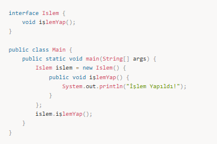

**Önemli Noktalar:**
- **HashSet** sırasızdır, ancak öğelerin tekrarı kabul edilmez.
- **LinkedHashSet** eklenme sırasını korur.
- **TreeSet** öğeleri doğal sıralama ya da belirli bir Comparator'a göre sıralar.

---

### 3. Queue

Queue, FIFO (First In First Out - İlk Giren İlk Çıkar) sırasını takip eden bir koleksiyondur.  
PriorityQueue ve LinkedList gibi implementasyonlar vardır.

PriorityQueue Örneği:

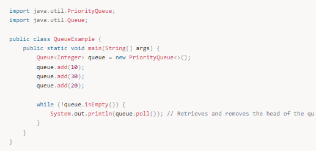

**Önemli Noktalar:**
- **PriorityQueue**, öğeleri doğal sıralama ya da belirtilen sıralama düzenine göre sıralar.
- **LinkedList** hem Queue hem de Deque arayüzünü uygulayan bir sınıftır.

---

### 4. Map

Map koleksiyonu, anahtar-değer çiftleri tutar. Anahtarlar eşsizdir ve her anahtar sadece bir değere sahiptir.  
HashMap, LinkedHashMap, TreeMap gibi implementasyonlar vardır.

HashMap Örneği:

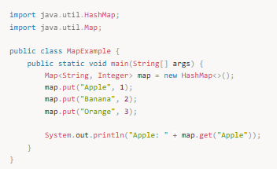

**Önemli Noktalar:**
- **HashMap** anahtarları sırasız olarak tutar.
- **LinkedHashMap** anahtarları eklenme sırasına göre tutar.
- **TreeMap** anahtarları doğal sıralama ya da bir Comparator kullanarak sıralar.

---

## 📌 Mülakat Soruları ve Cevapları

### 1️⃣ List ile Set arasındaki fark nedir?
- List: Elemanların sırası korunur ve aynı öğe birden fazla kez eklenebilir.
- Set: Elemanlar sırasızdır ve aynı öğe birden fazla kez eklenemez.

### 2️⃣ HashSet ve TreeSet arasındaki farklar nelerdir?
- HashSet sırasızdır ve HashMap'e dayanır.
- TreeSet sıralıdır ve Comparator ile sıralanır.

### 3️⃣ Map nedir?
Map anahtar-değer çiftlerinden oluşur.  
HashMap, LinkedHashMap, TreeMap gibi implementasyonları vardır.

### 4️⃣ ArrayList ile LinkedList farkı
- ArrayList: Hızlı erişim, yavaş ekleme/silme
- LinkedList: Hızlı ekleme/silme, yavaş erişim

### 5️⃣ PriorityQueue nedir?
Önceliğe göre sıralı çalışan kuyruk yapısıdır.

---

## 📌 Collection Hiyerarşisi

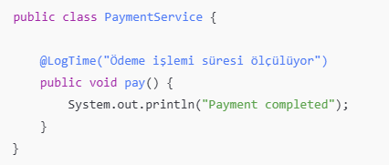

---

### ArrayList

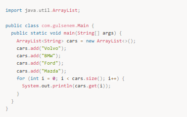

### LinkedList

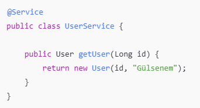

### HashSet

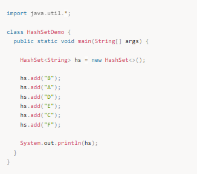

Çıktı:

Popping the stack: F E D B A