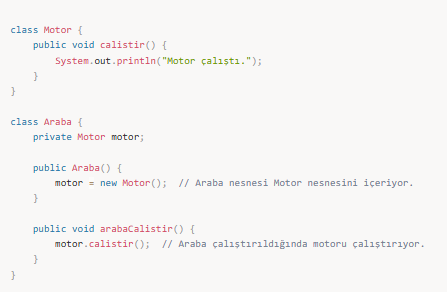
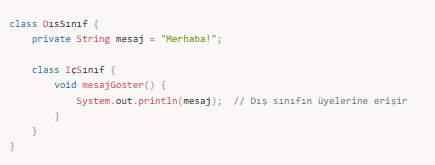
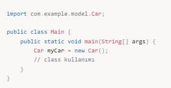

# Composition & Inner Class

utility → static kullanımı

## 📌 Composition (Bileşim) Nedir?

Composition, bir nesnenin başka bir nesneyi içermesi, yani bir nesne içinde başka bir nesnenin örneğini tutmasıdır.  
Bir nesnenin başka bir nesneyi içerdiği bir ilişki kurulur. Bu ilişki "has-a" (sahiplik) ilişkisi olarak tanımlanır. Yani, bir nesne başka bir nesnenin parçalarından biridir.

📌 Örnek:  
Bir Araba sınıfı, Motor sınıfını içerebilir. Yani, bir araba bir motora sahiptir.

### Önemli Noktalar

Bileşim, nesnelerin yaşam döngülerini birbirine bağlar. Araba yoksa, motor da yoktur.  
Bileşim, iç içe nesnelerin bağımsız olmasını sağlar. Her iki nesne bağımsız olarak var olabilir, ancak bileşimde bir nesne diğerini içerir.  
Bir nesne içerdiği nesneleri yaratır, yok eder. Yani, dışarıdan bir nesne geçerse, iç nesneler bileşim içinde oluşturulmaz.

### Bileşim ile Kalıtım Arasındaki Fark

**Composition (Bileşim):** Bir nesne başka bir nesne içerir. Bu genellikle daha esnektir.  
**Inheritance (Kalıtım):** Bir nesne başka bir nesneden türetilir. Bu, daha güçlü bir ilişkiyi ifade eder.

---

## 📌 Inner Class (İç Sınıf) Nedir?

İç sınıflar, bir sınıfın başka bir sınıfın içinde tanımlanmış sınıflardır. İç sınıflar, dış sınıfın özelliklerine ve metodlarına erişebilir ve dış sınıf ile daha yakın bir ilişki kurar.

### İç Sınıfların Türleri

### 1. Non-static Inner Class (Statik Olmayan İç Sınıf)

Dış sınıfın bir örneği ile ilişkili olup, dış sınıfın üyelerine doğrudan erişebilir.

📌 Örnek:

### 2. Static Nested Class (Statik İç Sınıf)

Dış sınıfın **statik bir örneği** ile ilişkili olup dış sınıfın statik üyelerine erişebilir.

📌 Örnek:

### 3. Local Inner Class (Yerel İç Sınıf)

**Bir metot içinde tanımlanan iç sınıf** türüdür. Sadece o metot içinde kullanılır.

📌 Örnek:

### 4. Anonymous Inner Class (Anonim İç Sınıf)

**İç sınıfın isimsiz olarak oluşturulması**dır. Genellikle tek kullanımlık sınıflar için kullanılır.

📌 Örnek:

---

## 📌 Önemli Noktalar

1. **İç sınıflar, dış sınıfın tüm üyelerine (private dahil) erişebilir.**  
2. **İç sınıfların tasarımı, dış sınıfın mantığını daha kapsayıcı hale getirebilir.**  
3. **İç sınıflar, dış sınıfla çok yakın ilişki kurmak istediğimiz durumlar için kullanılır.**

---

## 📌 Mülakat Soruları ve Cevapları

### 1️⃣ Bileşim (Composition) ile Kalıtım (Inheritance) arasındaki farklar nelerdir?

Bileşim (Has-a): Bir sınıf, başka bir sınıfı içerir. Örneğin, bir araba, bir motor içerir.  
Kalıtım (Is-a): Bir sınıf, başka bir sınıftan türetilir. Örneğin, bir köpek, bir hayvan sınıfından türetilir.  
Bileşim daha esnek ve düşük bağımlılığa sahiptir, Kalıtım ise daha sıkı ve güçlü bir bağ kurar.

### 2️⃣ İç sınıfların avantajları nelerdir?

Dış sınıf ile çok yakın ilişki kurar.  
Dış sınıfın private üyelerine erişim sağlar.  
Kodun daha düzenli ve kapsüllenmiş olmasını sağlar.  
Anonim iç sınıflar ile çok kısa kod yazılabilir.

### 3️⃣ Static Nested Class ve Inner Class arasındaki farklar nelerdir?

Static Nested Class: Dış sınıfın statik üyelerine erişebilir, dış sınıfın örneği olmadan oluşturulabilir.  
Inner Class (Non-static Inner Class): Dış sınıfın tüm üyelerine (private dahil) erişebilir ve dış sınıfın bir örneği ile ilişkilidir.

### 4️⃣ Composition ile Aggregation arasındaki fark nedir?

Composition: Daha güçlü bir ilişki kurar. Bir nesne diğerine ait olduğu zaman, içerdiği nesnenin yaşam döngüsünü de yönetir.  
Aggregation: Daha zayıf bir ilişki kurar. Bir nesne diğerini içerir ama dışarıdaki nesnenin yaşam döngüsü bağımsızdır.

### 5️⃣ İç sınıfı nasıl kullanırsınız?

İç sınıflar, dış sınıfla çok yakın bir ilişki kurmak ve dış sınıfın üyelerine (private dahil) erişim sağlamak için kullanılır.  
Non-static Inner Class: Dış sınıfın örneği ile ilişkilidir.  
Static Nested Class: Dış sınıfın örneği olmadan çalışabilir, sadece statik üyelere erişebilir.

---

## 📌 Özet

Composition, bir nesnenin başka bir nesneyi içermesiyle oluşur. Bu, "has-a" ilişkisini gösterir.  
Inner Class, bir sınıfın içinde tanımlanmış bir sınıftır. İç sınıflar, dış sınıfla yakın bir ilişki kurar ve dış sınıfın tüm üyelerine erişebilir.  
Mülakat soruları genellikle bileşim, kalıtım ve iç sınıfların kullanımını anlamaya yöneliktir.
