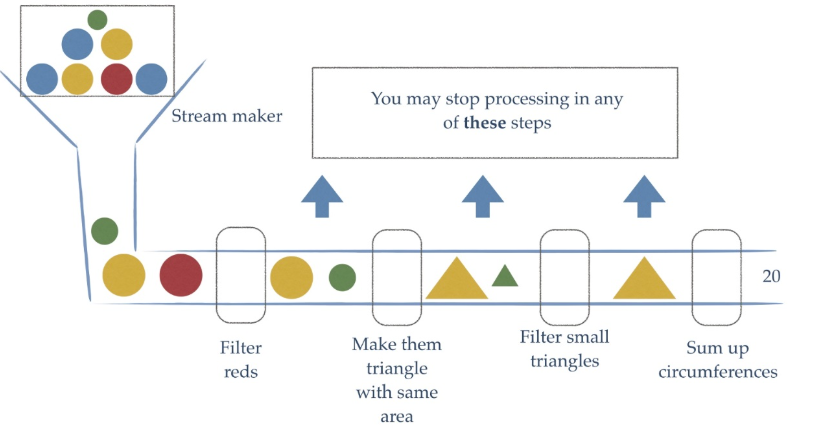
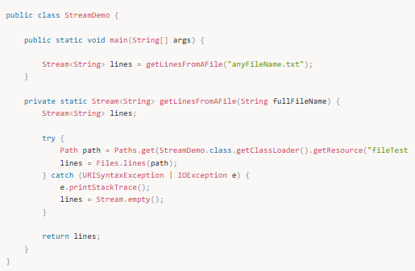
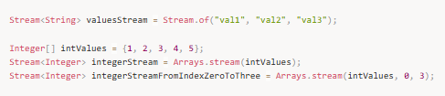
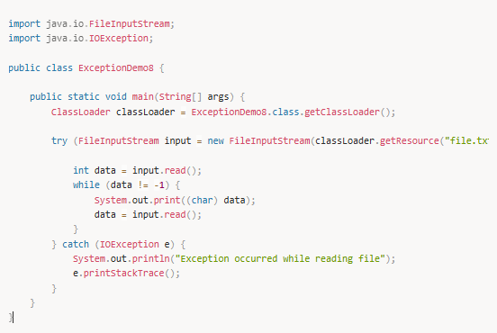
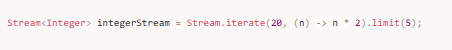
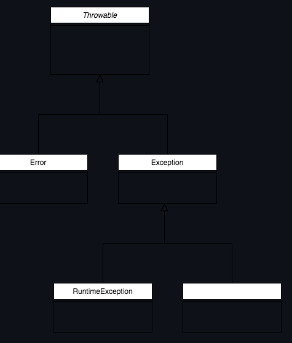

# Hata Yönetimi(Exception Handling)

Java'da hata yönetimi, yazılımda oluşabilecek hataların düzgün bir şekilde ele alınması ve uygun şekilde yanıt verilmesi için kullanılan bir mekanizmadır. Java, hataları exception adıyla adlandırır.

## Hata Türleri
Java’da exception (hata) iki ana kategoriye ayrılır:

### 1.Checked Exceptions (Kontrol Edilen Hatalar)

Bu hatalar, derleme zamanında kontrol edilir.  
Örneğin, dosya okuma işlemleri sırasında bir dosyanın var olup olmadığı kontrol edilir.  
Bu hatalar, try-catch blokları ile ya da throws anahtar kelimesi ile ele alınmalıdır.  
Örnek: IOException, SQLException

### 2.Unchecked Exceptions (Kontrol Edilmeyen Hatalar)

Bu hatalar, çalışma zamanında (runtime) oluşur.  
Derleyici tarafından kontrol edilmez ve bu hatalar yazılımcı tarafından doğrudan yönetilmez.  
Genellikle mantık hataları ve sistem hatalarıdır.  
Örnek: NullPointerException, ArithmeticException

---

## 📌 Java’da Hata Yönetimi Yapısı

Java’da hata yönetimi, try, catch, finally bloklarıyla yapılır.

### 1. try-catch-finally Blokları
- try: Hata oluşabilecek kod bloğu burada yazılır.
- catch: Hata meydana geldiğinde çalışacak olan bloktır. Bu blok, belirli bir hata türünü yakalayabilir.
- finally: Hata olup olmadığına bakılmaksızın her durumda çalıştırılacak koddur. Genellikle kaynakları serbest bırakmak (örneğin, dosya kapama, veritabanı bağlantısını sonlandırma) için kullanılır.

Örnek:

### 2. Throws Anahtar Kelimesi
Bir metodun içerisinde exception (hata) meydana geldiğinde, bu hatanın dışarıya fırlatılmasını sağlamak için throws anahtar kelimesi kullanılır. Bu, metodun imzasında yer alır ve metodu çağıran yerin bu hatayı yönetmesini bekler.

Örnek:

Bu örnekte, readFile metodu bir IOException hatasını fırlatır. Bu metodun çağırıldığı yerde try-catch bloğu ile hata yönetimi yapılmalıdır.

---

## 📌 Hata Sınıfları ve Özelleştirilmiş Hata Türleri

Java'da kullanıcıların kendi özel hata sınıflarını oluşturmaları mümkündür. Bu sınıflar Exception sınıfından veya RuntimeException sınıfından türetilebilir.

**Checked Exception:** Kullanıcı tarafından özelleştirilen hatalar genellikle Exception sınıfından türetilir.  
**Unchecked Exception:** Genellikle RuntimeException sınıfından türetilir.  

Özel Bir Exception Sınıfı Tanımlama:

Bu şekilde oluşturulan hata sınıfı, bir method tarafından fırlatılabilir ve try-catch bloğu ile yönetilebilir.

---

## 📌 Hata Yönetimi İçin İyi Uygulamalar

**Özel Hata Mesajları Kullanmak:** Hata mesajlarını mümkün olduğunca anlaşılır ve açıklayıcı yapın. Kapsayıcı ve kullanıcı dostu hata mesajları yazmak, hataların hızlıca tespit edilmesine yardımcı olur.

**Gereksiz Catch Bloğu Kullanmaktan Kaçının:** Hata yönetiminde gereksiz catch blokları kullanmak, hata mesajlarının gözden kaçmasına neden olabilir. Hataları doğru şekilde ele almak önemlidir.

**finally Bloklarını Kullanın:** Kaynakları serbest bırakmak için finally bloğunu kullanarak hataların ardından sistemin sağlıklı bir şekilde çalışmasını sağlayın.

**Özel Hata Türleri Oluşturun:** Eğer uygulamanızın mantığına uygun özel hatalar oluşturmanız gerekiyorsa, kendi exception sınıflarınızı tanımlayarak daha özelleşmiş hata yönetimi yapabilirsiniz.

---

## 📌 Mülakat Soruları ve Cevapları

### 1️⃣ Hata Yönetimi nedir ve neden önemlidir?
Cevap: Hata yönetimi, uygulamanın beklenmedik durumlarda (hatalar, istisnalar) doğru bir şekilde çalışmaya devam etmesini sağlamak için kullanılır. Hatalar, çalışma zamanında ortaya çıkan beklenmedik durumlardır. Hata yönetimi, kullanıcı deneyimini iyileştirir ve uygulamanın daha güvenli ve stabil olmasını sağlar.

### 2️⃣ Java’da Checked Exception ve Unchecked Exception arasındaki fark nedir?
Cevap: Checked Exception, derleme zamanında kontrol edilir ve try-catch veya throws anahtar kelimesi ile ele alınmak zorundadır. Örnek: IOException.

Unchecked Exception ise çalışma zamanında meydana gelir ve derleyici tarafından kontrol edilmez. Örnek: NullPointerException.

### 3️⃣ try-catch-finally bloğu nedir ve nasıl çalışır?
Cevap: try bloğu içinde hata oluşturabilecek kod yer alır, catch bloğu bu hatayı yakalar ve finally bloğu, hata olup olmadığına bakılmaksızın çalışır. finally genellikle kaynakları serbest bırakmak için kullanılır.

### 4️⃣ throws ve throw arasındaki fark nedir?
Cevap: throw anahtar kelimesi, bir exception'ı fırlatmak için kullanılır. Örneğin, throw new ArithmeticException("Hata!");.

throws ise bir metodun imzasında yer alır ve bu metodun hangi hataları fırlatabileceğini belirtir. Örneğin, public void readFile() throws IOException.

### 5️⃣ Java’da kendi exception sınıfınızı nasıl tanımlarsınız?
Cevap: Kendi exception sınıfınızı, Exception veya RuntimeException sınıfından türeterek tanımlayabilirsiniz. Bu sınıf, hata mesajlarını almak ve iletmek için özel bir yapıcı (constructor) içerebilir.

### 6️⃣ finally bloğu her zaman çalışır mı?
Cevap: Hayır, finally bloğu genellikle çalışır, ancak bazı istisnai durumlar (örneğin, JVM kapanması) finally bloğunun çalışmamasına neden olabilir.

---

## 📌 Özet
**Hata Yönetimi,** Java’da hataların ele alınmasını sağlar. Bu, uygulamanın stabil çalışmasını ve kullanıcı dostu olmasını sağlamak için kritik bir konudur.  
Java’da **Checked ve Unchecked Exception** türleri bulunur. Checked Exception metodu çağıran yere bildirilmeli, Unchecked Exception çalışma zamanında ortaya çıkar.  
**try-catch-finally yapısı**, hataları yönetmek için kullanılır. finally bloğu her durumda çalışır ve kaynakların serbest bırakılmasını sağlar.  
Hata yönetimi uygulamalarında doğru bir yaklaşım, yazılımın güvenilirliğini artırır.

---

## Try-Catch-Finally

compile : kodumuzun çalışır hale gelmesi.

ister try çalışsın ister catch finally her şekilde çalışır.Birden fazla catch bloğu kullanabiliriz.

---

## Exception Hiyerarşisi

Exception  , uygulamada yazdığımız kodlara yönelik hatalardır. Exxceptionları biz kodlarla kontrol altında tutabiliyoruz(try-catch).Bütün exceptionlar , exception classından inherite edilir yani extend edilir.

Errorlar bizim kodlarla müdahale edemeyeceğimiz hatalardır.

---

## Checked Exceptionlar

*BuferredReader

FileNotFoundException : sistem belirtilen dosyayı bulamazsa hatası.

*thorws IOException

---

## Throw

Throw ile bilinçli olarak hata fırlatırız.

---

## Custom Exception

---

## Exception handling

Exception, runtime da yani uygulama çalışırken meydana gelen hatalardır. Bu hataların bir kısmı tolere edilebilirken bir kısmı ise uygulamanın tamamen durmasına neden olur. Developer olarak bizim amacımız bu hataları yakalamak ve mümkünse tolere edip uygulamanın çalışmaya devam etmesini sağlamaktır, tabi hatanın meydana gelmesini önlemek çok daha öncelikli hedefimiz, ama yinede bir hata meydana gelirse bu durumda sistemin mümkün olan en iyi şekilde devam etmesini sağlamamız gerekir.

Java bizlere kullanılması kolay ve esnek bir hata yakalama mekanizması sunuyor. Detaylarına geçmeden önce Java dilinde gerçekleştirilen hata hierarşisini anlamak önemli.

Javada tüm hatalar sınıflar tarafından temsil edilir, yani bir hata oluştuğunda bir hata objesi oluşturulur. Java dilinde tüm hataların atası Throwable sınıfıdır. Throwable sınıfının iki tane doğrudan alt sınıfı bulunur, Exception ve Error. Error sınıfı doğrudan bizim kodumuzla ilgili olmayan JVM ile ilgili hatalar için kullanılır ve bu hatalar kontrolümüz dışındadır. Ayrıca kod içerisinde tolere edilmesi de mümkün değildir, o nedenle bunlardan çok fazla bahsetmeyeceğiz. Exception sınıfı ise doğrudan yazdığımız kodla ilgili bizim kontrolümüzde olan hatalar için kullanılır.

---

## Exception yakalama bileşenleri

Javada hata yakalama beş anahtar kelime ile yönetilir; **try**, **catch**, **throw**, **throws** ve **finally**. Hata açısından izlemek istediğimiz kodları try bloğuna yazmalıyız. try bloğu içerisinde bir hata oluşursa bu hata fırlatırlır. Fırlatılan hatayı catch bloğu yakalar, tabiki fırlatılan hata ile eşleşen bir catch bloğu varsa. Sistem tarafından oluşturulan hatalar otomatik olarak fırlatılır fakat bazı durumlarda bizim de manuel olarak hata fırlatmamız gerekir, bu durumda throw ifadesi kullanılır. Bazı durumlarda yazdığımız metodun hangi hataları fırlatabileceğini metod imzasında belirtmemiz gerekir. Bu durumda throws ifadesi kullanılır. Bir try bloğundan sonra hata olsun olmasın mutlaka yapılması gereken bir iş varsa o da finally bloğunda yapılır.

try ve catch bloğunun genel yapısı aşağıdaki gibidir. try tek başına kullanılabilir ama catch ifadesi sadece try ile birlikte kullanılabilir.

try bloğu içerisinde bir hata oluştuğu zaman, blok içerisinde hatanın gerçekleştiği noktadan sonra gelen kod işletilmez. O noktadan itibaren kodun akışı oluşan hata ile en çok uyumlu olan catch bloğuna geçer. O nedenle catch bloğunu oluştururken hata tipi seçimi önemlidir. catch bloğuna oluşan hata objesi argüman olarak verilir ve blok içerisinde hata işlenir.

Eğer hiçbir hata oluşmaz ise kod akışı en son catch ifadesinden sonraki kod parçasıyla devam eder. catch blokları yalnızca ilgili hata try bloğu içinde oluştuğu zaman çalıştırılır.

Kod içerisinde şöyle bir akış olduğunu düşünelim; a() metodu içerisinde bir noktada b() metodunu çağırsın ve b() metodu içinde bir noktada c() metodunu çağırsın ve c() metodu çalıştırılırken bir hata alalım. Eğer hata c() metodu içerisinde yakalanmıyorsa hata hierarşide bir üst katmana aktarılır yani b() metodunda c() metodunu çağırdığımız noktaya. Eğer o noktada da hatayı yakalayan bir catch bloğu yoksa hata bir üst katmana yani a() metodu içinde b() metodunun çağrıldığı yere aktarılır. Eğer bu noktada bu hatayı yakalayacak bir catch bloğu varsa hata orada yakalınır ve işlenir. Yok ise bu hata main metoduna kadar aktarılır ve uygulamanın durmasına neden olabilir.

Şimdi bütün bu öğrendiklerimizi bir örnekle kod üzerinde görelim;

Output :

try block is started  
    putValue method started  
Exception catched java.lang.ArrayIndexOutOfBoundsException: 10  
Program ends gracefully

Bu örnek bize hata yakalamanın nasıl işlediğine dair pek çok bilgi veriyor. Örnekte görüldüğü gibi putValue() metodunda arraye bir int değer koymaya çalışırken ArrayIndexOutOfBoundsException alıyoruz ve bu hatadan sonraki satır işletilmeden hata bu metodun çağırıldığı bir üst katmana iletiliyor, yani main() metoduna. main() metodu içinde putValue() metoduna çağrı yaptığımız kod parçası try bloğu içinde yer alıyor. Ve catch bloğunda yakaladığımız hata türü runtime da aldığımız hata türüyle eşleştiği için program akışı catch bloğuna geçiyor. catch bloğu içinde hata işleniyor ve buradan yeni bir hata fırlatılmadığı için akış catch bloğu sonrasından devam ediyor.

Bu örnekte hatanın yakalanmadığını düşünelim;

Output :

before calling put value  
    putValue method started  
Exception in thread "main" java.lang.ArrayIndexOutOfBoundsException: 10  
	at com.hkarabakla.inheritance.ArrayOperations.putValue(ArrayOperations.java:7)  
	at com.hkarabakla.inheritance.com.hkarabakla.Main.main(com.hkarabakla.Main.java:11)  

Process finished with exit code 1

Bu çıktı bize uygulamayı debug ederken hatanın yerini bulmak için yardımcı olurken başkalarının pek işine yaramayacaktır. O nedenle hatanın uygun şekilde işlenip uygun hata mesajlarının loga basılması gerekir.

Şimdi catch bloğunun bulunması fakat fırlatılan hata ile eşleşmemesi durumunda neler olur ona bakalım;

Output :

try block is started  
    putValue method started  
Exception in thread "main" java.lang.ArrayIndexOutOfBoundsException: 10  
	at com.hkarabakla.inheritance.ArrayOperations.putValue(ArrayOperations.java:7)  
	at com.hkarabakla.inheritance.com.hkarabakla.Main.main(com.hkarabakla.Main.java:11)  

Process finished with exit code 1

Sonuç aynı, doğru hata türünü catch bloğunda kullanmak o nedenle önemli, kullanılmadığı taktirde hatayı yakalamak mümkün değildir.

Hatalar uygun bir şekilde yakalanırsa uygulamanın çalışmaya devam edeceğini söylemiştik, şimdi bunu başka bir örnekle görelim;

Output :

1/5=0  
Division by 0, 34/0  
56/12=4  
Division by 0, 23/0  
78/34=2  
Program ended successfully

Bu örnekte eşit sayıda int değer taşıyan iki array tanımlanmış ve bir for döngüsü yardımıyla arrayler üzerinde dönülüyor. Her adımda numbers arrayi içindeki ilgili indekste bulunan int değer dividers arrayi içinde ilgili indekste bulunan int değere bölünüyor ve sonuç ekrana yazdırılıyor. dividers arrayi içinde sıfır değerleri bulunduğu için sıfıra bölmeden dolayı ArithmeticException oluşuyor fakat bu hata yakalandığı için döngü sonraki adımdan devam ediyor ve uygulama normal bir şekilde son buluyor.

---

## Exception sınıflarında super class - subclass ilişkisi ve hata yakalamaya etkisi

Bir try ifadesinin birden fazla catch bloğu ile ilişkilendirilebileceğini söylemiştik. Böyle bir durumda aralarında üst sınıf alt sınıf ilişkisi bulunan hata sınıflarından; önce alt sınıf hatayı sonra üst sınıf hatayı catch blokları ile yakalamalıyız. Yani herzaman hata sıralamasında özelden genele doğru gidilmeli. Tersi durumda compiler hata verecektir. Şimdi daha iyi anlayabilmek için bunu bir örnekle görelim;

Output :

1/5=0  
Division by 0, 34/0  
56/12=4  
Division by 0, 23/0  
78/34=2  
Another exception catched : java.lang.ArrayIndexOutOfBoundsException: 5  
Another exception catched : java.lang.ArrayIndexOutOfBoundsException: 6  
Program ended successfully

ArithmeticException sınıfı RuntimeException sınıfından türetilmiş bir hata sınıfıdır. Bu nedenle yukarıdaki örnekte görüldüğü gibi ArithmeticException hatası ilk catch bloğunda, RuntimeException hataları ise ikinci catch bloğunda yakalanmıştır. try-catch blokları yukarıdan aşağı doğru işletildiği için JVM ilk catch bloğunu daha önce ziyaret edecektir. Sınıf hierarşisi düşünüldüğünde ArithmeticException aynı zamanda bir RuntimeException sınıfından sayıldığı için, eğer catch bloklarının yerini değiştirirsek JVM RuntimeException ve onun alt sınıflarından türeyen tüm exceptionları ilk blokta yakalayacak ve ikinci catch bloğunu hiçbir zaman ziyaret etmecektir. Bu da erişilemez bir kod parçasını uygulamaya eklemiş olması demektir. Bu nedenle compiler catch bloklarını yazarken exception hierarşisinde özelden(alt sınıftan) genele (üst sınıfa) hata sınıflarını sıralamamızı ister ve doğru sırada yazmazsak bizi hata vererk uyarır.

---

## throw ile hata fırlatma

Daha önce fırlatılan hataların nasıl yakalanacağını gördük. Bazı durumlarda kod içerisinden çeşitli nedenlerle isteyerek ve bilerek bizim de hata fırlatmamız gerekebilir. Bu durumda bir hata objesi oluşturmamız ve onu throw ifadesi ile fırlatmamız gerekir. Yada catch bloğu içinde yakaladığımız bir hatayı işledikten sonra hatayı bir üst katmanda da işlensin diye bir üst katmana tekrar fırlatmamız gerekebilir. Bu durumda tekrar hata objesi oluşturmamız gerekmez catch bloğuna gelen hatayı aynen fırlatabiliriz. Şimdi bunu bir örnekle görelim;

Output :

Array sizes are not equal  
Fatal error, program terminated

---

## finally ifadesi

Bazı durumlarda try-catch ifadesini terk etmeden hemen önce çalıştırmamız gereken kodlar olabilir. Bu durumlar genelde try bloğu içinde bir dosya açtıysak onu kapatmak için yada bir network bağlantısı kurduysak o bağlantıyı kapatmak için kullanılan kodlardır. Bu tarz durumlar programlamada oldukça yaygındır ve java bize bu durumu yönetmek için finally ifadesini sunuyor. Genel yapısı şu şekildedir;

Bu yapıda finally bloğu catch bloğundan sonra gösterilmiştir ama teoride finally bloğu doğrudan try bloğunun ardından da gelebilir, exception yakalanmayacağı için finally ifadesi işletildikten sonra hata bir üst katmana iletilecektir. try bloğu içinden fırlatılan hata daha üst katmanlarda yakalanmaz ise uygulama son bulur. Bu durum teoride mümkün olsa da pratikte gerçekten böyle bir ihtiyaç olmadığı sürece tercih edilmemelidir.

Şimdi finally bloğunu bir örnekle inceleyelim;

Bu örnekte try bloğu içerisinde bir dosya okuma işlemi yapılıyor. Bu işlem sırasında dosyadaki verileri almak için bir FileInputStream açılıyor, bu stream işlem sonrasında kapatılması gerekiyor. Bu kapatma işlemini finally bloğu içinde yapabiliriz. FileInputStream kapanma sırasında IOException fırlatabileceği için (önceden kapanma durumunda olduğu gibi) input.close(); ifadesi de try bloğu içerisine alınmıştır.

---

## throws ifadesi

Bazı durumlarda bir metod bir yada birkaç hata yarattığı halde bu hataları kendi içinde yakalamak yerine hata yakalama işini kendisini çağıran metodlara bırakır. Bu durumda yakalanmayan hatalar metod imzasına throws ifadesi ile eklenir ve bu metodu çağıran kod parçası bu hatayı yakalamaya zorlanır. Bu zorlamayı compiler bizim için yapar. Genel yapı şu şekildedir;

Burada exception_list virgül ile ayrılmış hata listesini içerir. Şimdi bir önceki örneği biraz değiştirerek throws ifadesinin nasıl kullanıldığını bir örnekle görelim;

catch bloğunun ortadan kalktığına ve throws IOException ifadesinin metod imzasına eklendiğine dikkat edelim.

---

## try-with-resource

Önceki örneklerde gördüğümüz gibi eğer try bloğu içerisinde bir dosya yada bir network bağlantısı açıyorsak o kaynağın finally bloğu içinde kapatılması gerekiyor. Java 7 ile birlikte bu tarz durumlar için try-catch-finally blokları yerine try-with-resource kavramı geldi. try-with-resource içerisinde açılan kaynaklar try bloğu sonrasında otomatik olarak kapatılır. Bu kaynakların otomatik kapatılabilmeleri için AutoClosable interface ini implemente etmeleri gerekir.

Daha önceki örneklerdee gördüğümüz dosya okuma işlemini şimdi try-with-resource ile tekrar yapalım ve kodun nasıl sadeleştiğine dikkat edelim;

Görüldüğü gibi aynı işi yapan kod çok daha kısa ve sade.

Eğer birden fazla kaynağa erişmemiz gerekirse try bloğu içinde, bu drumda aşağıdaki örnekte gösterildiği gibi kaynaklar noktalı virgül ile ayrılarak erişilebilir.

---

## Checked / unchecked exception

Daha önce tüm exceptionların Throwable sınıfından türediğinden ve onun altında Error ve Exception sınıflarının bulunduğundan bahsetmiştik. Şimdi bütün exception hiyerarşisine tekrar gözatalım ve bu yapının arkasında yatan mantığı anlamaya çalışalım.

Grafikte görüldüğü gibi tüm exceptionların atası Throwable sınıfı, onun altında Error sınıfı ve Exception sınıfı yer alıyor. Exception sınıfının altında ise RuntimeException sınıfı ve diğer pekçok exception sınıfı bulunuyor. Bu kısımda daha çok RuntimeException ve diğer kardeşlerinden bahsedeceğiz.

Java dilinde uygulama ile ilgili ve runtime da karşımıza çıkabilecek tüm hatalar RuntimeException sınıfından türer. Bu hatalar çalışma sırasında karşımıza çıkar ve uygulamanın compile edilmesi sırasında görülmesi mümkün değildir. Bu nedenle de compiler bizi bu hataları yakalamak için zorlamaz, bu mantıktan dolayı bunlara unchecked exception denir. ArithmeticException, ArrayIndexOutOfBoundException unchecked exceptionlara örnektir.

Exception sınıfından türeyen RuntimeException dışındaki tüm exceptionlar compile time hatalarıdır ve catch edilmesi yada throw edilmesi zorunludur. Compiler tarafından kontrol edilen bu hatalara checked exception denilir. IOException, SQLException checked exceptionlara örnektir.

Peki nezaman checked ne zaman unchecked exception kullanmalıyız ? Oracle'ın resmi dökümanında yeralan tavsiye şu şekilde:

> If a client can reasonably be expected to recover from an exception, make it a checked exception. If a client cannot do anything to recover from the exception, make it an unchecked exception.
