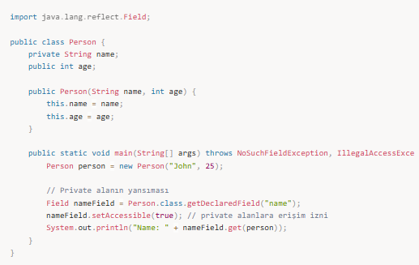
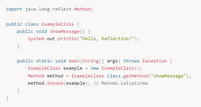
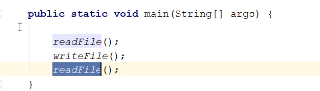

# Dosyalar(file handling)

Java'da dosya işlemleri, java.io paketindeki sınıflarla yapılır. Bu sınıflar dosya okuma, yazma, silme gibi işlemleri yapabilmenizi sağlar. Java 7 ile birlikte NIO (New Input Output) ile dosya işlemleri daha verimli hale getirilmiştir.

## Dosya İşlemleri İçin Kullanılan Temel Sınıflar
- **File:** Dosya ve dizin işlemleri için temel sınıftır. Dosya varlığını kontrol etmek, dosya adı almak gibi işlemleri yapar.
- **FileReader / FileWriter:** Karakter tabanlı dosya okuma ve yazma işlemleri yapar.
- **BufferedReader / BufferedWriter:** Daha verimli okuma ve yazma işlemleri için kullanılan sınıflardır.
- **FileInputStream / FileOutputStream:** Bayt tabanlı dosya okuma ve yazma işlemleri yapar.
- **PrintWriter:** Formatlı dosya yazma işlemleri için kullanılır.

---

## 📌 Temel Dosya İşlemleri

### 1. Dosya Oluşturma
Dosya oluşturmak için File sınıfını kullanabilirsiniz.

Örnek:

### 2. Dosya Okuma
Dosya okumak için FileReader veya BufferedReader kullanılır.

Örnek:

try-with-resources kullanmak, kaynakları düzgün şekilde kapatmak için en iyi yaklaşımdır.

### 3. Dosya Yazma
Dosya yazmak için FileWriter veya BufferedWriter sınıfları kullanılır.

Örnek:

### 4. Dosya Silme
Bir dosyayı silmek için delete() metodunu kullanabilirsiniz.

Örnek:

### 5. Dosya Özellikleri
Bir dosyanın var olup olmadığını, boyutunu, okunabilirliğini vb. özelliklerini kontrol etmek için File sınıfını kullanabilirsiniz.

Örnek:

---

## 📌 NIO (New I/O)
Java 7 ile birlikte NIO (New I/O) sınıfları tanıtıldı. NIO, daha verimli I/O işlemleri sağlar, aynı zamanda Path, Files, ByteBuffer gibi sınıflar ile dosya yönetimini kolaylaştırır.

Örnek: Dosya Kopyalama (NIO ile)

---

Java içindeki hazır sınıflar ile dosya işlemlerini yapabiliyoruz.

### Dosya yoksa yeni dosya oluştursun varsa dosya var desin:

### Dosya Bilgilerini Okumak
  

### Dosyaların Okunması
  

### Dosyaya Yazmak
  

---

## 📌 Mülakat Soruları ve Cevapları

### 1️⃣ Java'da dosya okuma ve yazma nasıl yapılır?
Cevap: Java'da dosya okuma ve yazma için FileReader, BufferedReader, FileWriter, ve BufferedWriter sınıfları kullanılır. BufferedReader ve BufferedWriter daha büyük dosyalarla çalışırken daha verimlidir çünkü tampon bellek kullanır.

### 2️⃣ Neden try-with-resources kullanılmalıdır?
Cevap: try-with-resources kullanmak, dosya işlemleri gibi kaynakların doğru şekilde kapatılmasını sağlar. Bu, kaynakların manuel olarak kapatılmasını unutma riskini ortadan kaldırır ve bellek sızıntılarını önler.

### 3️⃣ Java'da dosya silme işlemi nasıl yapılır?
Cevap: Dosya silmek için File sınıfındaki delete() metodu kullanılır. Bu metot, dosyanın silinip silinmediğini belirten bir boolean değer döndürür.

### 4️⃣ NIO (New I/O) ile dosya işlemleri nasıl yapılır?
Cevap: Java 7 ile gelen NIO (New I/O) sınıfları, dosya işlemlerini daha verimli hale getirir. Örneğin, Files.copy() metodu dosya kopyalama işlemi yapar. NIO ile daha hızlı dosya erişimi sağlanabilir.

### 5️⃣ Java'da bir dosya var mı diye nasıl kontrol edebilirim?
Cevap: File sınıfının exists() metodu, dosyanın var olup olmadığını kontrol etmek için kullanılır.

### 6️⃣ BufferedReader ve FileReader arasındaki farklar nelerdir?
Cevap: FileReader, tek tek karakter okuma işlemi yapar, ancak BufferedReader bir tampon bellek kullanarak daha verimli okuma işlemleri yapar. Büyük dosyalarla çalışırken BufferedReader daha hızlıdır.

---

## 📌 Özet

**Dosya Okuma ve Yazma:** Java’da dosya işlemleri FileReader, BufferedReader, FileWriter, BufferedWriter gibi sınıflarla yapılır. Ayrıca Java 7 ile gelen NIO (New I/O), dosya işlemlerini daha verimli hale getirir.  
**Dosya Özellikleri:** Dosyanın var olup olmadığı, boyutu, okuma/yazma izinleri gibi özellikler File sınıfı ile kontrol edilebilir.  
**Dosya Kopyalama ve Silme:** Dosya kopyalama NIO ile daha hızlı yapılabilir, dosya silme işlemi ise File.delete() ile yapılır.
