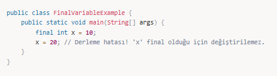
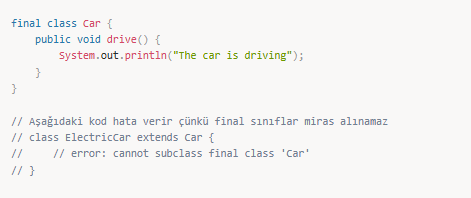
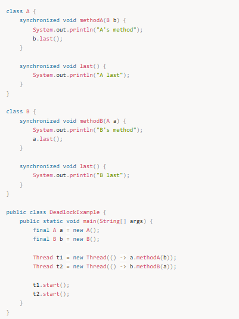
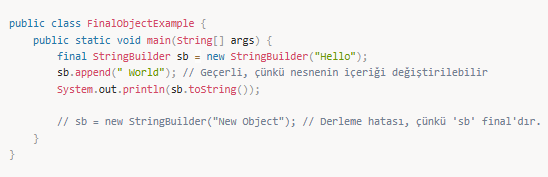
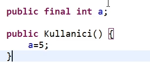
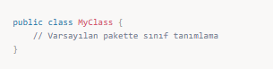
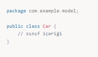
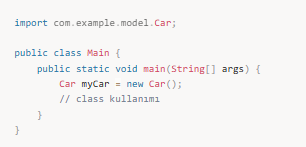
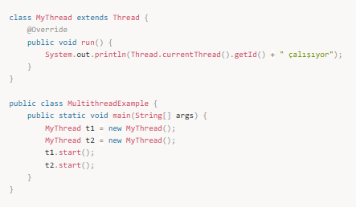

# 📌 final Anahtar Kelimesi Kullanımı

> **final** anahtar kelimesi; değişkenlerde, metotlarda, sınıflarda ve parametrelerde kullanıldığında farklı anlamlara gelir.

---

## 1. Final Değişkenler
Bir değişkeni final olarak tanımladığınızda, o değişkenin değeri yalnızca bir kez atanabilir ve sonrasında değiştirilmesi mümkün değildir.

**Örnek:**

**Önemli Nokta:** final değişkenler, yalnızca ilk atama sırasında değer alabilirler. Değer bir kez atandıktan sonra değiştirilmesi mümkün değildir.

---

## 2. Final Metotlar
Bir metodu final olarak tanımladığınızda, o metodun alt sınıflar tarafından override edilmesi engellenir. Bu özellik, güvenlik veya tutarlılık sağlamak amacıyla kullanılır.

**Örnek:**

**Önemli Nokta:** final metodlar, alt sınıflar tarafından değiştirilemez ve her zaman kendi sınıfındaki davranışını devam ettirir.

---

## 3. Final Sınıflar
Bir sınıfı final olarak tanımladığınızda, o sınıfın başka bir sınıf tarafından miras alınması engellenir. Bu özellik, sınıfların değiştirilmesini engellemek için kullanılır.

**Örnek:**

**Önemli Nokta:** final sınıflar, miras alınamaz, bu yüzden onları değiştirmek için alt sınıflar kullanılamaz.

---

## 4. Final Parametreler
Bir metodun parametrelerini final olarak tanımladığınızda, bu parametrelerin metodun içinde değiştirilmesi engellenir.

**Örnek:**

**Önemli Nokta:** final parametreler, metodun içinde yeniden atanamazlar, fakat parametrelerin kullanılması mümkündür.

---

## 5. Final ve İmmutability
Bir nesne final olarak tanımlandığında, nesnenin referansı değiştirilemez. Ancak nesnenin içeriği (özellikleri) değiştirilebilir, çünkü final sadece referansı etkiler, nesnenin iç yapısını etkilemez.

**Örnek:**

**Önemli Nokta:** final anahtar kelimesi, nesnenin referansını değiştiremez, ancak nesnenin içeriği üzerinde işlem yapılabilir.

---

# 📌 Mülakat Soruları ve Cevapları

## 1️⃣ final anahtar kelimesi ne işe yarar?
Cevap: final anahtar kelimesi, Java'da değişkenlerin, metodların ve sınıfların sabitlenmesini sağlar.  
Final değişkenler yalnızca bir kez değer alabilir.  
Final metodlar alt sınıflar tarafından override edilemez.  
Final sınıflar miras alınamaz.  
Final parametreler, metot içinde değiştirilmez.

---

## 2️⃣ final ve static anahtar kelimelerinin farkları nedir?
Cevap:  
final bir değeri, metodu veya sınıfı sabitler.  
static, bir değişkeni, metodu veya sınıfı sınıfın tüm örnekleri tarafından paylaşılabilir hale getirir.  
final değişkenler bir kez atanabilir ve sonrasında değiştirilemez, static ise sınıf düzeyinde paylaşılan bir öğedir.

---

## 3️⃣ final anahtar kelimesi ile const anahtar kelimesinin farkları nedir?
Cevap: Java'da const anahtar kelimesi kullanılmaz. Bunun yerine, sabit değerler için final anahtar kelimesi kullanılır. final ile sabit bir değeri belirlerken, const Java dilinde hiç kullanılmaz.

---

## 4️⃣ final bir parametre nedir ve ne işe yarar?
Cevap: final bir parametre, metod içinde değiştirilemez. Yani, metodu çağırırken parametre değerini değiştiremezsiniz.

---

## 5️⃣ final sınıf ne demek ve ne işe yarar?
Cevap: final sınıflar, miras alınamazlar. Yani, bu tür sınıflar başka bir sınıf tarafından genişletilemez. Bu, sınıfın davranışlarının değiştirilmesini engellemek amacıyla yapılır.

---

## 6️⃣ final bir metodun amacı nedir?
Cevap: final metodlar, alt sınıflar tarafından override edilemez. Bu özellik, metodun sabit bir davranışa sahip olmasını sağlar ve sınıfın miras alınmasını engeller.

---

# 📌 Özet
final değişkenler, metodlar, sınıflar ve parametreler için kullanılır.  
**Değişkenler:** final olarak tanımlandığında yalnızca bir kez değer atanabilir.  
**Metodlar:** final metodlar alt sınıflar tarafından override edilemez.  
**Sınıflar:** final sınıflar başka sınıflar tarafından miras alınamaz.  
**Parametreler:** final parametreler metod içinde değiştirilemez.  
**Nesneler:** final nesnelerin referansını sabitler, ancak nesnenin içeriği değiştirilebilir.

---

## Ek Notlar

Final değişkenlerde , metotlarda ,metot parametrelerinde, classlarda eklenildiğinde farklı farklı anlamlara geliyor.

Bir değişkeni final anahtar kelimesiyle işaretlersek onun değeri daha sonradan değiştirilemiyor sabit kalmak zorundadır.

iki şekilde değer atayabiliriz birincisi;

public final int a=5;

public final int SAYI ; → Bir değişken büyük harflerle tanımlanmışsa finaldır.

ikincisi ise constractırında değer atayabilriz;

Bir metodun parameteresini final olarak tanımlarsak değişkenin değeride değiştirilemez.

Final olarak tanımlanan metot parametrelerinin değeride sonradan değiştirilemez.

  

Bir metodu final olarak tanımlama:

Kullanıcı sınıfı BaseClassı miras aldığı için baseclass içindeki test metodu @override edebiliyor.(final kullanmazsam)

Bir metot final anahtar kelimesiyle işaretlenmişse bu metodu bu classı miras alan class o metodu override edemez.

Bir sınıfı final anahtar kelimesiyle tanımlamak:

Bir sınıf final anahtar kelimesiyle tanımlandığı zaman bu classı kimse miras alamaz.

