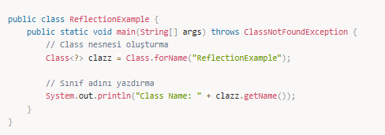
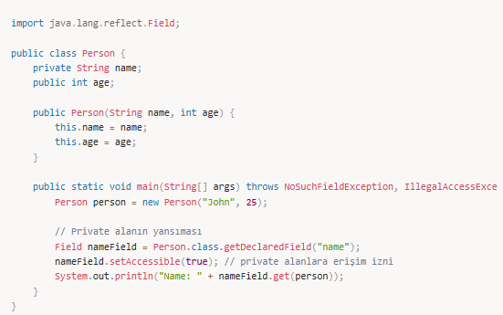
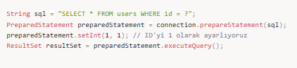
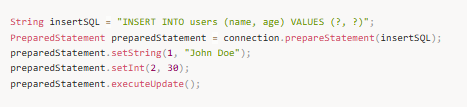
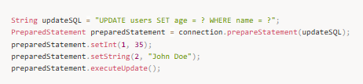
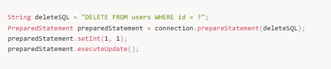

# JDBC ile Veri Tabanı Programlama

## **JDBC Nedir?**

JDBC, Java'nın veri tabanlarına bağlanmak için kullanılan API'dir. JDBC, Java uygulamalarının veri tabanlarıyla etkileşimde bulunmasını sağlayan bir teknolojidir. Java uygulamaları, JDBC aracılığıyla veri tabanlarından veri alabilir, veri ekleyebilir, güncelleyebilir ve silebilir.

Java uygulamasında veri tabanı kullanmak için JDBC kütüphaneleri kullanırız. JDBC ile Java uygulamalarında veri tabanına erişim sağlıyoruz.

java app → jdbc → driver → database (oracle, mysql)

---

## **JDBC Bileşenleri**

JDBC, birkaç temel bileşenden oluşur:

- **Driver:** Veritabanı ile Java uygulaması arasında bağlantıyı sağlar.  
- **Connection:** JDBC bağlantısı kurmak için kullanılan sınıftır.  
- **Statement:** SQL komutlarını veritabanına ileten araçtır.  
- **ResultSet:** SQL sorgularından dönen sonuçları tutan veri yapısıdır.  
- **SQLException:** JDBC sırasında oluşabilecek hataları yakalamak için kullanılır.  

---

## **JDBC Bağlantısı Kurma**

### **1. JDBC Driver Yüklemek**

Veritabanı ile bağlantı kurabilmek için uygun JDBC driver yüklenir.

### **2. Veritabanı Bağlantısı Kurmak**

DriverManager sınıfı kullanılarak bağlantı oluşturulur.

---

## **SQL Komutları ve Kullanımı**

JDBC ile kullanılan temel SQL komutları:

1. **SELECT** – Veri sorgulamak  
2. **INSERT** – Veri eklemek  
3. **UPDATE** – Veri güncellemek  
4. **DELETE** – Veri silmek  

### **SELECT**

### **INSERT**

### **UPDATE**

### **DELETE**

---

## **JDBC ile Bağlantı Havuzu (Connection Pooling)**

Her bağlantı oluşturma maliyetlidir. Connection Pool sayesinde bağlantılar yeniden kullanılır. Popüler kütüphanelerden biri **HikariCP**’dir.

---

## **PreparedStatement ve Statement Arasındaki Fark**

- **Statement:**  
  - SQL her seferinde derlenir.  
  - Performans düşüktür.  
  - SQL Injection riski vardır.

- **PreparedStatement:**  
  - Sorgu önceden derlenir.  
  - Parametreli çalışır.  
  - SQL Injection’a karşı güvenlidir.  
  - Daha performanslıdır.

---

## **JDBC Exception Handling**

**SQLException** metotları:

- `getMessage()`  
- `getSQLState()`  
- `printStackTrace()`  

---

## **🎯 Mülakat Soruları ve Cevapları**

### 1️⃣ JDBC nedir?  
**Cevap:**  
JDBC (Java Database Connectivity), Java uygulamalarının veri tabanlarıyla iletişim kurmasını sağlayan API’dir.

### 2️⃣ Statement ve PreparedStatement farkı nedir?  
**Cevap:**  
PreparedStatement daha güvenli ve performanslıdır, SQL Injection’a karşı koruma sağlar.

### 3️⃣ ResultSet nedir?  
**Cevap:**  
SQL sorgusunun döndürdüğü sonuç kümesini temsil eder.

### 4️⃣ JDBC Bağlantı Havuzu nedir?  
**Cevap:**  
Bağlantıların tekrar kullanılmasını sağlayarak performansı artırır.

### 5️⃣ PreparedStatement neden kullanılır?  
**Cevap:**  
Parametreli yapı, ön derleme ve güvenlik sağlar.

---

## **📌 Özet**

- **JDBC**, Java uygulamalarının veri tabanlarıyla iletişimini sağlar.  
- Temel bileşenler: **Connection, Statement, ResultSet, SQLException**  
- **PreparedStatement**, güvenlik ve performans sağlar.  
- **Connection Pooling**, maliyeti düşürür ve ölçeklenebilirliği artırır.
