# Map

## **📌 Java Map Nedir?**

Map, key-value çiftleriyle çalışmak için kullanılan bir arayüzdür. Java’da Map arayüzü, elemanların sırasını garanti etmeden saklar ve her anahtar yalnızca bir değer ile ilişkilendirilir.

Map, Java'nın Collection Framework'ünün bir parçasıdır, ancak Collection arayüzünün doğrudan bir alt sınıfı değildir. Bunun yerine, Map arayüzü `java.util` paketinde bulunur.

---

## **📌 Java Map Arayüzü ve Alt Sınıfları**

Map arayüzünün bazı yaygın alt sınıfları şunlardır:

- HashMap  
- TreeMap  
- LinkedHashMap  
- Hashtable  
- ConcurrentHashMap  

Her birinin farklı özellikleri ve kullanım alanları vardır.

---

## **1. HashMap**

**HashMap, Map** arayüzünü implement eden en yaygın kullanılan sınıftır.  
**Anahtar-değer** çiftlerini **hashing** yöntemiyle depolar.  
**Anahtarlar** benzersizdir, ancak sırasızdır.  
**Null değerlerine** izin verir (Bir anahtar ve bir değer null olabilir).

📌 Örnek: HashMap Kullanımı

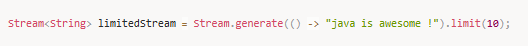

**Önemli Noktalar:**
- **HashMap**, sırasızdır; yani, elemanların eklenme sırası garanti edilmez.
- **Null anahtar ve null** değer kullanılabilir.

---

## **2. TreeMap**

**TreeMap, SortedMap** arayüzünü implement eder ve anahtarları sıralar.  
Anahtarlar doğal sıralama düzenine göre veya özel bir **Comparator** kullanılarak sıralanabilir.  
Null anahtarına izin vermez, ancak null değerler kullanılabilir.

📌 Örnek: TreeMap Kullanımı

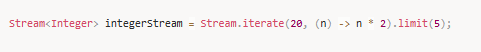

**Önemli Noktalar:**
- **TreeMap** anahtarları **sıralar** (doğal sıralama veya Comparator ile).
- **Null anahtarına** izin vermez, ancak null değerler olabilir.

---

## **3. LinkedHashMap**

LinkedHashMap, HashMap'in bir alt sınıfıdır ancak eklenme sırasını korur.  
Sıra, elemanların eklenme sırasına göre belirlenir.  
Null anahtar ve değer kullanımına izin verir.

📌 Örnek: LinkedHashMap Kullanımı

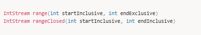

**Önemli Noktalar:**
- LinkedHashMap, eklenme sırasını korur.
- Performansı HashMap'e göre biraz daha düşüktür çünkü sıralama yapılır.

---

## **4. Hashtable**

Hashtable, eski Java sürümlerinde kullanılan, synchronization (eşzamanlılık) desteği olan bir sınıftır.  
Null anahtar ve null değer kullanılamaz.

📌 Örnek: Hashtable Kullanımı

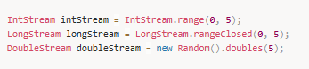

**Önemli Noktalar:**
- Hashtable, eşzamanlılık sağlar, yani çoklu iş parçacıkları (thread) aynı anda güvenli şekilde erişebilir.
- Null anahtar veya null değer kullanılamaz.

---

## **5. ConcurrentHashMap**

ConcurrentHashMap, Hashtable'a benzer şekilde eşzamanlılık (thread-safety) sağlar, ancak daha verimlidir.  
ConcurrentHashMap'te veriler birden fazla iş parçacığı (thread) tarafından güvenli bir şekilde erişilebilir.

📌 Örnek: ConcurrentHashMap Kullanımı

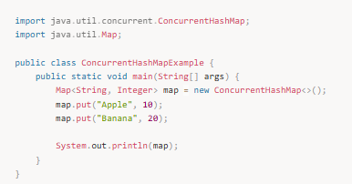

**Önemli Noktalar:**
- ConcurrentHashMap, yüksek eşzamanlı erişim için optimize edilmiştir.
- HashMap gibi çalışır ancak eşzamanlı erişim güvenliği sağlar.

---

## **📌 Map İle İlgili Temel Operasyonlar**

- `put(K key, V value)` → Anahtar-değer çifti ekler.  
- `get(Object key)` → Verilen anahtara karşılık gelen değeri döndürür.  
- `remove(Object key)` → Verilen anahtara karşılık gelen öğeyi kaldırır.  
- `containsKey(Object key)` → Anahtarın varlığını kontrol eder.  
- `containsValue(Object value)` → Değerin varlığını kontrol eder.  
- `size()` → Haritadaki öğe sayısını döndürür.  
- `clear()` → Tüm öğeleri siler.  
- `keySet()` → Tüm anahtarları döndürür.  
- `values()` → Tüm değerleri döndürür.

---

Map interface’i key-value çiftlerini tutmaya yarayan sınıfların üretilmesinde kullanılır.

HashMap sınıfı ise kendisine gelen key-value çiftlerden key değerinin hash code’unu hesaplar ve bu hash code’a karşılık gelen indekste key-value çiftini saklar. Çalışma yapısı:

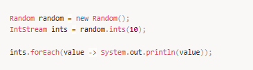

Hash collision durumu:

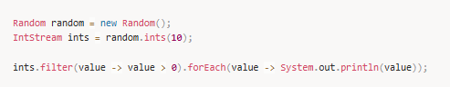

📌 Örnek çıktı:
Ralph Smith: -19.08
Tom Smith: 123.22
John Doe: 3434.34
Tod Hall: 99.22
Jane Baker: 1378.0

John Doe's new balance: 4434.34

TreeMap anahtarları sıralı tutar.  
LinkedHashMap eklenme sırasını korur.

---

## **Collection’dan Stream Yaratma**

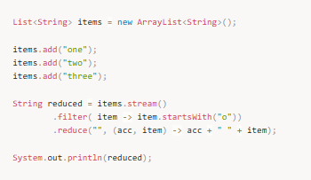

---

## **Comparator Kullanımı ve Sıralama**

Varsayılan sıralama:

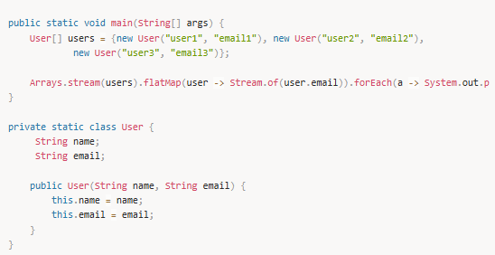

Çıktı:
[Audi, BMW, Mercedes, Skoda, Wolksvagen]

Ters sıralama:

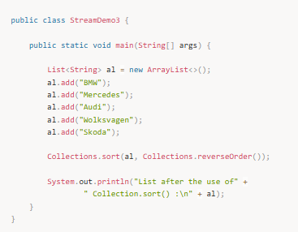

Çıktı:
[Wolksvagen, Skoda, Mercedes, BMW, Audi]

Özel Comparator:

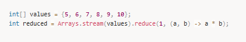

Comparator vs Comparable  
Comparator chain()

---

## **📌 Map Mülakat Soruları ve Cevapları**

### 1️⃣ HashMap ile LinkedHashMap arasındaki farklar nelerdir?
HashMap sırasızdır.  
LinkedHashMap eklenme sırasını korur.

### 2️⃣ TreeMap ve HashMap arasındaki farklar nelerdir?
TreeMap anahtarları sıralar.  
HashMap sırasızdır.

### 3️⃣ ConcurrentHashMap nedir?
Çoklu thread ortamında güvenli ve yüksek performanslı Map implementasyonudur.

### 4️⃣ Null anahtar ve değerler
- HashMap & LinkedHashMap → null kabul eder  
- TreeMap → null key kabul etmez  
- Hashtable → null kabul etmez

---

## **📌 Özet**

- **Map**, anahtar-değer yapısıdır.  
- En yaygın sınıflar: **HashMap, TreeMap, LinkedHashMap, Hashtable, ConcurrentHashMap**  
- Sıralama, eşzamanlılık ve performans ihtiyacına göre doğru Map seçilmelidir.

