# Multithread Programlama

**📌 Multithread Programlama**

**Multithread Nedir?**  
Multithreading, bir uygulamanın aynı anda birden fazla işlem yapabilmesidir. Java'da, multithreading, birden fazla iş parçacığının paralel olarak çalıştırılmasını sağlar. Her iş parçacığı, kendi işlem akışını yürütür, bu da çok daha hızlı ve verimli programlar yazmamıza olanak tanır.

**Multithreading’in temel avantajları:**

- **Verimlilik:** Aynı anda birden fazla işlem yaparak zaman kazanılır.  
- **Yüksek Performans:** CPU'nun daha verimli kullanılması sağlanır.  
- **İşlem Hızı:** Programın hızı artırılır çünkü işlemler paralel bir şekilde çalıştırılır.  

---

## **Java'da Multithreading Yöntemleri**

Java'da çoklu iş parçacığı çalıştırmak için iki ana yöntem vardır:

### 1. **Thread Sınıfını Kullanmak:**
Thread sınıfını genişleterek iş parçacığı oluşturabilirsiniz.

### 2. **Runnable Arayüzünü Kullanmak:**
Runnable arayüzü daha esnek bir yöntemdir. Bu yöntemde, iş parçacığını başlatmak için Thread sınıfı ile kullanılır.

---

## **Thread Sınıfını Kullanarak Multithread Örneği**

---

## **Runnable Arayüzünü Kullanarak Multithread Örneği**

Her iki örnek de aynı iş parçacığını başlatır ve iki iş parçacığının aynı anda çalışmasını sağlar. Ancak Runnable kullanmak daha esnektir çünkü bir sınıf başka bir sınıfı genişletiyorsa, Runnable arayüzünü implement edebilir.

---

## **Thread Pool (İş Parçacığı Havuzu)**

Birçok iş parçacığı yaratmak ve yönetmek maliyetli olabilir. Bunun yerine Thread Pool (iş parçacığı havuzu) kullanarak iş parçacıklarını yeniden kullanabiliriz. Bu, iş parçacıklarının daha verimli kullanılmasını sağlar.

ExecutorService arayüzü, thread pool yönetimi için kullanılır.

**Thread Pool Örneği**

Bu örnekte, ExecutorService kullanarak iş parçacıkları havuzu oluşturulmuş ve iki iş parçacığı başlatılmıştır. İş bitiminde shutdown() metodu çağrılır.

---

## **Thread Senkronizasyonu (Synchronization)**

Birden fazla iş parçacığı aynı kaynağa erişmeye çalıştığında veri tutarsızlıkları oluşabilir. Bunu engellemek için synchronized anahtar kelimesi kullanılır.

**Synchronized Örneği**

Bu örnekte, increment() metodu synchronized olarak işaretlendiği için aynı anda sadece bir iş parçacığı bu metodu çalıştırabilir.

---

## **Deadlock kavramı (Ölü Kilitlenme)**

Deadlock, iki veya daha fazla iş parçacığının birbirlerini beklemesi ve bu yüzden hiçbiri çalışamaması durumudur. Deadlock'ı önlemek için eşzamanlılık yönetimine dikkat etmek gerekir.  

Deadlock kelimesinin Türkçe anlamı çıkmaza girmek demektir ve multithread uygulamalarda birden fazla threadin synchronized objeler üzerinde döngüsel bağımlılığa düşmesi durumudur. Örneğin bir thread bir A objesinin synchronized metodundan başka bir B objesinin synchronized metodunu çağırıyorsa ve aynı zamanda başka bir thread B objesinin bir synchronized metodu içerisinden A objesinin synchronized metodunu çağırıyor ise bu durumda deadlock oluşur. Bu durumda threadler çıkmaz bir yola girmiş olup birbirlerini sonsuza kadar beklerler. Böyle durumlar çok nadir oluştuğundan ve threadlerın aynı CPU cycle ında bu durumu gerçekleştirmesi gerektiğinden bu durumu debug etmek ve test etmek zordur. Ama yine de multithread bir uygulama yazıyorsak synchronized kod içeren sınıfların bağımlılıklarını kontrol etmek gerekir.

**Deadlock Örneği**

Bu örnekte, iş parçacıkları A ve B arasında birbirlerini bekler ve deadlock durumu oluşur.

---

## **Thread yaşam döngüsü**

Bir thread var olmaya başladığı andan itibaren bir durum(state) bilgisine sahip olur. Bu state bilgisi threadin o anki durumuna göre şu değerleri alabilir; NEW, RUNNABLE, BLOCKED, WAITING, TIMED_WAITING ve TERMINATED. State bilgisi değerleri Thread sınıfı içinde tanımlanmıştır.

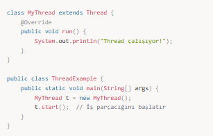

- **NEW:** Bir thread ilk yaratıldığı anda bu state bilgisine sahip olur.  
- **RUNNABLE:** start() metodunu çağırdığımız anda threadin state bilgisi Runnable olarak atanır ve artık thread çalışmaya hazırdır. Fakat biz start() metodunu çağırdığımızda direk çalışmaya başlamaz sadece scheduler (planlayıcı) ın kendisine CPU zamanı vermesini bekler.  
- **BLOCKED:** Bir thread bir input beklerken yada başka bir thread tarafından lock edilmiş bir obje üzerinde çalışmayı beklerken Blocked durumuna geçer.  
- **WAITING:** Bir thread başka bir threadin çalışıp işini bitirmesini bekliyorsa sahip olduğu durumdur.  
- **TIMED_WAITING:** sleep() yada wait() metodlarının timeout bilgisi ile çağırılması sonucu threadin sahip olduğu durumdur.  
- **TERMINATED:** Bir threadin başarıyla yada hata olarak son bulması durumunda sahip olduğu durumdur.  

Bir threadin state bilgisi getState() metodu çağrılarak alınabilir fakat bu state bilgisi threadi kontrol etmek için kullanılamaz, çünkü bir bu değeri okuduktan hemen sonra değer değişebilir. Bu bilgiyi daha çok debug amaçlı kullanmakta fayda var.

---

## **Concurrent API**

Bu kısma kadar Java'da thread yaratma, threadler arası iletişim ve öncelik atama gibi yönetim işlemlerinin nasıl yapıldığını gördük. Bunu yaparken Thread sınıfı ve Runnable interface ini ve Object sınıfının bize sağladığı wait(), notify(), notifyAll() metodlarını kullandık. Bunlar her nekadar kullanışlı araçlar olsa da bazı uygulamalar için gerekli olan üst seviye fonksiyonları sağlamıyorlar. İşte tam da bu ihtiyacı karşılamak için java diline concurrent paketi eklendi. Bu paket içerisinde semaphor, thread pool ve execution manager gibi üst seviye fonksiyonları sağlayan sınıflar yeralmaktadır.

---

## **Senkronizasyon sınıfları**

Thread senkronizasyonu önemli olduğu kadar bazı durumlarda çok karmaşık bir hal alabilmekte. İhtiyaçların çeşitliliği ve senkronizasyon işleminin karmaşıklığı karşısında Java dili concurrent paketi içerisinde çeşitli senkronizasyon araçları sunuyor bize, şimdi bunları tek tek görelim.

---

### **Semaphore**

Semaphore sınıfı ortak kullanılan objeler üzerinde threadlerin sıra ile işlem yapmasına olanak verir. Bu işlemi daha önce de klasik thread ve Object sınıfının fonksiyonları ile de yapmıştık. Fakat Semaphore sınıfı bu işlemi çok daha kolay hale getiriyor.

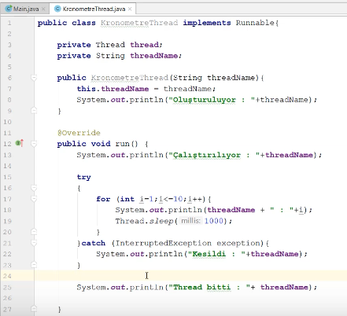

Semaphore sınıfı arka planda bir değişken tutar ve bir thread paylaşılan bir objeye erişmek istediğinde semaphore objesinin acquire() metodunu çağırması gerekir. Semaphore bu durumda eğer kaynak üzerinde çalışan aktif bir thread yoksa erişim isteyen o threade erişim verir ve bu değişkenin değerini artırır. Eğer kaynak üzerinde çalışan başka bir thread varsa bu durumda erişim isteyen thread kaynak müsait oluncaya kadar bloklanır. Daha sonra kaynak üzerinde çalışan thread işini bitirdiği zaman aynı semaphore objesinin release() metodunu çağırır ve kaynağı serbest bırakır. Bu durumda ise semaphore objesinde tutlan değişkenin değeri azaltılır, bu değişkenin değeri 0 olduğu zaman kaynak erişime müsait demektir.

Semaphore sınıfının 2 tane constructoru vardır:

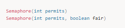

Burada permits parametresi başlangıçta verilecek erişim sayısını ayarlamak için fair parametresi ise true olması durumunda erişim isteyen threadlere erişim isteme sırasına göre erişim verme imkanı sunuyor.

Şimdi Semaphore sınıfının nasıl kullanıldığını görmek için bir örnek yapalım:

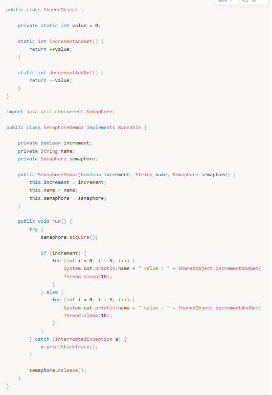 

Çıktı :

Incrementer value : 1  
Incrementer value : 2  
Incrementer value : 3  
Incrementer value : 4  
Incrementer value : 5  
Decrementer value : 4  
Decrementer value : 3  
Decrementer value : 2  
Decrementer value : 1  
Decrementer value : 0

Örnekte iki task ve bir tane de threadler tarafından paylaşılacak task yarattık. Paylaşılan objenin içindeki statik int değişkeninin değerini bir thread ile artırırken diğer thread ile azalttık. Threadlerin aynı anda paylaşılan objeye erişmesini engellemek için ise bir semaphore objesi yarattık ve threadlere haberleşmeleri için verdik. Çıktıda da görüldüğü gibi artırma ve azaltma threadleri semaphor objesi yardımıyla birbirlerini kesmediler.

Bu örnekte semaphor objesini yaratırken constructora ilk erişim sayısını 1 olarak verdiğimize dikkat edelim. Burada arguman olarak 1 değil de 0 verseydik bu durumda iki thread birden birbirini beklemeye başlayacaktı, cünkü semaphoreun permit sayısı 0 olduğu zaman erişim yetkisini vermek için bir threadin release() metodunu çağırmasını gerekir. Eğer erişim sayısını 1den daha büyük bir değer versekdik bu durumda da iki thread birden aynı anda çalışacak ve paylaşılan objeye erişimi istediğimiz gibi engelleyemeyecektik. Bu nedenle semaphore objesini yaratırken bu durumları göz önünde bulundurmak gerekir.

LAB : Semaphore sınıfını kullanarak bir consumer producer patterni implementasyonu yapalım. Bir queue ya 3 farklı producerdan veri yollayalım ve 3 farklı consumerun bu kuyruktan veri okumasını sağlayalım.

---

### **CountDownLatch**

Bazen bir threadin belli sayıda bir event gerçekleşinceye kadar beklemesini isteriz, işte bu durumda CountDownLatch kullanılabilir. CountDownLatch sınıfından objeler yaratmak için aşağıdaki constructor kullanılabilir;

CountDownLatch(int number)

Burada number threadin çalışmaya başlamadan önce bekleyeceği event sayısını belirler, beklenen eventler geldikçe counter sıfıra doğru sayar ve sıfıra ulaşınca bekleyen threadi uyarır. Bekleyen thread CountDownLatch objesi üzerinde await() metodunu çağırmalıdır, eventleri gönderen thread ise aynı CountDownLatch objesi üzerinden countDown() metodunu çağırır.

Şimdi bunları bir örnekle görelim:

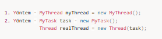  
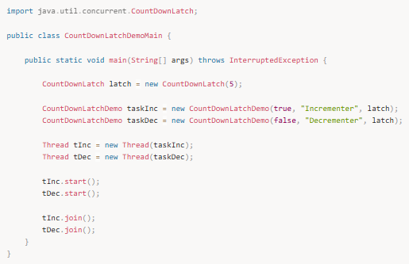

Çıktı :

Incrementer value : 1  
Incrementer value : 2  
Incrementer value : 3  
Incrementer value : 4  
Incrementer value : 5  
Decrementer value : 4  
Decrementer value : 3  
Decrementer value : 2  
Decrementer value : 1  
Decrementer value : 0

Bu örnekte yine bir önceki örnekteki SharedObject sınıfını threadler tarafından paylaşılacak objeyi yaratmak için kullandık. main() metodu içinde 5 tane event bekleyen bir CountDownLatch yarattık. Bu latch objesini sayım yapan threadlerimize verdik ve artırma işleminin önce gerçekleşmesini istediğimiz için decrement işlemi içinde doğrudan latch objesi üzerinden await() metodunu çağırdık. Increment işlemi içerisinde ise her bir adımda latch geri doğru sayması için latch objesi üzerinden countDown() metodunu çağırdık. Burada for döngüleri içindeki counterların latch objesine verilen counter ile aynı olduğuna dikkat edelim. Olurda increment işlemi içindeki for döngüsünün counter değerini latch objesinin counter değerinden daha büyük bir değer ile çalıştırırsak bu durumda; increment işlemi 5 defa çalışacak ve sonra sıra decrement threadine geçecek, sonrasında her iki işlemde de sleep() metodu kullanıldığı için threadler sırayla çalışacak. decrement işlemi bittikten sonra ise increment işlemini yürüten thread kalan işlemlerine devam edecektir.

---

### **CyclicBarrier**

CyclicBarrier belli sayıda threadin istenilen noktaya ulaşıncaya dek ulaşan threadlerin o noktada diğerlerini beklemesi gerektiği durumlarda kullanılır. İstenilen tüm threadlerin herbiri istenilen noktaya ulaşması ile CyclicBarrier objesi üzerinden await() metodunu çağrırarak diğer threadleri beklemeye başlar. CyclicBarrier sınıfının iki constructor u vardır;

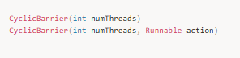

numThreads kaçtane threadin bariyer noktasına ulaşması gerektiğini, action ise bariyer geçildiği anda gerçekleştirilmesi gereken taskı belirtir. Şimdi bütün bunların nasıl kullanıldığı bir örnekle görelim:

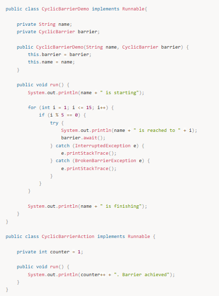 

Çıktı :

T1 is starting  
T1 is reached to 5  
T3 is starting  
T2 is starting  
T3 is reached to 5  
T2 is reached to 5  
1. Barrier achieved  
T2 is reached to 10  
T1 is reached to 10  
T3 is reached to 10  
2. Barrier achieved  
T3 is reached to 15  
T2 is reached to 15  
T1 is reached to 15  
3. Barrier achieved  
T1 is finishing  
T3 is finishing  
T2 is finishing

Bu örnekte 3 tane thread yarattık ve herbirinin 1den 15e kadar saymasını ve 5, 10 ve 15. adımlarda birbirlerini o noktaya kadar beklemelerini istedik. Bu adımlara ulaşan threadler CyclicBarrier objesinin await() metodunu çağırdı ve diğerlerini beklemeye başladı, her bir bariyer aşıldığında da ekrana bir aşılan bariyer sayını bastırdık. Bu örnekte CyclicBarrier objelerinin bariyere ulaşınca tüm threadleri serbest bıraktığını gördük. Bu örnek bize aynı zamanda CyclicBarrier objelerinin tekrar kullanılabilir olduğunu da gösterdi.

---

### **Exchanger**

Exchanger iki thread arasında aynı türden veri değiştirmeye yarar. Burada veri değiştirmek isteyen threadler aynı Exchanger objesinin exchange() metodunu değiştirmek istedikleri veri ile çağırır. Bir thread exchange() metodunu çağırınca diğer thread de aynı metodu çağırana kadar ilk thread bloklanır. İki thread de exchange() metodunu çağırdığı noktaya geldiği zaman veri değişimi gerçekleşir, burada veri değişimi çift yönlüdür. Şimdi Exchanger sınıfının nasıl kullanıldığını bir örnekle görelim:

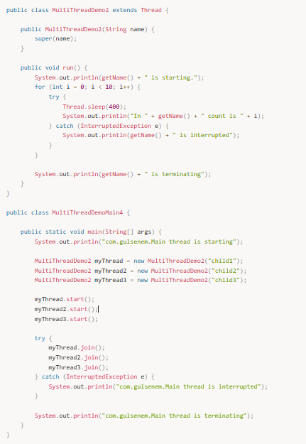
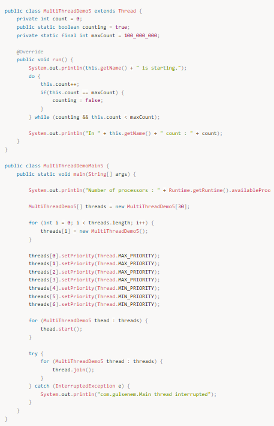

Çıktı :

abc  
def  
ghi

Bu örnekte iki threadin birbirine nasıl veri gönderdiğini gördük. Yarattığımız threadlerden birisi iç içe for döngüleri ile veri üretirken diğer thread o verileri alarak ekrana yazdırdı. Exchanger ile bir nevi producer-consumer konseptini implemente etmiş olduk.

---

### **Phaser**

Phaser son senkronizasyon sınıfımız, bir kaç adımdan oluşan bir fonksiyonumuz olduğunu düşünelim. Örneğin bir e ticaret sitemiz var ve basket dediğimiz satın alınmış ürünlerin eklendiği sonunda da, stok kontrolü, kullanıcı bilgileri kontrolü, ödeme ve satın alma işleminden oluşan bir dizi adımdan oluşan bir süreç. Bu süreci hızlandırmak için satın al butonuna tıklandığı zaman çalışan tüm alt fonksiyonları farklı threadlere vererek süreci hızlandırabiliriz. İşte Phaser tam da bu noktada birden fazla adımdan oluşan süreçleri koordine etmeye yarıyor.

Phaser aslında bir noktada CyclicBarrier a da benziyor. CyclicBarrier ile benzer işlemi döngüler kullanarak yapmıştık fakat bazen ihtiyacımız olan işlem döngülerle yönetemeyeceğimiz bir işlem olabilir. Bu durumda daha doğal ve sade olan Phaser ı kullanmak çok daha kolay ve iyi olacaktır. Ayrıca CyclicBarrier sınıfını kullanırken en başta kaç tane threadin senkronizasyona katılacağını belirtiyoruz fakat Phaser kullanırken thread katılımını dinamik olarak yönetebiliyoruz.

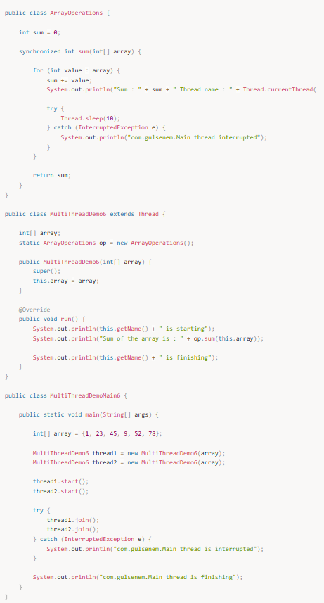  
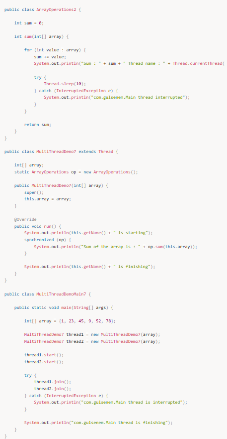

Çıktı :

P1 is starting phase 1  
P3 is starting phase 1  
P2 is starting phase 1  
Phaser completed phase 0  
P2 is starting phase 2  
P1 is starting phase 2  
P3 is starting phase 2  
Phaser completed phase 1  
P3 is starting phase 3  
P2 is starting phase 3  
P1 is starting phase 3  
Phaser completed phase 2  
Phaser terminated

Bu örnekte main thread ile birlikte 3 tane daha thread yarattık ve hepsini oluşturduğumuz phaser objesine register ettik. sonrasında her bir threadin birden çok adımdan oluşan görevleri senkron bir şekilde birlikte yürütmesini sağladık. Her bir threadin bir adımı bitirdiğinde diğer threadleri beklemek için phaser objesi üzerinden arriveAndAwaitAdvance() metodnu çağırdığını gördük. Ayrıca her bir threadin işlemini bitirince phaser objesi üzerinden arriveAndDeregister() metodunu çağırarak phaserdan çıktığını gördük.

Phaser bize thread senkronizasyonunu yönetme konusunda pek çok kullanışlı metod sunuyor; her bir adım tamamlandığında bir işlem yaptırmak istiyorsak onAdvance() metodunu ovveride etmemiz gerek, register olan kaç tane thread var bunu görmek için getRegisteredParties(), şuanda phaserın ulaştığı adıma ulaşan thread sayısını almak için getArrivedParties() metodunu, ulaşamayan thread sayısını almak için getUnarrivedParties() metodunu, phaser belli bir adıma ulaşıncaya kadar beklemek için awaitAdvance() metodunu yada phaser objesini terminate etmeye zorlamak için forceTermination() metodunu kullanabiliriz.

---

## **Executor kullanımı**

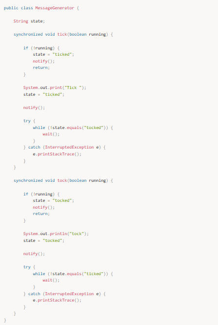

Bu noktaya kadarki tüm örneklerimizde Runnable interfaceini kullanarak tasklarımızı yarattık ve daha sonra bu taskları çalıştırmak üzere thread leri kendimiz manuel olarak yarattık. Bu işlem basit örnekler için yeterli olsa da gerçek hayat uygulamalarında thread yaratmak ve onları yönetmek çok maliyetli bir işlem. İşte bu noktada threadleri yaratmak ve yönetmek için Java programlama dilinin bize sunduğu farklı ihtiyaçlara cevap veren executorları kullanabiliriz.

Executorların en tepesinde yukardaki resimde görüldüğü gibi Executor interface i yer alır. Bu Executor interface execute() isimli bir adet Runnable interfaceinden türetilmiş task alır, başka bir metodu yoktur.

Executor interfaceini extend eden ve threadler üzerinde daha fazla işlem yapmaya yarayan metodlar içeren aynı zamanda threadleri işletip sonuç dönmeye yarayan metodlar da bulunduran ExecutorService interfacei de concurrent paket altında yeralır.

ExecutorService interfaceini extend eden ScheduledExecutorService interfacei ise threadleri schedule etmeye yarayan metodları barındırır.

Bu interfaceleri implemente eden 3 adet sınıf bulunur concurrent API'da; ThreadPoolExecutor, ScheduledThreadPoolExecutor ve ForkJoinPool. ForkJoinPool sınıfı ForkJoin framework tarafından kullanılır ve bu eğitimin konusu değildir.

ThreadPoolExecutor sınıfı dolaylı yoldan ExecutorService interfaceini implemente eder ve threadlerden oluşan bir havuzu yönetmeye yarar. ScheduledThreadPoolExecutor sınıfı ise ThreadPoolExecutor sınıfını extend eder ve üzerine de ScheduledExecutorService interfaceini implemente ederek threadlerden oluşan bir havuzu yönetirken bunun üzerine zamanlama işlevselliğini ekler.

Bir thread pool bir grup taskı her bir task için ayrı thread yaratmadan havuzda var olan threadleri tekrar tekrar kllanarak işletmeye yarar. Bu işlemi yönetmek için bir executor yaratmak gerekir. Yeni executor yaratmak için Java'da Executors isimli utility sınıfının static metodları kullanılabilir, bu metodlar aşağıdaki gibidir:

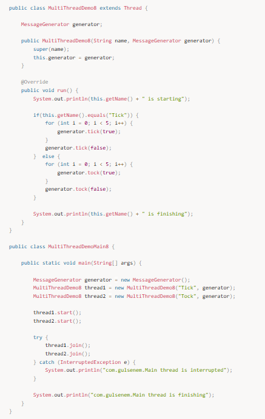

newFixedThreadPool() metodu belli sayıda threadden oluşan ve yeni thread ekleme yapmadan gerektiğinde boş durumdaki threadleri kullanmaya yarayan bir executor yaratır. newCachedThreadPool() metodu ise gerektiğinde havuzdaki boşta olan threadleri kullanmaya yarayan ama boşta thread olmadığında ise havuza yeni thread ekleyen bir executor yaratır. newScheduledThreadPool() ise thread pool mantığını ve threadlerin üzerinde zamanlamayı mümkün kılan bir executor yaratır.

---

## **Callable ve Future kavramları**

Daha önce Runnable interfaceini kullanarak nasıl tasklar yarattığımızı görmüştük. Runnable interfacei içinde void tipinde dönüş değeri olan run() metodu içerisinde çalıştırmak istediğimiz işlemleri yapıp taskın son bulmasını bekliyorduk. Burada run() metodu void tipinde olduğu için bize bir sonuç dönmüyor, işte bu noktada çalıştırdığımız threadlerden sonuç da alabilmek için Callable interfaceini kullanabiliriz. Callable interfacei jeneric bir fonksiyonel interface, içerisinde bulunan call() mettodunun yapısı aşağıdaki gibi:

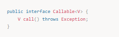

call() metodunu implemente ederek yapmak istediğimiz işlemleri buraya koyabilir sonucunu da dönebiliriz.

Executor service içerisinde Callable tipinde tasklar çalıştırmak için submit() metodu yeralır. Bu metod bir callable taskı alır ve tasktan dönen değeri Future isimli bir objenin içerisine koyarak bize döner. submit() metodunun genel yapısı aşağıdaki gibidir:

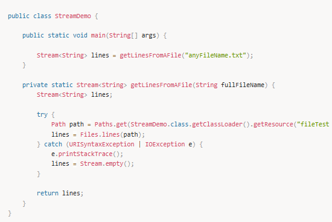

Submit metodunu çağırdığımız zaman bize Future tipinde bir obje dönüyor, bu obje task thread tarafından çalıştırılıp bir sonuç döndüğü zaman bu sonuca erişmemizi sağlar. Bu sonucu alabilmek için Future tipindeki objeden get() metodunu çağırmamız gerekir. Burada get metodunun iki farklı implementasyonu vardır:

V get( ) throws InterruptedException, ExecutionException;  
V get(long wait, TimeUnit tu) throws InterruptedException, ExecutionException, TimeoutException;

Birinci get() metodu herhangi bir bekleme parametresi almadığı için sonucun dönmesini sonsuza kadar bekleyebilirken ikinci implementasyon bir maksimum bekleme parametresi alır. Ve bu bekleme süresi son buluncaya kadar değer dönmesini bekler ve bekleme süresi zaman aşımına uğrarsa bir TimeoutException fırlatılır. Burada önemli olan nokta şudur, bir Future objesi aldığımızda get() metodunu çağırdığımız zaman bu işlemi yaptığımız yani metodu çağıran thread sonuç gelinceye kadar bloklanır.

Şimdi Callable ve Future sınıflarının nasıl kullanıldığına bir örnekle bakalım:

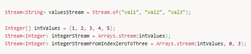

Çıktı :

com.hkarabakla.Main thread gets started  
Future results are being collected  
Factorial of 10 is 3628800  
Sum of 10 is 45  
Future results are collected  
com.gulsenem.Main thread completed

Bu örnekte bir sayının factorial değerini ve birden o sayıya kadar olan sayıların toplamını hesaplayan iki tane Callable taskı yarattık ve bu taskları bir executor service aracılığı ile çalıştırdık. com.hkarabakla.Main threadin future objeleri üzerinden get() metodunu çağırdığında nasıl bloklandığını görmek için ise callable tasklarını çalıştıran threadlerin sleep() metodu yardımıyla 3er saniye uyumasını sağladık. Böylece executor service, callable ve future kavramlarının nasıl kullanıldığını görmüş olduk.

concurrent paketinde başka neler var ?  
concurrent paketi oldukça büyük bir paket ve içerisinde daha kullanabileceğimiz öğrenmemiz gereken pek çok sınıf var; bu anlattıklarımıza ek olarak concurrent collection sınıfları, ForkJoin frameworku ve Lock sınıfları yer alıyor. Bu sınıfların detaylarına ise başka bir eğitimde değineceğiz.

---

## **📌 Mülakat Soruları ve Cevapları**

1️⃣ Multithreading nedir?  
Cevap: Multithreading, bir programın birden fazla iş parçacığını aynı anda çalıştırmasını sağlar. Bu, programın verimliliğini artırır ve paralel işlem yapmayı mümkün kılar.

2️⃣ Java'da thread nasıl başlatılır?  
Cevap: Java'da Thread sınıfını genişleterek veya Runnable arayüzünü implement ederek iş parçacıkları başlatılabilir. start() metodu çağrıldığında iş parçacığı çalışmaya başlar.

3️⃣ Synchronization nedir ve nasıl kullanılır?  
Cevap: Synchronization, bir kaynağa aynı anda birden fazla iş parçacığının erişmesini engeller. Bunun için synchronized anahtar kelimesi kullanılır. synchronized ile işaretlenmiş bir metod veya blok, aynı anda yalnızca bir iş parçacığı tarafından çalıştırılabilir.

4️⃣ Thread Pool nedir ve ne zaman kullanılır?  
Cevap: Thread Pool, iş parçacıklarının oluşturulup yeniden kullanılmasını sağlayan bir yöntemdir. Çoğu zaman iş parçacıklarının yeniden oluşturulmasını engellemek için kullanılır ve verimliliği artırır.

5️⃣ Deadlock nedir ve nasıl önlenir?  
Cevap: Deadlock, iki veya daha fazla iş parçacığının birbirlerini beklemesi ve hiçbirinin çalışamaması durumudur. Deadlock'ı önlemek için iş parçacıkları arasında dikkatli bir şekilde eşzamanlama yapılmalıdır. Ayrıca kaynak erişimi sırasının dikkatlice planlanması gerekir.

---

## **📌 Özet**

- **Multithreading**, aynı anda birden fazla işlem yapabilmeyi sağlar ve büyük veri işleme, paralel işlem gereksinimlerinde çok kullanışlıdır.  
- **Thread** sınıfı ve **Runnable** arayüzü ile iş parçacıkları başlatılabilir.  
- **Synchronization** (eşzamanlama), aynı kaynağa birden fazla iş parçacığının erişmesini engeller.  
- **Thread Pool** kullanarak iş parçacıkları yeniden kullanılabilir ve verimlilik artırılabilir.  
- **Deadlock**, birbirini bekleyen iş parçacıkları arasında meydana gelir ve dikkatlice yönetilmesi gerekir.
