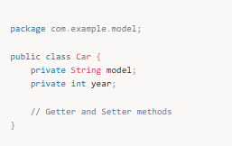
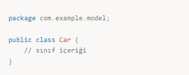

# Packages

Bir konuyla ilgili bir classı aradığımızda hangi pakete gideceğimizi biliriz.

Bir paketi başka bir projede de kullanabiliriz.

Javanın içinde tanımlı paketler vardır - Build in 

örn : java.util.Scanner

Bir paketi kullanmak için import etmem lazım.

import matematik.*;  * koyunca matematik paketindeki her şeyi getir demek oluyor.

**Package (Paket),** bir Java sınıfının gruplandığı bir yapıdır. Paketler, sınıfların ve diğer Java bileşenlerinin düzenlenmesini sağlar ve ad alanı sağlar. Paket kullanmak, organizasyon, yönetilebilirlik ve güvenlik açısından önemli bir rol oynar.

**Java'da iki ana paket türü bulunur:**

**1.Built-in Packages (Yerleşik Paketler):** Java'nın standart kütüphanelerini içeren paketlerdir. Örnek: java.util, java.io, java.lang.
**2.User-defined Packages (Kullanıcı Tanımlı Paketler):** Kullanıcı tarafından oluşturulan paketlerdir.

**Paketlerin Faydaları:**
**İsim Çakışmalarını Önler:** Farklı sınıfların aynı isme sahip olması durumunda paketler, çakışmaları önler.
**Kod Düzenini Sağlar:** Kodun modüler olmasını sağlar ve büyük projelerde sınıfların yönetilmesini kolaylaştırır.
**Erişim Kontrolü:** Paketin sınıfları, diğer paketlerden sınıflara nasıl erişileceğini kontrol etmek için erişim belirleyicileriyle birlikte kullanılabilir.

**Paket Türleri:**
Yerleşik Paketler (Built-in Packages): Java'nın sunduğu paketlerdir. Örneğin:
java.lang → Java'nın temel sınıflarını içerir (örneğin, String, System).
java.util → Koleksiyonlar, zaman, vb. sınıflar içerir (örneğin, ArrayList, HashMap).
java.io → Girdi/çıktı işlemleri ile ilgili sınıflar içerir.
Kullanıcı Tanımlı Paketler: Kullanıcıların oluşturduğu ve projelerinde kullandığı paketlerdir. Örneğin, com.mysite.model, com.myapp.controller.

**📌 Kullanıcı Tanımlı Paket Oluşturma**
**Paket Tanımlama:**
Bir sınıfı bir pakete dahil etmek için, sınıfın en üst kısmına package anahtar kelimesi eklenir.

Paket ile Erişim:
Bir sınıf, kendi paketinden başka bir pakete ait sınıflara erişmek için import anahtar kelimesi kullanır.

# **📌 Paket ve Dosya Sistemi**

- **Paketler, dosya sistemine yansır.** Örneğin, `com.example.model` paketi, dosya sisteminde şu şekilde yer alır:
    
    `com/example/model/Car.java`
    
- **Paket yapısını doğru oluşturmak**, Java sınıflarını düzenli bir şekilde yönetmek için önemlidir.

**📌 Default Package (Varsayılan Paket)**
Eğer bir sınıf hiçbir paket belirtilmeden tanımlanırsa, o sınıf default package içinde yer alır. Ancak, default package genellikle büyük projelerde kullanılmaz, çünkü ad çakışmalarını ve yönetim sorunlarını beraberinde getirebilir.

**📌 Paketler ve Erişim Kontrolü**
Java'da erişim belirleyicileri (access modifiers), bir sınıfın, metodun veya değişkenin hangi paketlerden ve sınıflardan erişilebileceğini kontrol eder:

**public:** Sınıf, metod veya değişken her yerden erişilebilir.
**protected:** Erişim, aynı paket içinden ve türetilmiş sınıflardan yapılabilir.
**private:** Erişim sadece sınıf içinde yapılabilir.
**default (no modifier):** Erişim sadece aynı paket içinden yapılabilir.

**📌 Önemli Noktalar:**
Paketler, Java'nın organizasyon yapısını sağlar ve farklı sınıfları mantıklı bir şekilde gruplamanıza yardımcı olur.
Paketlerin kullanılması, isim çakışmalarını engeller ve güvenlik sağlar.
Java'da import anahtar kelimesi, bir paketten diğerine sınıfları dahil etmek için kullanılır.
Default package kullanmak genellikle önerilmez; büyük projelerde paketler kullanarak düzen sağlanmalıdır.
Erişim belirleyicileri, sınıfların ve metodların erişilebilirliğini kontrol eder.

**📌 Mülakat Soruları ve Cevapları**

1️⃣ Paketler (Packages) nedir?
Paketler, Java sınıflarını mantıklı bir şekilde organize etmek ve sınıfların erişim seviyelerini belirlemek için kullanılır. Paketler, isim çakışmalarını engeller ve kodun düzenli olmasını sağlar.

2️⃣ Kullanıcı Tanımlı Paket oluşturmak için hangi adımlar izlenir?
package anahtar kelimesi ile bir paket tanımlanır.
Sınıf, bu paket içinde yer alacak şekilde tanımlanır.
Diğer sınıflar, import anahtar kelimesi ile bu sınıflara erişir.

3️⃣ Default Package nedir?
Default package, sınıfın herhangi bir paket belirtilmeden tanımlandığı pakettir. Genellikle küçük projelerde kullanılır, ancak büyük projelerde paketler kullanılarak düzen sağlanması önerilir.

4️⃣ Bir sınıf başka bir paketten nasıl erişilir?
Başka bir paketten sınıfa erişebilmek için, import anahtar kelimesi kullanılır.

### **5️⃣ Paketlerin faydaları nelerdir?**

- **Kod düzenini sağlar** ve büyük projelerde sınıfların daha iyi organize edilmesini sağlar.
- **İsim çakışmalarını engeller.**
- **Erişim kontrolü sağlar**, yani hangi sınıfın hangi sınıfa nasıl erişebileceğini belirler.

### **6️⃣ Java'da bir sınıfın hangi erişim belirleyicilerine sahip olabileceği hakkında bir örnek veriniz?**

- **Public**: Her yerden erişilebilir.
- **Private**: Yalnızca sınıf içinden erişilebilir.
- **Protected**: Aynı paket içinden ve türetilmiş sınıflardan erişilebilir.
- **Default**: Aynı paket içinden erişilebilir.

📌 Özet:
Paketler, sınıfları organize etmek ve erişimi kontrol etmek için kullanılır.
Yerleşik paketler ve kullanıcı tanımlı paketler bulunur.
Kullanıcı tanımlı paketler, sınıfları daha düzenli hale getirmek için package anahtar kelimesiyle oluşturulur.
Mülakat soruları genellikle paketlerin nasıl oluşturulacağı, erişim kontrolü ve default package hakkında olur.