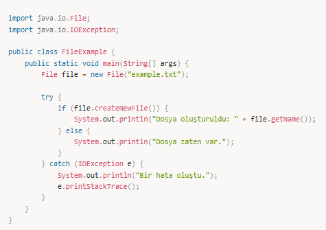
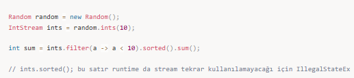
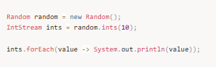
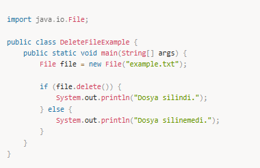
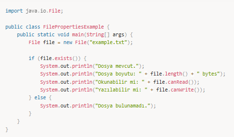
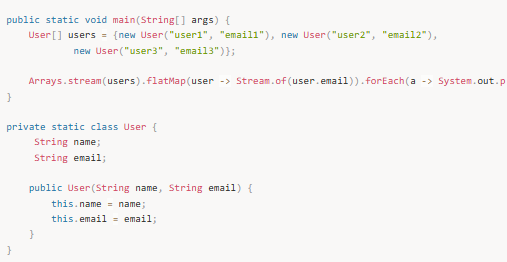
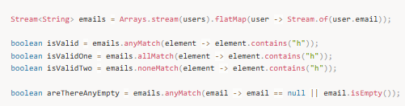
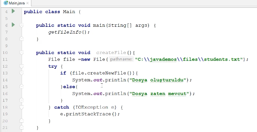

# Stream API

Java 8 versiyonuna eklenen en önemli özelliklerden biri olan **Stream API**, bir grup veri üzerinde **sıralı** ya da **paralel** olarak **fonksiyonel yaklaşımla** işlemler yapmaya yarar. Bu işlemlerin başında **filtreleme**, **veri dönüştürme**, **döngü**, **minimum** ya da **maksimum** değer bulma sayılabilir. Aşağıdaki diagram bir **stream pipeline**’ının nasıl çalıştığını gösteriyor;

---

## Stream yaratma

Stream objesi çok farklı kaynaklar kullanılarak farklı şekillerde yaratılabilir. Şimdi bunları tek tek görelim;

---

### Boş stream yaratma

Boş bir stream objesi yaratmak için `Stream` sınıfının `empty()` metodunu yaratmak yeterlidir. Stream objeleri de diğer objeler gibi metodlar tarafından return edilebilir, eğer böyle stream dönen bir metodumuz varsa ve stream objesi yaratılamıyorsa bu durumda boş stream dönmek faydalı olur.

---

### Bir arrayden stream yaratma

Arraylerden stream yaratmak için Java bize iki tane yöntem sunuyor; birincisi `Stream` sınıfının `of()` metodunu bir array input vererek çağırmak, ikincisi ise `Arrays` utility sınıfının `stream()` metoduna bir array input vererek çağırmak.

---

### Stream.builder() ile stream yaratma

`Stream` sınıfının `builder` metodu bize bir builder objesi döner, bu obje üzerinden elimizde bulunan aynı tipteki verileri tek tek ekleyip daha sonra builder’ın `build` metodunu çağırarak stream objesi yaratabiliriz.

`Stream<String> stringStream = Stream.<String>builder().add("val1").add("val2").add("val3").build();`

Burada builder metodunun hemen önündeki ifadesine dikkat etmek gerekir, builder metodu jenerik bir metod olduğu için özellikle hangi tipte bir stream oluşturacağımızı bu şekilde vermemiz gerekir.

---

### Stream.generate() ile stream yaratma

`Stream` sınıfı altında bulunan `generate()` metodu bir `Supplier` argüman alır ve supplier’ın ürettiği verilerden sonsuz bir stream üretir. Bu sonsuz stream biz bir limit vermediğimiz sürece memory dolana kadar stream objesini doldurur. O nedenle üretilecek streamin boyutunu `limit()` metodu yardımıyla vermek gerekir. Bu yöntem sabit streamler ya da random değerler taşıyan streamler üretmek için oldukça kullanışlıdır.

Bu örnek içinde 10 tane `"java is awesome !"` değeri bulunduran bir stream yaratır.

---

### Stream.iterate() ile stream yaratma

`iterate()` metodu bir ilk değer ve bir adet fonksiyonu parametre olarak kabul eder, daha sonra bu ilk değeri önce streamin ilk elemanı olarak ekleyip sonra bu fonksiyona parametre olarak verir, sonrasında fonksiyondan dönen değeri streame koyar ve tekrar fonksiyonu bu dönen değer ile çağırır. Bu işlemi sonsuz defa yaparak streami doldurur, o nedenle `generate()` metodunda yaptığımız gibi `limit()` fonksiyonu ile streamin boyutunu belirlemek gerekir.

Bu örnek çalıştığı zaman şöyle bir stream oluşturur; `20, 40, 80, 160, 320`

---

### Numeric stream yaratma

Java programlama dilinde sayısal (numeric) streamler yaratmak için üç tane sınıf bulunuyor;

- `IntStream`
- `LongStream`
- `DoubleStream`

Bu sınıfların `range()` ve `rangeClosed()` metodlarını çağırarak sayısal streamler yaratmak mümkün. Bu metodların genel yapısı aşağıda gösterildiği gibidir;

Bu sınıfların dışında `Random` sınıfı içinde de random sayısal streamler yaratmak için `ints()`, `longs()` ve `doubles()` isminde metodlar yer alır.

---

### String stream yaratma

Bir string değeri bir regular expression ile parçalara ayırarak bir string streami yaratabiliriz.

`Stream<String> stringStream = Pattern.compile("|").splitAsStream("name|surname|birthDate|email");`

---

### Collection'lardan stream yaratma

Java dilinde collectionlardan stream yaratma ve collection elemanları üzerinde işlem yapmak mümkündür. Fakat bu konuya collection API'ı anlattığımız zaman değineceğiz.

---

## Stream pipeline

Stream pipeline bir stream üzerinde birden fazla işlem yapmaya yarayan bir metod zinciri gibi düşünebiliriz. Bir stream pipeline üç bileşenden oluşur:

- Streami besleyen **source (kaynak)**
- **Ara işlemler (intermediate operations)**
- **Sonlandırıcı işlem (terminal operation)**

Ara işlemler ile stream üzerinde işlem yaparız ve streame erişmeye devam ederiz, fakat sonlandırıcı işlemler streami sonlandırır ve artık o stream üzerinde bir daha işlem yapılamaz. Bu nedenle bir stream pipeline’da sadece bir tane sonlandırıcı işlem yer alır.

Şimdi bir stream pipeline örneğine bakalım;

Örnekte `Random` sınıfı kullanılarak bir `IntStream` yaratılmış ve bu stream üzerinde önce 10’dan küçük olan değerler filtrelenmiş sonra filtrelenen değerler sıralanmış son olarak da bu değerler toplanmış. `sum()` metodu sonlandırıcı bir işlem olduğu için artık stream erişilemez hale gelmiştir.

---

## Başlıca stream işlemleri

### Döngü

Stream elemanları üzerinde döngü kurmak için `forEach()` metodu kullanılabilir. `forEach` metodu bir `Consumer` alır ve bu metoda vereceğimiz consumer lambda fonksiyonu ile tek tek stream elemanları üzerinde dolaşarak işlem yapabiliriz.

---

### Filtreleme

Stream üzerinde `filter()` metodu çağrılarak filtreleme yapılabilir. `filter()` metodu bir `Predicate` alır ve stream üzerindeki her bir eleman için bu predicate çalıştırılır ve predicate hangi eleman için `true` dönerse o elemanlar filtrelenir.

---

### Mapleme

Stream üzerinde dolaşırken bazen elimizdeki değerleri farklı tipte verilere dönüştürmek ya da tipini değiştirmeden sadece değer üzerinde değişiklik yapmak isteyebiliriz. İşte bu durumda `map()` metodu yardımıyla dönüşüm işlemini yapabiliriz.

Bazı durumlarda da elimizde kendi fieldlarını içeren bir grup obje olabilir ve biz sadece o objelerin bir fieldında bulunan değerlerden bir stream yaratmak isteyebiliriz. İşte bu durumda `flatMap()` metodu kullanılabilir, `flatMap` metoduna verilen fonksiyon bir stream dönmelidir;

---

### Matching

Bazen de elimizde bulunan stream içerisinde belli bir şartı yerine getiren bir eleman var mı yok mu sadece bunu bilmek isteriz. İşte bu durumda matching metodları bu kriteri test etmemize yardımcı olur;

---

### Reduction

Stream sınıfı içinde yer alan `reduce()` metodu stream içinde yer alan bir grup elemandan tek bir değer yaratmaya yarar.

