# Threading

**📌 Java'da Threading (Çoklu İş Parçacığı)**  
Java’da Thread kullanmak, aynı anda birden fazla işlemi (veya iş parçacığını) çalıştırmanızı sağlar. Bu, özellikle yoğun işlem yapan uygulamalar için verimliliği artırabilir.

Java'da threading kullanmanın iki temel yolu vardır:

1. Thread Sınıfını Genişletmek.
2. Runnable Arayüzünü Uygulamak.  
Her iki yöntem de Java'da çoklu iş parçacığı oluşturmanıza olanak tanır.

---

## **1. Thread Sınıfını Genişletmek**

Java'da Thread sınıfını genişleterek çoklu iş parçacıkları oluşturabilirsiniz. Bu yöntemle, `run()` metodunu override ederek işlem yaparsınız.

**Örnek:**

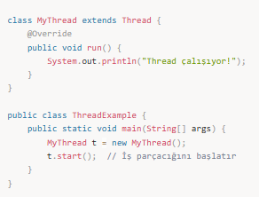

Burada, `MyThread` sınıfı `Thread` sınıfını genişleterek `run()` metodunu override etmiştir. `start()` metodu çağrıldığında, Java bu iş parçacığını çalıştırır.

---

## **2. Runnable Arayüzünü Uygulamak**

Bir başka yöntem ise `Runnable` arayüzünü implement etmektir. Bu yöntem, çoklu iş parçacığı oluşturmak için daha esnek bir yaklaşımdır.

**Örnek:**

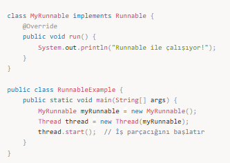

Bu yöntemde, `Runnable` arayüzünü implement eden bir sınıf tanımlarsınız ve sonra bu sınıfı bir `Thread` nesnesiyle başlatırsınız. `run()` metodunda, çalıştırılacak iş parçacığı kodu yer alır.

---

## **Thread Metodları**

Java’da `Thread` sınıfı, iş parçacığı ile ilgili bazı önemli metodları içerir. İşte bunlardan bazıları:

- **start():** Yeni bir iş parçacığı başlatır.
- **run():** İş parçacığının çalışacağı kodu içerir (doğrudan çağrılmaz, `start()` metodu tarafından çağrılır).
- **sleep(long millis):** İş parçacığını belirtilen süre boyunca uyutur. Bu, iş parçacığının geçici olarak durmasını sağlar.
- **join():** Bir iş parçacığının bitmesini bekler.
- **getName():** İş parçacığının adını döndürür.
- **setName(String name):** İş parçacığının adını ayarlayabilirsiniz.

---

## **Thread Synchronization (Eşzamanlama)**

Çoklu iş parçacıkları bir kaynağa aynı anda erişmeye çalıştığında data inconsistency (veri tutarsızlığı) yaşanabilir. Bu durumu önlemek için synchronization (eşzamanlama) kullanılır.

Bir metodun `synchronized` olarak işaretlenmesi, bu metodu sadece bir iş parçacığının aynı anda çalıştırabileceği anlamına gelir.

**Örnek:**

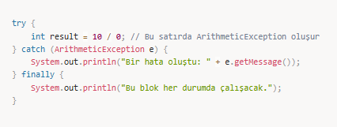

Bu örnekte, `increment()` metodu `synchronized` olarak işaretlendiği için aynı anda sadece bir iş parçacığı bu metodu çalıştırabilir.

---

## **Thread Life Cycle (İş Parçacığı Yaşam Döngüsü)**

Bir iş parçacığı şu durumları geçirebilir:

- **New:** İş parçacığı oluşturuldu, ancak çalıştırılmadı.
- **Runnable:** İş parçacığı çalıştırılabilir durumda.
- **Blocked:** İş parçacığı, bir kaynağa erişim için bekliyor.
- **Waiting:** İş parçacığı başka bir iş parçacığının tamamlanmasını bekliyor.
- **Terminated:** İş parçacığı çalışmasını tamamladı.

---

## **Thread Pool (İş Parçacığı Havuzu)**

Java’da çok sayıda iş parçacığı oluşturmak ve yönetmek pahalı bir işlem olabilir. Bu yüzden Thread Pool kullanarak iş parçacıkları yeniden kullanılabilir.

**Örnek:**

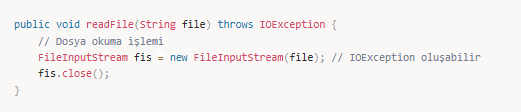

Burada, iş parçacıkları havuzu kullanarak iş parçacıkları oluşturulur ve yönetilir.

---

## **📌 Mülakat Soruları ve Cevapları**

### 1️⃣ Java’da Threading (çoklu iş parçacığı) nedir?
**Cevap:** Threading, bir programın birden fazla iş parçacığı kullanarak aynı anda birden fazla işlem yapabilmesidir. Bu, paralel işlem yaparak uygulamanın verimliliğini artırabilir.

### 2️⃣ Thread ve Runnable arasındaki farklar nelerdir?
**Cevap:** Thread sınıfı genişletilerek bir iş parçacığı oluşturulabilir. Runnable arayüzü ise bir iş parçacığı oluşturmak için implement edilir ve Thread sınıfına parametre olarak geçirilir. Runnable kullanmak daha esnektir çünkü bir sınıf zaten başka bir sınıfı genişletiyor olabilir.

### 3️⃣ Java’da synchronized anahtar kelimesi ne işe yarar?
**Cevap:** `synchronized` anahtar kelimesi, aynı anda sadece bir iş parçacığının bir metodu veya bloğu çalıştırmasına izin verir. Bu, aynı kaynağa erişim sağlayan birden fazla iş parçacığının veri tutarsızlığına yol açmasını engeller.

### 4️⃣ Thread sleep() metodu nedir ve nasıl kullanılır?
**Cevap:** `sleep()` metodu, bir iş parçacığının belirtilen süre kadar uyumasını sağlar. Bu süre boyunca iş parçacığı çalışmaz. Bu metot, zaman uyumsuz işlemler için kullanılır.

### 5️⃣ Threading ile ilgili hangi riskler vardır ve nasıl önlenir?
**Cevap:** Threading ile ilgili başlıca riskler veri tutarsızlığı ve ölümcül kilitlenme (deadlock) gibi sorunlar olabilir. Bu riskler synchronization ve Thread Pool kullanılarak önlenebilir.

---

## **📌 Özet**

**Threading** bir programda aynı anda birden fazla işlem yapabilmeyi sağlar. Bu, özellikle büyük veri işleme ve yoğun işlem gereksinimi olan uygulamalarda önemlidir.

- **Thread** sınıfı veya **Runnable** arayüzü ile iş parçacıkları oluşturulabilir.
- **Synchronization** (eşzamanlama), aynı kaynağa aynı anda erişimi engelleyerek veri tutarsızlıklarını önler.

---

## Singlethread-Multithreading :

*Runnable interface

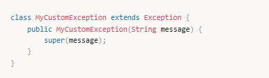
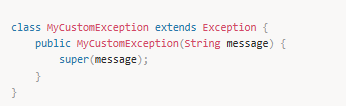 
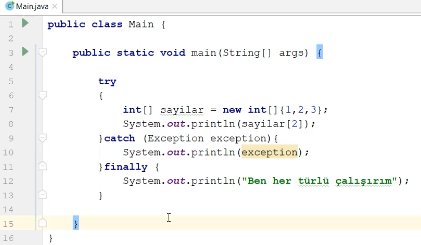

---

## Multithreaded programlama

Pekçoğumuz bilgisayarı açtığımız zaman aynı anda birkaç uygulamayı başlatırız. Öğrneğin kod yazarken bir yandan internette birşeyler arar bir yandan müzik dinler bir yandan da gelen maillerimizi kontrol ederiz. Bütün bunlar aynı anda olur yada bize öyle oluyormuş gibi gelir. İşte bu olaya multitasking denilir, yani eş zamanlı görevler.

Bilgisayarda multi tasking yapmanın iki yolu vardır; process ler aracılığıyla yada threadler aracılığıyla. Process dediğimiz şey işletim sistemi tarafından çalıştırılan her bir uygulamadır, az önce bahsettiğimiz gibi kod yazarken aynı anda müzik dinlemek gibi. Thread ise processler tarafından yaratılan en küçük iş birimidir, aynı process içinde paralel işler yapmaya yarar. Örneğin müzik uygulamanızda bir yandan müzik dinlerken bir yandan da listelerde gezinebilirsiniz.

Multithreading çok daha verimli uygulamalar yazmak için önemlidir. Çünkü gerçek hayatta pek çok uygulama bir iş yaparken ya bir input bekler yada yaptığı bir işin sonucunun dönmesini bekler. Bu durumda CPU idle kalır yani boşta bekler, işte multithreading ile bu idle zamanlar daha verimli hale getirilebilir.

Son yıllarda multicore yani çok çekirdekli CPU teknolojisi oldukça yaygın bir hale geldi. Tek çekirdekli bir CPU kullanan bir sistemde aynı anda çalıştırılan threadler aynı CPU yu paylaşır, her bir thread sırayla CPU dan çalışma zamanı alarak gerçekleştirir bunu. Bu durumda aslında thread ler aynı anda çalışmaz, sırayla çalışır fakat CPU okadar hızlıdır ki bu işler arası geçişte, bu işlem kullanıcıda eş zamanlılık hissi yaratır. Çok çekirdekli CPU bulunduran sistemlerde aynı anda gerçekten iki farklı thread farklı çekirdekler üzerinde çalıştırılarak gerçekten eş zamanlı görevler yaratılabilir. Fakat teoride kod yazarken multithreading denilince tek çekirdekli CPU varmış gibi düşünmek gerekir, bu nedenle multithreading denildiği zaman akla gelmesi gereken ilk konu CPU kullanımı olmalıdır.

---

## Thread sınıfı ve Runnable interface

Her bir process en az bir tane thread içermek zorundadır, bu threade **main thread** denilir. main thread gerekli durumda başka threadleri de yaratabilir.

Java'da multithread kavramı Thread sınıfı ve Runnable interface üzerine kurulmuştur. Yeni bir thread yaratmak ve ona bir görev atamak için bu iki sınıfı kullanabiliriz; birinci yöntemde doğrudan Thread sınıfını extend edip run metodunu override edebiliriz böylece yeni bir thread sınıfı yaratmış oluruz ve onun objelerini yaratarak doğrudan thread yaratmış ve çalıştırmış oluruz. İkinci yöntemde ise Runnable sınıfını implemente eder ve run metodunu override ederek yeni bir task oluştururuz ve bu oluşturduğumuz taskı bir thread objesine verip çalıştırmasını isteriz.

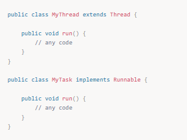

`run()` metodu oluşturacağımız thread çalıştığı zaman çağrılacak olup, bu metodun uygulama içindeki diğer metodlardan hiçbir farkı yoktur. Sadece farklı bir thread tarafından çalıştırılır.

Bu noktaya kadar sadece thread in nasıl çalışacağını tanımlamış olduk, henüz thread i yaratmadık. Thread i yaratmak için aşağıda gösterildiği gibi new ile yeni bir thread objesi yaratmamız gerekir.

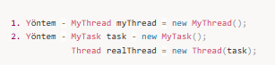

Artık gerçek bir thread objemiz var, fakat bu sadece thread objesinin yaratılma kısmı, bu thread biz `start()` metodunu çağırana kadar çalışmayacaktır. Şimdi bu noktaya kadar gördüklerimizi bir örnekle kod üzerinde inceleyelim.

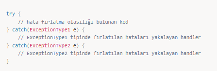

**Output :**

com.gulsenem.Main thread is starting  
.child1 is starting.  
...In child1 count is 0  
....In child1 count is 1  
..com.gulsenem.Main thread is terminating  
In child1 count is 2  
In child1 count is 3  
In child1 count is 4  
In child1 count is 5  
In child1 count is 6  
In child1 count is 7  
In child1 count is 8  
In child1 count is 9  
child1 is terminating  

Örnekte görüldüğü gibi main thread child1 isminde bir task yarattı ve bu taskı yeni yarattığı bir threade verip başlattı. Bu noktadan itibaren iki thread paralel olarak çalıştı ve ekrana çıktı üretti. Bu işlemi yaparken de belli aralıklarla çalışan threadler sleep() metodu çağrılarak durduruldu, bunu işlem akışını yavaş gösterimde daha iyi anlayabilmek için yaptık.

Bir uygulama o uygulama tarafından yaratılan bütün threadler son bulduğunda uygulama da son bulur. Örneğin çıktısına baktığımız zaman main threadin child thread den daha önce sonlandığını görüyoruz. Normalde önerilen main threadin en son bitmesidir fakat threadlerin birbirini nasıl beklediğini ilerleyen konularda göreceğiz.

Bu örnekte MultiThreadDemo1 sınıfının bir name değişkeni tuttuğunu, ve MultiThreadDemo1 sınıfından bir obje oluşturup bu objeyi oluşturacağımız Thread tipinde objeye input olarak verdiğimizi görüyoruz. Bu Runnable interface i kullanarak yaptığımız örnekti, şimdi bir de aynı örneği Thread sınıfını extend ederek ve daha fazla thread yaratarak oluşturalım.

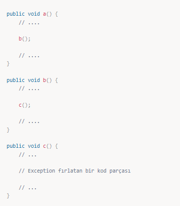

**Output :**

com.gulsenem.Main thread is starting  
.child2 is starting.  
child1 is starting.  
child3 is starting.  
....In child2 count is 0  
In child1 count is 0  
In child3 count is 0  
...In child1 count is 1  
In child2 count is 1  
In child3 count is 1  
..com.gulsenem.Main thread is terminating  
In child3 count is 2  
In child1 count is 2  
In child2 count is 2  
In child3 count is 3  
In child1 count is 3  
In child2 count is 3  
In child3 count is 4  
In child1 count is 4  
In child2 count is 4  
In child3 count is 5  
In child1 count is 5  
In child2 count is 5  
In child3 count is 6  
In child1 count is 6  
In child2 count is 6  
In child3 count is 7  
In child1 count is 7  
In child2 count is 7  
In child3 count is 8  
In child1 count is 8  
In child2 count is 8  
In child3 count is 9  
child3 is terminating  
In child2 count is 9  
child2 is terminating  
In child1 count is 9  
child1 is terminating  

Görüldüğü gibi task yaratmak yerine doğrudan Thread sınıfını extend ettiğimiz için direk start() metodunu çalıştırabiliyoruz, ihtiyaca göre Runnable yada Thread tercih edilebilir. Fakat thread yaratma işleminin task yaratma işlemine göre daha maliyetli olduğunu ve thread objelerinin farklı taskları çalıştırabilecek şekilde tekrar kullanılabilir olduğunu göz önünde bulundurarak gerçek uygulamalarda tasklar yaratıp bu taskları threadlere vermeyi tavsiye ederim. Bunun nasıl yapılacağını ilerleyen konularda göreceğiz.

Burada dikkat edilmesi gereken threadlerin bizim start() metodunu çağırdığımız sırada başlamamış olması, burada yarattığımız threadleri JVM arka tarafta istediği gibi planlayabiliyor. Bu nedenle aynı kodu kendi bilgisayarınızda çalıştırmanız durumunda bilgisayarınızın ve CPUnun durumuna göre farklı sırada çıktılar görmek mümkün.

---

## Bir threadin bitmesini nasıl bekleriz ?

Önceki örneklerde child threadleri yaratan main threadin child threadler işlemini bitirmeden son bulduğunu ve bunun iyi bir pratik olmadığını söylemiştik. Normalde main thread yarattığı tüm threadler çalışmasını bitirene kadar beklemeli sonra kendisi son bulmalıydı. Java dilinde bunu yapmanın üç tane yolu bulunuyor;

Birincisi main threadin uzunca bir süre, child threadlerin çalışma süresini kapsayacak şekilde, sleep() metodu ile uyutulması. Bu yöntem child threadlerin nekadar süre çalışacağını kestiremediğimiz için uyuma süresini belirlemek çok zor olduğundan tercih edilebilecek en kötü yöntem olarak karşımıza çıkıyor.

İkinci yöntem ise her bir threadin `isAlive()` metodunu çağırarak threadlerin çalışma durumunu bir döngü ile takip etmek ve bu süre zarfında main threadi sürekli uyutmak. `isAlive()` metodu söz konusu thread çalıştığı sürece true döner ve thread son bulduğu zaman dönüş değeri false değerini alır. Örneği inceleyelim;

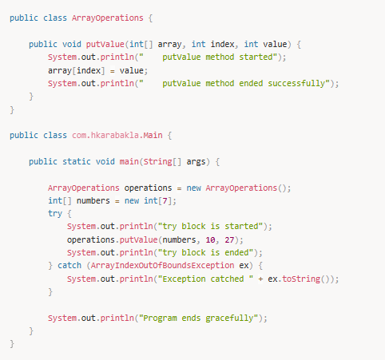

**Output:**

com.gulsenem.Main thread is starting  
.child2 is starting.  
child3 is starting.  
child1 is starting.  
...In child3 count is 0  
In child2 count is 0  
In child1 count is 0  
....In child3 count is 1  
In child2 count is 1  
In child1 count is 1  
....In child2 count is 2  
In child1 count is 2  
In child3 count is 2  
....In child2 count is 3  
In child3 count is 3  
In child1 count is 3  
....In child2 count is 4  
In child3 count is 4  
In child1 count is 4  
....In child2 count is 5  
In child3 count is 5  
In child1 count is 5  
....In child2 count is 6  
In child3 count is 6  
In child1 count is 6  
....In child2 count is 7  
In child3 count is 7  
In child1 count is 7  
....In child2 count is 8  
In child3 count is 8  
In child1 count is 8  
....In child2 count is 9  
In child3 count is 9  
child3 is terminating  
In child1 count is 9  
child1 is terminating  
child2 is terminating  
com.gulsenem.Main thread is terminating  

Örnekte görüldüğü gibi main thread yarattığı child threadlerden sonra son bulmuştur. Bu yöntem ilk yönteme göre daha verimli olsa da yine de zaman yönetimi konusunda en ideal yöntem değildir. Çünkü do-while döngüsü içerisinde main threadi bekletmek ve ilk `isAlive()` kontrolünü yapmak için 100ms bekledik.

Üçüncü ve en verimli yöntem ise `join()` metodunun kullanımıdır. `join()` metodu child threadleri yaratan thread tarafından çağrılır ve isminden de anlaşılacağı gibi child threadlerin işlerini bitirip tekrar main threade katılmalarını söyler. Böylece `sleep()` metodunu kullanmaya gerek kalmaz ve işi biten child thread main threadi bunun hakkında bilgilendirir. Şimdi thread join metodunun nasıl kullanıldığını örnekle görelim;

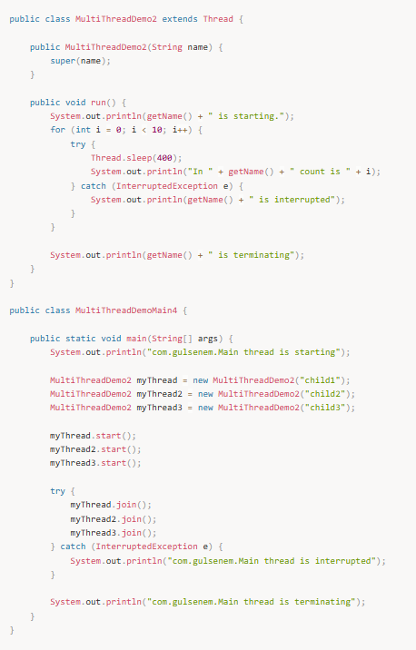

**Output :**

com.gulsenem.Main thread is starting  
child1 is starting.  
child3 is starting.  
child2 is starting.  
In child1 count is 0  
In child2 count is 0  
In child3 count is 0  
In child2 count is 1  
In child1 count is 1  
In child3 count is 1  
In child2 count is 2  
In child1 count is 2  
In child3 count is 2  
In child2 count is 3  
In child1 count is 3  
In child3 count is 3  
In child1 count is 4  
In child3 count is 4  
In child2 count is 4  
In child1 count is 5  
In child3 count is 5  
In child2 count is 5  
In child3 count is 6  
In child1 count is 6  
In child2 count is 6  
In child3 count is 7  
In child2 count is 7  
In child1 count is 7  
In child3 count is 8  
In child1 count is 8  
In child2 count is 8  
In child1 count is 9  
In child2 count is 9  
child2 is terminating  
In child3 count is 9  
child3 is terminating  
child1 is terminating  
com.gulsenem.Main thread is terminating  

Örnekte görüldüğü gibi main thread yarattığı child threadlerden sonra son bulmuştur. Threadler arası iletişim yardımıyla main threadin child threadleri beklemesi sağlanmıştır. Bu yöntem threadler arası etkileşimi tetiklediği için herhangi bir noktada sleep metodunu çağırmaya gerek yoktur ve işi biten thread doğrudan main threadi çağırdığından zaman kayıpları yaşanmaz.

---

## Thread önceliklendirme

Çok threadli bir uygulamada threadlerin CPU zamanını paylaşarak çalıştığından bahsetmiştik. Hangi threadin ne kadar CPU zamanı, diğer threadlere görece, alacağına threadin öncelik değerine göre karar verilir.

Bir threadin görece olarak daha yüksek önceliğe sahip olması o threadin daha düşük öncelikli bir threade göre daha hızlı yada daha fazla CPU zamanı alarak çalışacağı anlamına gelmez. Çünkü bir threadin ne kadar CPU zamanı alacağını belirlemede öncelik dışında başka faktörler de vardır. Bunlar arasında işletim sisteminin multitaskingi nasıl uyguladığı, öncelikli threadin çeşitli nedenlerle bloklanıp bloklanmadığı sayılabilir.

Her threadin bir öncelik değeri vardır, bu değer 1 ve 10 arasında değişir. Biz bir değer atamazsak yarattığımız thread 5 ortalama öncelik değerine sahip olur. En düşük değer için `MIN_PRIORITY`, en yüksek değer için `MAX_PRIORITY` ve ortalama değer için `NORM_PRIORITY` Thread sınıfı içinde sabit değişken olarak tanımlanmıştır. Bir threadin önceliğini atamak için `setPriority()` metodu, aynı şekilde öncelik değerini okumak için de `getPriority()` metodu kullanılır. Şimdi thread önceliklendirmenin nasıl yapıldığını örnekle görelim;

// TODO bu ornegı bırdaha ıncele statıc kullanmak ne kadar dogru

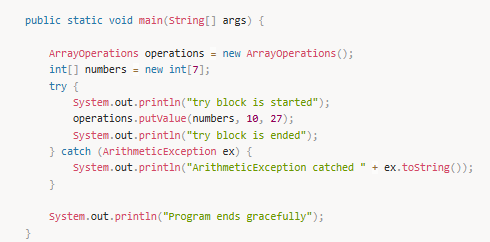

**Output :**

Number of processors : 12  
Thread-1 is starting.  
Thread-0 is starting.  
Thread-2 is starting.  
Thread-3 is starting.  
Thread-4 is starting.  
Thread-5 is starting.  
Thread-6 is starting.  
Thread-7 is starting.  
Thread-8 is starting.  
Thread-9 is starting.  
Thread-10 is starting.  
Thread-11 is starting.  
Thread-12 is starting.  
Thread-13 is starting.  
Thread-14 is starting.  
Thread-15 is starting.  
Thread-16 is starting.  
Thread-17 is starting.  
In Thread-7 count : 100000000  
In Thread-17 count : 1  
In Thread-0 count : 100000000  
In Thread-1 count : 100000000  
In Thread-14 count : 9296  
In Thread-10 count : 74334  
Thread-19 is starting.  
In Thread-19 count : 1  
In Thread-15 count : 6878  
Thread-21 is starting.  
In Thread-21 count : 1  
Thread-22 is starting.  
In Thread-22 count : 1  
In Thread-5 count : 120781  
Thread-23 is starting.  
In Thread-12 count : 100000000  
Thread-24 is starting.  
In Thread-24 count : 1  
In Thread-13 count : 4180  
Thread-25 is starting.  
In Thread-4 count : 100000000  
In Thread-23 count : 1  
In Thread-3 count : 100000000  
Thread-27 is starting.  
Thread-28 is starting.  
Thread-20 is starting.  
Thread-18 is starting.  
In Thread-8 count : 100000000  
In Thread-2 count : 100000000  
In Thread-6 count : 100000000  
In Thread-9 count : 100000000  
In Thread-16 count : 8193  
In Thread-11 count : 100000000  
In Thread-18 count : 1  
In Thread-20 count : 1  
Thread-29 is starting.  
In Thread-29 count : 1  
In Thread-28 count : 1  
In Thread-27 count : 1  
Thread-26 is starting.  
In Thread-25 count : 1  
In Thread-26 count : 1  

Bu örnekte bir thread sınıfı yarattık ve threadin sıfırdan yüz milyona kadar saymasını istedik. main() metodu içerisinde ise 30 tane thread objesi yarattık bu sınıftan. Bu thread objelerinden bazılarına MAX_PRIORITY bazılarına ise MIN_PRIORITY öncelik değerini atadık. Yüz milyona ulaşan threadin diğer threadlerin çalışmasını durdurmak için de thread sınıfına static bir boolean değer koyduk. Yüz milyona ulaşan ilk thread bu boolean değişkenin değerine false atadı ve diğer threadlerin de sayma işlemini sonlandırmasını sağladık. Sonuç olarak da yukarıdaki çıktıyı elde ettek. 12 çekirdeğe sahip bir bilgisayarda çalıştırdığımız bu kod thread öncelik değerinin ne kadar etkili olduğunu bunun yanında maksimum thread önceliğine sahip olmayan başka threadlerin de sayma işlemini aynı zamanda bitirebildiğini gösterdi.

---

## Senkronizasyon

Çok threadli bir uygulama söz konusu olduğu zaman threadlerin aktivitelerini kontrol etmek gerekebilir. Bazı durumlarda iki yada daha fazla thread paylaşılan bir kaynağa aynı anda erişmek ve üzerinde değişiklik yapmak isteyebilir. Örneğin bir threadin bir dosyaya yazma işlemi yaptığı sırada bir başka threadin de aynı işlemi yapmak istemesi gibi. Böyle durumlarda kaynağa ilk ulaşan threadin işini tamamlayıncaya kadar ilgili kaynağın lock dediğimiz kilit mekanizması ile erişime kapatılması daha sonra ise tekrar erişime açılması gerekir. Java programlama dilinde her obje bu lock mekanizması ile koruma altına alınabilir ve bu işlem `synchronized` ifadesi ile sağlanır.

---

## Metodlar ile synchronized kullanımı

`synchronized` ifadesi ile metodlara erişim kontrol altına alınabilir. Bir sınıftaki herhangi bir metod synchronized ifadesini aldığı zaman o metoda bir thread girdiğinde metodun bulunduğu obje otomatikman olarak lock mekanizması ile erişime kapatılır. Bu durumda başka bir thread o sınıf içindeki hiçbir synchronized metoda erişemez. synchronized metod üzerinde işlem yapan thread metoddan çıktığı zaman ise lock kaldırılır ve tüm obje yeniden erişilebilir hale gelir. Şimdi bu işlemin nasıl yapıldığını örnekle görelim;

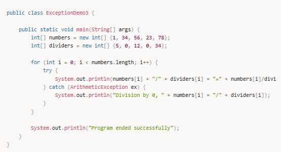

**Output :**

Thread-0 is starting  
Thread-1 is starting  
Sum : 1 Thread name : Thread-0  
Sum : 24 Thread name : Thread-0  
Sum : 69 Thread name : Thread-0  
Sum : 78 Thread name : Thread-0  
Sum : 130 Thread name : Thread-0  
Sum : 208 Thread name : Thread-0  
Sum of the array is : 208  
Sum : 209 Thread name : Thread-1  
Thread-0 is finishing  
Sum : 232 Thread name : Thread-1  
Sum : 277 Thread name : Thread-1  
Sum : 286 Thread name : Thread-1  
Sum : 338 Thread name : Thread-1  
Sum : 416 Thread name : Thread-1  
Sum of the array is : 416  
Thread-1 is finishing  
com.gulsenem.Main thread is finishing  

Örnekte bir int arrayinin tüm elemanlarını toplamak için ArrayOperations sınıfı içerisinde synchronized bir sum() metodu yarattık. Daha sonra bu sınıftan sınıf düzeyinde static bir obje yaratarak oluşturduğumuz thread sınıfından sum() metodunu çağırdık. Burda amaç threadlerin aynı obje üzerinde işlem yapmasını sağlamak. sum() metodu içerisinde de multitaskingi mümkün kılmak için sleep() metodunu bilinçli olarak çağırdık. Son olarak main() metodu içerisinden 2 tane thread yaratarak bu threadlere oluşturduğumuz int arrayini toplamalarını istedik. Bu işlem sonunda yukarıdaki çıktıyı alarak synchronized ifadesinin threadleri nasıl blokladığını gördük.

---

## synchronized blok kullanımı

synchronized ifadesini kontrolü bizde olan metodlara uygulanabilir. Fakat herzaman bu mümkün olmayabilir. Bazı durumlarda kontrolü bizde olmayan yani başkası tarafından yazılmış metodları synchronized olarak çağırmamız gerekebilir. Böyle durumlarda synchronized blok yardımımıza yetişiyor. synchronized metod örneğini şimdi bir de synchronized blok ile yapalım;

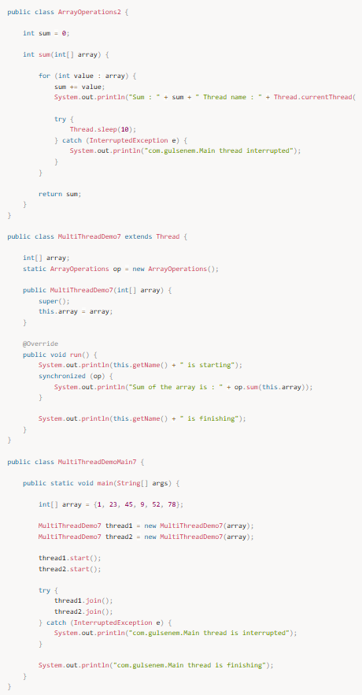

**Output :**

Thread-0 is starting  
Thread-1 is starting  
Sum : 1 Thread name : Thread-0  
Sum : 24 Thread name : Thread-0  
Sum : 69 Thread name : Thread-0  
Sum : 78 Thread name : Thread-0  
Sum : 130 Thread name : Thread-0  
Sum : 208 Thread name : Thread-0  
Sum of the array is : 208  
Thread-0 is finishing  
Sum : 209 Thread name : Thread-1  
Sum : 232 Thread name : Thread-1  
Sum : 277 Thread name : Thread-1  
Sum : 286 Thread name : Thread-1  
Sum : 338 Thread name : Thread-1  
Sum : 416 Thread name : Thread-1  
Sum of the array is : 416  
Thread-1 is finishing  
com.gulsenem.Main thread is finishing  

Çıktıda görüldüğü gibi synchronized blok synchronized metod ile benzer bir davranış sergiledi. sum() metodunda bulunan synchronized ifadesini kaldırıp thread sınıfı içerisinde ArrayOperations2 objesine synchronized blok içerisinden eriştik.

---

## Threadler arası iletişim

Bazı durumlarda birden fazla thread tarafından paylaşılan obje geçici olarak kullanıma uygun olmayabilir. Bu durumda thread objeyi kullanmak yerine wait() metodunu çağırarak kendini beklemeye alır ve diğer threadlerin işlemleri bitirmesi için beklemeye geçer. Bu durumu notify() yada notifyAll() metodlarını çağırarak obje üzerinde işlem yapmak için bekleyen diğer threadlere bildirir. O threadler de işlemlerini bitirince aynı biçimde notify() yada notifyAll() metodlarını çağırarak diğer bekleyen threadleri uyarır. wait(), notify() ve notifyAll() metodları Object sınıfından gelir ve synchronized kapsamı içinden çağrılmalıdır.

Bu durumu basit bir tick tock uygulaması yaparak yakından görelim;

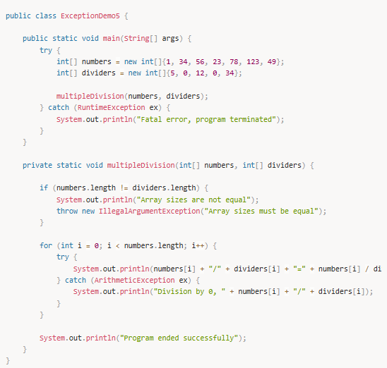 
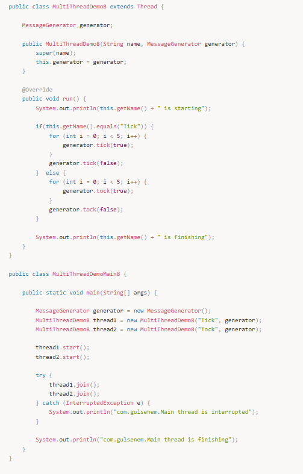

**Output :**

Tick is starting  
Tock is starting  
Tick tock  
Tick tock  
Tick tock  
Tick tock  
Tick tock  
Tick is finishing  
Tock is finishing  
com.gulsenem.Main thread is finishing  

Örnekte görüldüğü gibi iki thread farklı mesajları ekrana bastırmak için ayarlanmıştır ve threadler mesajları yazdırmak için birbirini beklemektedir. İlk thread 'Tick' mesajını yazdırdıktan sonra beklemeye geçer ve topu diğer threade atar. O thread de aynı şekilde 'tock' mesajını yazdıktan sonra beklemeye geçer ve yeni den 'tick' mesajı yazılması için diğer threadi uyarır.
