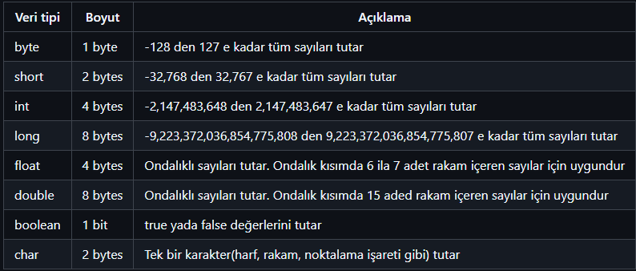
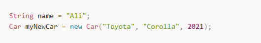
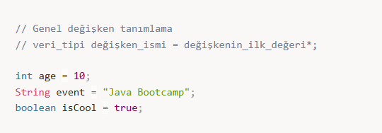
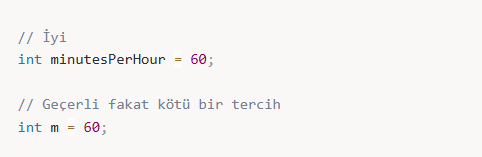
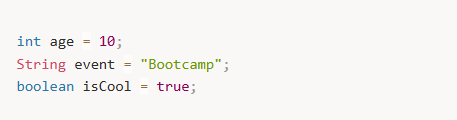
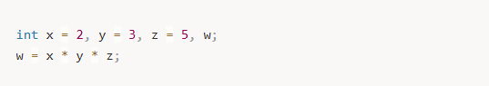
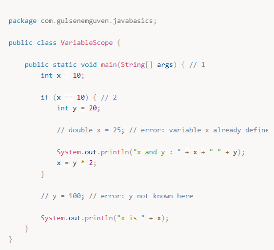

# 📌 Değişkenler ve Veri Tipleri

---

## 🔢 Veri Tipleri

Java **strongly typed** bir dildir.  
Yani bütün işlemler compile zamanında *type checking* dediğimiz veri tipi kontrolü işleminden geçirilir.  
Bu işlem yazılımcının veri tipi uyuşmazlığından kaynaklanan hatalar yapmasına engel olur.

Java’da veri tipleri:

- **Primitive (İlkel)**
- **Non-Primitive (Referans)**

olmak üzere ikiye ayrılır.

---

## 🔹 Primitive (İlkel) Veri Tipleri

Primitive tipler belli bir boyuta sahiptir ve ekstra fonksiyon sunmazlar.

Doğrudan bellekte saklanır.

---

## 🔹 Non-Primitive (Referans) Veri Tipleri

**Non-primitive tipler (ilkel olmayan türler)** aslında **referans tipleridir**.

Sınıf türünden bütün veri tipleri non-primitive (referans tipler) olarak adlandırılır.

Bellekte adres tutar.

---

## ⚖️ Primitive Tipler ve Non-Primitive Tipler Arasındaki Farklar

- Primitive tipler her zaman bir değere sahip olmak zorundadır bu nedenle default değerleri vardır, non-primitive tipler ise null değer alabilir.
- Non-primitive tipler tuttukları değer üzerinde işlem yapmaya yarayan metodlar sunabilirler
- Non-primitive tipler primitive tipler kullanılarak elde edilir
- Primitive tipler hafızada stack denilen bir bölgede saklanırken,  
  referans tiplerin referans kısımları stack'de,  
  referansların işaret ettiği gerçek objeler heap denilen özel alanda saklanır.

---

## 🧠 Değişkenler

### 🔸 Değişken Nedir?

Bir değişken, **bellekte veri saklamak için kullanılan bir isimlendirilmiş alan**dır.

Değişkenler verileri uygulamanın çalışma anında uygulama içerisinde depolamaya yarar.  
Her değişkenin bir veri tipi ve ismi olmak zorundadır.

Değişkenler Java programlama dilinde:
- sınıf seviyesinde
- metod seviyesinde  

tanımlanabilir.

---

## 📝 Değişken İsimlerini Belirlerken Uyulması Gereken Kurallar

- Değişken isimleri anlamlı ve değişkenin görevini açıklar nitelikte olmalıdır.
- Sadece harf ile başlayabilir, geri kalan kısmında harf, rakam, alt çizgi (`_`) ve dolar işareti (`$`) bulundurabilir.
- Küçük harfle başlamalıdır ve birden fazla kelimeden oluşuyor ise kelimeler arasında boşluk içeremez.
- `$` ve `_` ile de başlayabilir fakat yaygın olarak tercih edilmez
- Değişken isimleri büyük küçük harfe duyarlıdır.
- `int`, `boolean` gibi Java için rezerve edilmiş anahtar kelimeler değişken ismi olamaz.

---

## 🔁 Değişkenlere Değer Atama

### 🔸 Tanımlama Sırasında Değer Atama

Değişkenin tanımlandığı yerde değer almasıdır.

---

### 🔸 Dinamik Değer Atama

Değişkenin tanımlandığı yerde değer almayıp sadece tanımlanması ile elde edilir.  
Değişkene değer ataması yapılıncaya kadar işlemlerde kullanılamaz, compiler hata verir.

---

## 📦 Değişkenlerde Scope (Faaliyet Alanı) Kavramı

Java programla dilinde açılan her bir kıvırcık parantez (`{`) bir scope açar  
ve değişkenler bu parantezler içinde tanımlanır.

Her bir değişken:
- tanımlandığı scope içerisinde
- tanımlandığı noktadan sonraki alt scope'larda  

geçerlidir.

Bir değişken geçerli olduğu scope dışında kullanılamaz.

---

## 🔍 Kodda Bulunan Scope Türleri

### 🔸 Metod Scope

**Metod Scope (main metodu içinde geçerli değişkenler)**

- `x` (satır 3) → main metodu içinde tanımlandığı için tüm main içinde geçerlidir.

---

### 🔸 Blok Scope

**Blok Scope (if bloğu içinde geçerli değişkenler)**

- **`y` (satır 6)** → `if` bloğunun içinde tanımlandığı için **sadece if bloğu içinde geçerlidir**.
- `if` bloğu dışında `y` kullanılmak istendiğinde **"cannot find symbol" hatası** alınır.
- **Metod içinde tanımlanan değişkenler (x), tüm metotta geçerlidir.**
- **Blok içinde tanımlanan değişkenler (y), sadece o blok içinde geçerlidir.**

---

## 📝 Özet

- **Değişkenler**, verileri saklamak için kullanılır.
- **Primitive tipler** doğrudan bellekte saklanır.
- **Non-primitive tipler** bir referans adresi üzerinden çalışır.
