# 📚 Diziler (Arrays)

---

## 🔢 Array İşlemleri

Array aynı tipten verileri depolamaya yarayan koleksiyonlara denir.  
Genellikle birbiri ile alakalı verileri tutmak için kullanılır.

Java'da arrayler obje tipindedir.  
Arraylerin bize sunduğu en büyük avantajlardan biri de sakladıkları veriler üzerinde kolay işlem yapabilme olanağıdır.

Örneğin:
- Programlama kitaplarının isimlerini saklayıp listeleyebiliriz.
- Bir grup insana ait gelir bilgilerini saklayıp ortalama hesaplayabiliriz.
- Verileri kolayca sıralayabiliriz.

Diziler sabit boyutlu veri yapılarıdır ve elemanlarına **indeks** (0'dan başlayan sayılarla) üzerinden erişilir.

---

## 🧩 Dizi Tanımlama

Bir dizi tanımlarken, dizinin **türünü**, **adını** ve **boyutunu** belirtiriz.  
Boyut, dizide kaç eleman saklanacağını gösterir.

### 🔹 Dizi Türü + Dizi Adı

int[] sayilar; // int türünde bir dizi tanımlandı

---

### 🔹 Dizi Tanımlama ve Başlangıç Değeri Atama

int[] sayilar = new int[5]; // 5 elemanlı int dizisi tanımlandı

---

### 🔹 Dizi Elemanlarına Başlangıç Değeri Atama

int[] sayilar = {1, 2, 3, 4, 5}; // Diziye değerler atanarak tanımlama

---

## 🔍 Dizi Elemanlarına Erişim

Bir dizinin elemanlarına erişmek için dizinin **indeksini** kullanırız.  
Diziler 0'dan başlayan indeks numaralarına sahiptir.

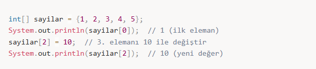

---

## 📏 Dizi Boyutu

Bir dizinin boyutuna (eleman sayısına) erişmek için **length** özelliğini kullanırız.

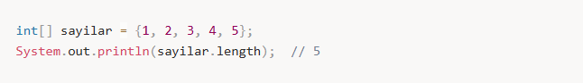

---

## ➖ Bir Boyutlu Arrayler

Bir boyutlu arrayler aynı türden birbiri ile alakalı verileri tutmak için kullanılan diziler olarak düşünülebilir.

type array_name[] = new type[array_capacity];

- `type` : array içinde saklanacak veri tipi  
- `array_name` : array adı  
- `new` : yeni obje yaratma anahtar kelimesi  
- `array_capacity` : arrayin saklayabileceği maksimum eleman sayısı  

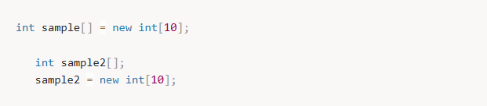

---

Arrayler sakladıkları verileri indeksleri ile birlikte saklarlar.  
Bu nedenle veri eklerken ve okurken indeks kullanılır.

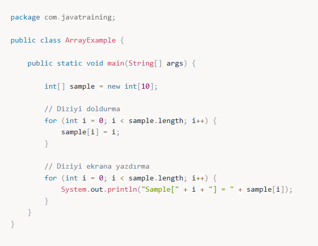

### Output

Sample [0] is 0
Sample [1] is 1
Sample [2] is 2
Sample [3] is 3
Sample [4] is 4
Sample [5] is 5
Sample [6] is 6
Sample [7] is 7
Sample [8] is 8
Sample [9] is 9

---

Tek boyutlu arraylerde ilk değer verme işlemi:

type array_name[] = {value1, value2, value3}

Arraylerde indeks değeri her zaman **0**'dan başlar.  
10 elemanlı bir arrayde en büyük indeks **9** olur.

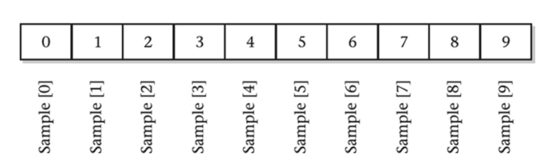
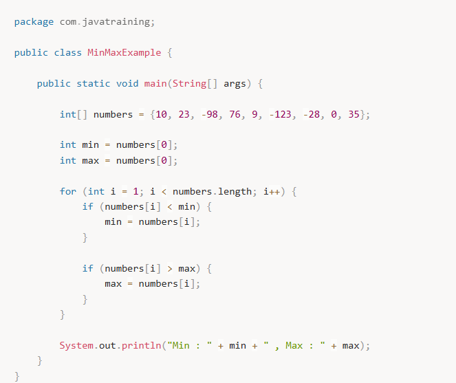

### Output

Min : -123 , Max : 76

Peki kapasitesi 10 olan bir arrayimiz var diyelim,  
**-1. veya 10. indexe erişmeye çalışırsak ne olur?**

---

## 🔄 Array Sıralama (Bubble Sort)

Şu ana kadar öğrendiğimiz bilgilerle arraylerde sıralama yapabiliriz.  
Bunun için küçük arraylerde iyi performans gösteren  
ama büyük arrayler için önerilmeyen **bubble sort** algoritmasını kullanacağız.

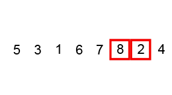
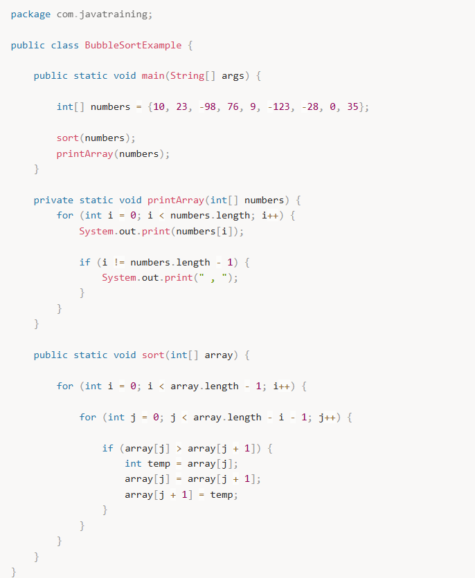

---

## 🧱 Çok Boyutlu Arrayler

Çok boyutlu arraylerin en basit hali **2 boyutlu arraylerdir**.  
2 boyutlu arrayler matris gibi düşünülebilir.

Java'da birden fazla boyutlu diziler (2D, 3D) tanımlanabilir.

---

### 🔹 2 Boyutlu Dizi Tanımlama

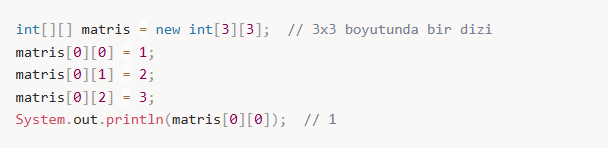

---

### 🔹 Başlangıç Değeri ile 2 Boyutlu Dizi

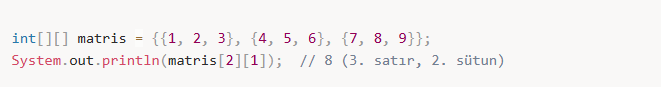
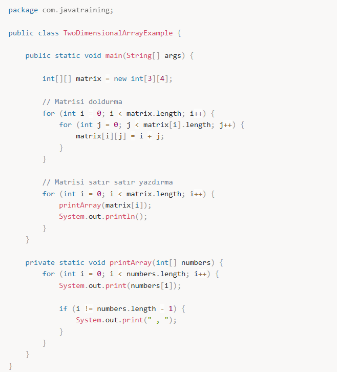

### Output

0 , 1 , 2 , 3
1 , 2 , 3 , 4
2 , 3 , 4 , 5

Tanımlama sırasında değer atama işlemi  
tek boyutlu arraylerdeki gibidir.

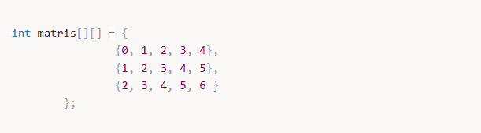

---

### 🔹 Çok Boyutlu Array Genel Formülü

---

## 🔁 foreach Tarzı For Döngüsü

Arrayler üzerinde döngü kurmayı kolaylaştıran özel bir for döngüsüdür.  
Her elemanla işlem yapılacağı zaman kodu sadeleştirir.

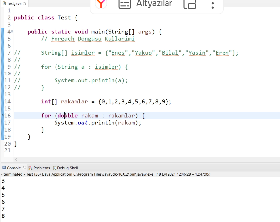

---

### for Döngüsü ile Dizi Elemanlarına Erişim

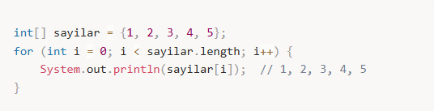
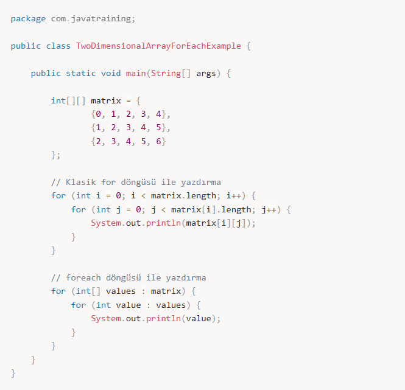

---

### for-each Döngüsü ile Dizi Elemanlarına Erişim

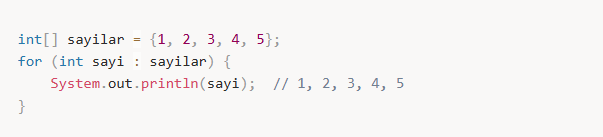

---

Arrayler metodlara parametre olarak gönderilebilir  
ya da bir metoddan çıktı olarak return edilebilir.

---

## 🧰 Dizi Metodları ve Yöntemler

Java'da diziler üzerinde işlem yapmak için bazı yardımcı metodlar kullanılır.

---

### Arrays.toString()

Dizi elemanlarını string formatında yazdırmak için kullanılır.

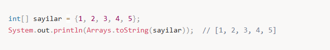

---

### Arrays.sort()

Diziyi sıralamak için kullanılır.

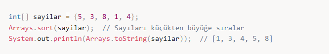

---

### Arrays.fill()

Dizinin tüm elemanlarını belirli bir değerle doldurur.

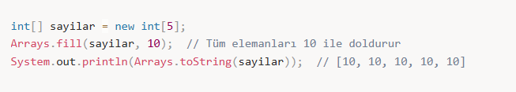

---

## 🧩 Dizi Sınıfları ve Nesneleri

Java'da diziler, Object sınıfından türetilen özel nesnelerdir.

### Dizi Nesnesinin Eşitlik Kontrolü

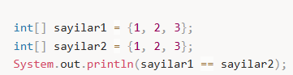

---

## 📝 Özetle Dizilerle Çalışmak

- **Boyutları sabittir:** Sonradan eleman eklenemez veya çıkarılamaz.
- **Hızlı erişim sağlar:** İndeksle doğrudan erişim yapılır.
- **Tek veri türü içerir:** Tüm elemanlar aynı tiptedir.
- **Çok boyutlu olabilir:** Matris ve daha karmaşık yapılar oluşturulabilir.

Java'da diziler, veri kümeleriyle çalışmayı kolaylaştıran,  
hızlı ve esnek bir yapı sunar.
