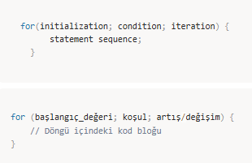

# 🔁 Döngüler

Java'da döngüler tekrarlı işleri gerçekleştirmek için kullanılır.  
Java programlama dilinde belli bir sayıda işlemi gerçekleştirmek için  
ya da belli bir koşul gerçekleştiği sürece çalıştırabileceğimiz döngüler yaratılabilir.

---

## 🔹 For Döngüsü

Bu döngü tipi bir kod bloğunun belli bir sayıda çalıştırılması gerektiği bilindiği durumlarda kullanılır.  
Genellikle bir değişkenin başlangıç değeri, bitiş koşulu ve her iterasyonda nasıl değişeceği belirtilir.  

### Genel Yapı



Initialization ifadesi döngü kontrol değişkeninin tanımlandığı ve ilk değerini aldığı kısımdır.  
Condition ifadesi döngünün hangi şartlar altında devam edeceğinin belirlendiği kısımdır.  
Iteration ifadesi ise döngü kontrol ifadesinin her bir döngü adımında nasıl değişeceğinin belirlendiği kısımdır.


---

### Örnek 


### 📤 Output

```text
0
1
2
3
4

Yukarıdaki örnekte int tipinde i değeri 0 olarak tanımlanmış
ve döngünün i 5den küçük olduğu sürece tekrarlanması istenmiş.
Döngünün her adımı tamamlanınca i değeri 1 artırılmıştır.

---

### Örnek 

 for(int i = 0, j = 10; i < j; i++, j--) {
        System.out.println("i and j :" + i + " " + j);
    }

### 📤 Output

    i and j :0 10
    i and j :1 9
    i and j :2 8
    i and j :3 7
    i and j :4 6

Bu örnekte ise i ve j olmak üzere iki farklı değer kullanılmıştır.
Her döngü adımında i değeri 1 artırılırken j değeri 1 azaltılmış
ve i j'den küçük olduğu sürece döngünün tekrarlanması sağlanmıştır.

---

### Örnek 

  int i = 0;
    for(; i < 5;) {
        System.out.println("i :" + i++);
    }

### 📤 Output

    i :0
    i :1
    i :2
    i :3
    i :4

Bu örnekte ise i değeri döngü dışında tanımlanmış ve döngünün i değeri 5ten küçük olduğu sürece çalışması istenmiş. i değerinin değiştirilmesi işi ise döngü bloğunun içinde yapılmış.

Not : for döngüsünün farklı bir versiyonu olan foreach döngüsüne daha sonra array konusunu işlediğimiz zaman değineceğiz.

##🔹 While Döngüsü

Koşul doğru olduğu sürece döngü çalışmaya devam eder.
Koşul döngü başlamadan önce kontrol edilir.

while döngüsü, döngünün kaç defa işletileceğinin bilinmediği
ama hangi koşul devam ettiği sürece tekrar edeceğinin bilindiği durumlarda kullanılır.

Genel yapısı aşağıdaki gibidir:

while (koşul) {
    // Döngü içindeki kod bloğu
}

Condition ifadesi döngünün hangi şartlar altında devam edeceğine karar verilen kısımdır.
Condition true olduğu sürece döngü tekrar eder.

   int i = 0;
    while (i < 5) {
      System.out.println(i);
      i++;
    }

while döngüsü çalışmaya condition ifadesinin sonucunu kontrol ederek başlar.
Her adımda condition kontrol edilir.
true dönerse döngü içindeki kod çalıştırılır, false dönerse döngü son bulur.

##🔹 Do-While Döngüsü

while döngüsünün özel bir şeklidir.
Önce do bloğu çalıştırılır, ardından while koşulu kontrol edilir.

Bu nedenle do-while döngüsünde döngünün en az bir kere çalışması garantidir.

  int i = 5;
    do {
        System.out.println("Iteration: "+ ++i);
    } while(i < 5);

📤 Output

Iteration: 6

---

⛔ break ve continue İfadeleri

Bazı durumlarda döngünün ne zaman sonlanacağına
döngü içerisinde karar vermek gerekebilir.

🔸 break

break ifadesi döngüyü tamamen sonlandırmaya yarar.

  for (int i = 0; i < 10; i++) {
      if (i == 4) {
        break;
      }
      System.out.println(i);
    }

📤 Output

0
1
2
3

Bu örnekte döngünün normalde 10 adımda sonlanması gerekirken,
i değeri 4 olduğunda break ile döngü sonlandırılmıştır.

   while (true) {
        char ch = (char) System.in.read();
        if (ch == 'q') {
            break;
        }
    
        System.out.println(ch);
    }

break ifadesi for, while ve do-while döngülerinde kullanılabilir.

🔸 continue

Bazı durumlarda döngü adımının pas geçilmesi istenebilir.
continue ifadesi, kendisinden sonra gelen kodu çalıştırmadan
bir sonraki iterasyona geçilmesini sağlar.

for (int i = 0; i < 100; i++) {
        if (i % 10 != 0) {
            continue;
        }
        System.out.println("I : " + i);
    }

Output :

    I : 0
    I : 10
    I : 20
    I : 30
    I : 40
    I : 50
    I : 60
    I : 70
    I : 80
    I : 90

Bu örnekte 0'dan 99'a kadar sayılmış
ve sadece 10’un katları konsola yazdırılmıştır.

---

 🔁 İç İçe Döngüler

Bu bölümde kullanıcıdan alınan yükseklik bilgisine göre
ekrana bir piramid çizdirilmesi beklenmektedir.

Enter the height of pyramid : 
4
   *
  ***
 *****
*******
 *****
  ***
   *

import java.util.Scanner;

public class NestedLoops {

    public static void main(String[] args) {

        Scanner sc = new Scanner(System.in);

        System.out.println("Enter the height of pyramid : ");
        int height = sc.nextInt();

        int stars = 1;

        for (int i = 0; i < height; i++) {
            for (int j = 0; j <  (height * 2 - stars) / 2; j++) {
                System.out.print(" ");
            }

            for (int j = 0; j < stars ; j++) {
                System.out.print("*");
            }

            stars += 2;
            System.out.println();
        }

        stars -= 4;
        for (int i = height - 1; i > 0 ; i--) {

            for (int j = 0; j < (height * 2 - stars) / 2; j++) {
                System.out.print(" ");
            }

            for (int j = 0; j < stars; j++) {
                System.out.print("*");
            }

            stars -= 2;
            System.out.println();
        }
    }
}

##🔹Do-While Döngüsü

do-while döngüsü, while döngüsüne benzer, ancak koşul döngü tamamlandıktan sonra kontrol edilir. Bu yüzden, döngü en az bir kez çalışır.

do {
    // Döngü içindeki kod bloğu
} while (koşul);

int i = 1;
do {
    System.out.println(i);  // 1'den 5'e kadar olan sayıları yazdırır
    i++;
} while (i <= 5);

##🔹 for-each Döngüsü (Enhanced for loop)

Dizi veya koleksiyonlar üzerinde döngü yapmayı kolaylaştıran bir yapıdır.
Özellikle diziler ve koleksiyonlar ile çalışırken kullanılır.

for (eleman_tipi eleman : koleksiyon) {
    // Döngü içindeki kod bloğu
}

int[] sayilar = {1, 2, 3, 4, 5};
for (int sayi : sayilar) {
    System.out.println(sayi);  // Dizideki her bir sayıyı yazdırır
}

 ---

 🧠 Döngü Kontrol Yapıları

Döngüler içinde döngü kontrolünü yönetmek için kullanılan komutlar:

1️⃣ break

Açıklama:
Döngüyü hemen sonlandırmak için kullanılır.

for (int i = 1; i <= 5; i++) {
    if (i == 3) {
        break;  // i 3 olduğunda döngüden çıkılır
    }
    System.out.println(i);  // 1 ve 2'yi yazdırır
}

2️⃣ continue

Açıklama:
Döngüdeki bir iterasyonu atlamak için kullanılır.

for (int i = 1; i <= 5; i++) {
    if (i == 3) {
        continue;  // i 3 olduğunda bu iterasyonu atlar
    }
    System.out.println(i);  // 1, 2, 4, 5'i yazdırır
}

---

## 📝 Özetle Döngülerin Kullanımı

for döngüsü: Belirli sayıda iterasyon gerektiren durumlar için kullanılır.

while döngüsü: Koşul doğru olduğu sürece çalışır, başta kontrol edilir.

do-while döngüsü: Koşul sonda kontrol edilir, en az bir kez çalışır.

for-each döngüsü: Dizi veya koleksiyonlar üzerinde iterasyon yapmak için kullanılır.

Bu döngüler Java'da tekrar eden işlemleri
etkili bir şekilde yapmak için temel araçlardır.