# 🛠️ Geliştirme Ortamı

---

## ☕ Java Nedir?

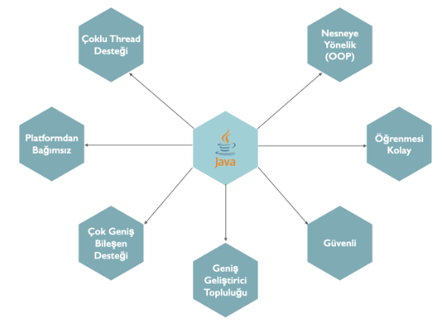

- Javanın başarısının arkasında yatan sihir Bytecode. Java kaynak kodları doğrudan CPU üzerinde çalıştırılmaz. Kaynak Kodlar önce bytecode'a çevrilir daha sonra bu bytecode Java Virtual Machine(JVM) dediğimiz sistem tarafından yorumlanır. Bu bytecode dönüşümü ve JVM mantığı Javaya platform bağımsızlık ve güvenlik özelliklerini kazandırmıştır.
- Diğer bir güçlü özelliği de nesne tabanlı olmasıdır. Bu özellik sayesinde gerçek dünyayı sanal ortamda modellemek son derece kolay bir hal almıştır. Gerçek dünyaya yakın olması sayesinde Java programlama dili en kolay öğrenilebilen dillerden birisi olmuştur.

---

## 🔢 Java Sürümleri ve Sürümler Arası Farklılıklar

Java 8, **Lambda ve Stream API** ile büyük bir değişim getirirken, Java 9 **modüler sistem (Jigsaw)** ekledi. Java 10, **`var` anahtar kelimesi** ile dinamik tip tanımlamayı sağladı. Java 11, **HTTP Client API** ve uzun vadeli destek (LTS) sunarken, Java 14 **Records** ve **Pattern Matching** ile kod yazmayı kolaylaştırdı. Java 17, **LTS desteğiyle** stabiliteyi artırırken, Java 19 ve 21 **Virtual Threads ve String Templates** gibi performans iyileştirmeleri getirdi. **Java 8’den sonra modüler sistem, `var`, HTTP Client API, Records ve Virtual Threads gibi özellikler eklendi, ancak bazı eski API’ler kaldırıldı ve JavaFX ayrıldı.**

---

### 1️⃣ Java SE 6 (2006)

**Öne Çıkan Özellikler:**
- @Override anotasyonunun genişletilmesi  
- Web servis desteği  
- JDBC 4.0  
- Script motoru desteği  

---

### 2️⃣ Java SE 7 (2011)

**Öne Çıkan Özellikler:**
- try-with-resources (otomatik kaynak yönetimi)  
- switch ifadesinde String kullanımı  
- Diamond Operator (`<>`)  
- NIO 2.0 (Dosya işlemleri için geliştirmeler)  

---

### 3️⃣ Java SE 8 (2014) – En Önemli Dönüm Noktası

**Öne Çıkan Özellikler:**
- Lambda ifadeleri (Fonksiyonel programlamaya giriş)  
- Stream API (Veri işlemlerini kolaylaştıran API)  
- default ve static metodları arayüzlere ekleme  
- Yeni java.time API'si (Tarih/Saat işlemleri için)  

---

### 4️⃣ Java SE 9 (2017)

**Öne Çıkan Özellikler:**
- Java Modüler Sistemi (Jigsaw) (Uygulamaların daha küçük parçalara bölünmesini sağlar)  
- var anahtar kelimesi GELMEDİ (yanlış bilinir, Java 10’da geldi)  
- JShell (Java için REPL desteği)  

---

### 5️⃣ Java SE 10 (2018)

**Öne Çıkan Özellikler:**
- var anahtar kelimesi (Yerel değişkenlerde tip belirtmeden kullanım)  
- Çöp toplayıcı geliştirmeleri  

---

### 6️⃣ Java SE 11 (2018) – Uzun Vadeli Destek (LTS)

**Öne Çıkan Özellikler:**
- Yeni HTTP Client API  
- JavaFX’in ayrılması  
- Çalıştırılabilir `.java` dosyaları (java File.java ile doğrudan çalıştırma)  

---

### 7️⃣ Java SE 12 – 17 (2019 – 2021)

**Öne Çıkan Özellikler:**
- Switch ifadelerinde pattern matching (Java 14)  
- Records (Java 14) – DTO yazmayı kolaylaştırır  
- Sealed Classes (Java 15) – Mirası sınırlandırma  
- Java 17 (LTS) – Daha stabil, kurumsal projeler için önerilir  

---

### 8️⃣ Java SE 18 – 21 (2022 – 2023)

**Öne Çıkan Özellikler:**
- Virtual Threads (Java 19) – Yüksek performanslı iş parçacıkları  
- String Templates (Java 21) – Daha kolay string işlemleri  
- Java 21 (LTS) – Güncel uzun vadeli destek sürümü  

---

## 📌 Genel Özet

- Java 8 → Lambda, Stream API  
- Java 9 → Modüler sistem  
- Java 10 → var anahtar kelimesi  
- Java 11 → LTS, HTTP Client API  
- Java 14+ → Record, Pattern Matching  
- Java 17 & 21 → LTS, performans ve güvenlik iyileştirmeleri  

---

## ⚙️ Interpreter – Compiler

**Interpreter (Yorumlayıcı) ve Compiler (Derleyici)**, programlama dillerini makine koduna çeviren iki farklı yaklaşımdır.

- **Compiler (Derleyici):**  
  Kaynak kodunu tamamen makine diline çevirir ve çalıştırılabilir bir dosya üretir.  
  Program çalışmadan önce derleme süreci tamamlanır.  
  **Örnek:** C, C++

- **Interpreter (Yorumlayıcı):**  
  Kaynak kodunu satır satır okuyarak anında çalıştırır.  
  Her çalıştırmada kod tekrar yorumlanır, bu yüzden genellikle daha yavaştır.  
  **Örnek:** Python, JavaScript

---

### Java’nın Çalışma Mantığı

Java önce **Compiler (javac)** ile **Bytecode** üretir,  
sonra **Interpreter (JVM)** bu Bytecode’u satır satır çalıştırır.

Bu yüzden **Java hem derlenen hem yorumlanan bir dildir.**

Java interpreter mıdır compiler mıdır?  
Java hem interpreter hemde compilerdır.

---

## 🧠 JVM

**JVM (Java Virtual Machine - Java Sanal Makinesi):**  
Java kodunu çalıştıran ortamdır. Bytecode’u satır satır yorumlayarak işletim sistemine uygun şekilde çalıştırır.  
JVM, platform bağımsızlığı sağlar.

---

## 🔁 JRE

**JRE (Java Runtime Environment - Java Çalışma Ortamı):**  
JVM’i içerir ve Java programlarının çalışması için gereken kütüphaneleri ve sınıf dosyalarını barındırır.  
JRE, sadece çalıştırma için yeterlidir, geliştirme araçlarını içermez.

---

## 🛠 JDK (Java Development Kit) Nedir?

**JDK (Java Development Kit - Java Geliştirme Kiti):**  
Java uygulamaları geliştirmek için gereken **JRE + Compiler (javac) + Debugger + Geliştirme Araçlarını** içerir.  
Kod yazmak ve derlemek için JDK gereklidir.

JDK, Java dilinde yazdığımız uygulamaları compile etmek ve çalıştırmak için gerekli olan altyapıyı sunar.

JDK bize iki temel program sunar:
- Kodları compile etmek için **javac**
- Compile edilmiş kodları yorumlayan ve uygulamayı çalıştıran **java**

Bu anlamda JDK ekranları olan bir uygulama değildir, sadece komut satırı uygulamaları sunan bir platformdur.  
Bir IDE de değildir, IDE'ler kodları derlemek ve çalıştırmak için JDK'yı kullanır.

---

## 🧩 IDE

Java dilinde uygulama yazmayı kolaylaştıran ve yazılımcının üretkenliğini destekleyen pek çok IDE mevcuttur.

En popüler olanlar:
- Eclipse
- IntelliJ IDEA

IDE sadece kodlamayı kolaylaştırmak ve daha verimli hale getirmek için vardır.  
IDE olmadan da sadece JDK kullanarak geliştirme yapılabilir.

---

## 🔗 JDK – JRE – JVM İlişkisi

**JDK ⊃ JRE ⊃ JVM**

- **JVM:** Sadece çalıştırma  
- **JRE:** Çalıştırma için gerekli kütüphaneler + JVM  
- **JDK:** Geliştirme araçları + JRE  

---

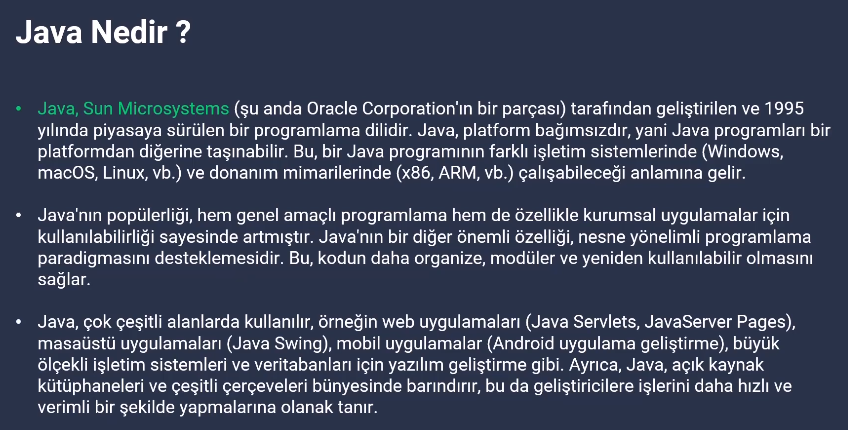
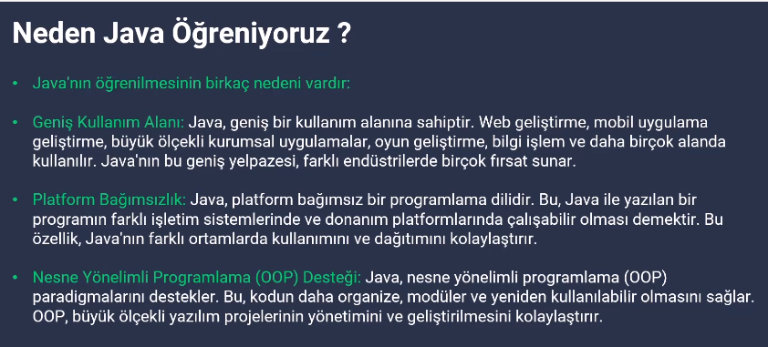
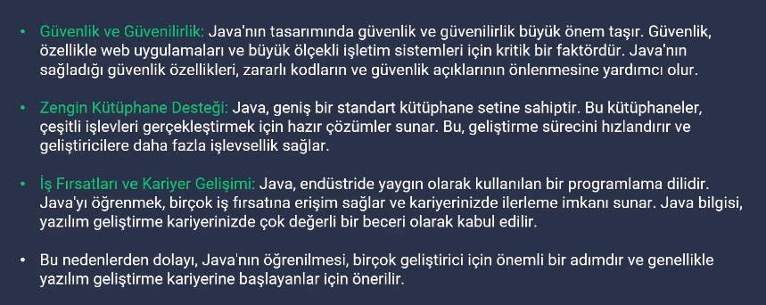
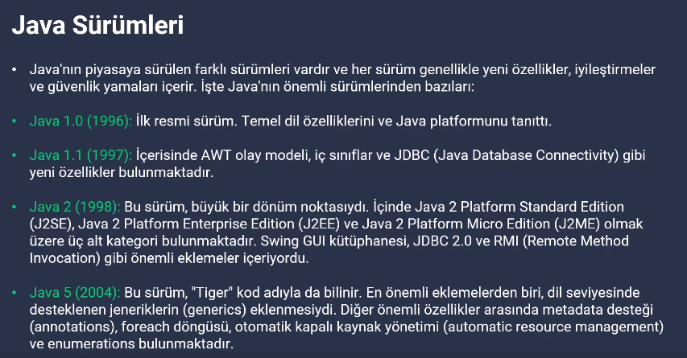
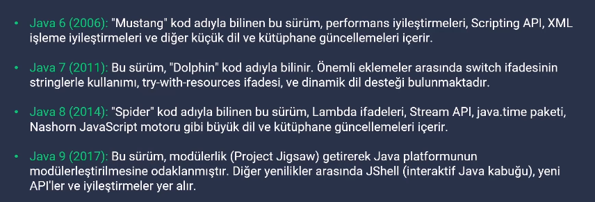
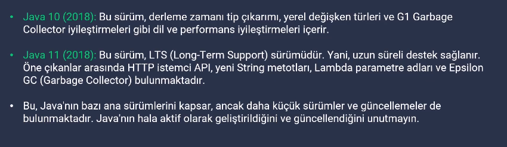
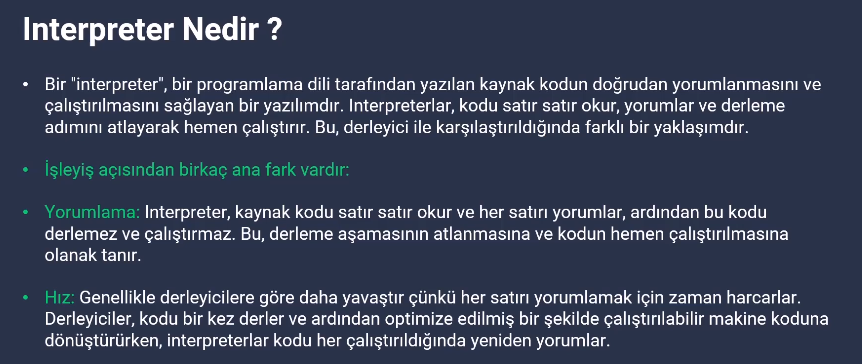
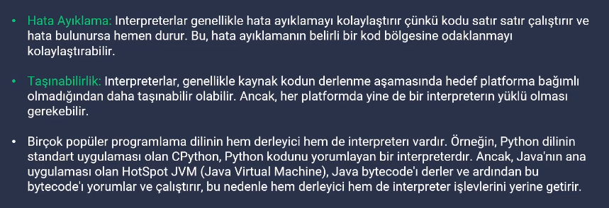
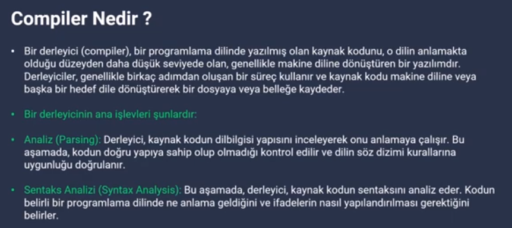
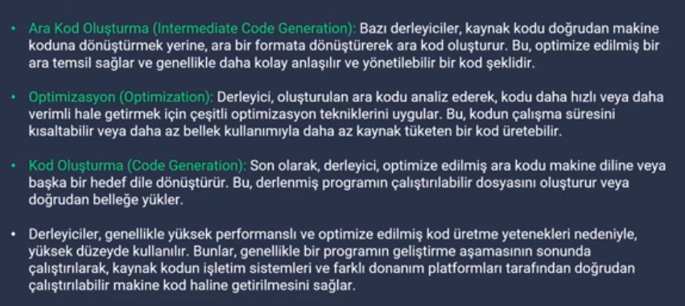
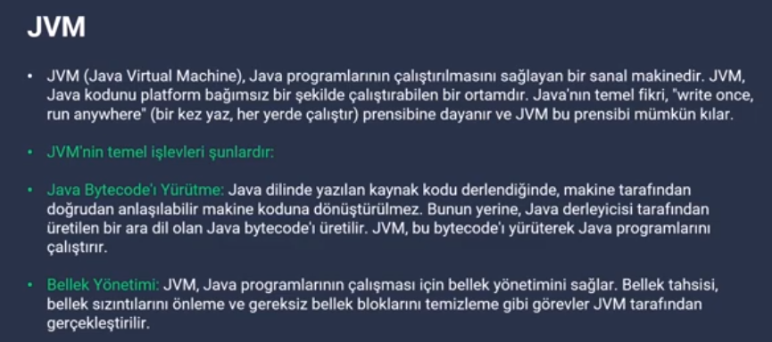
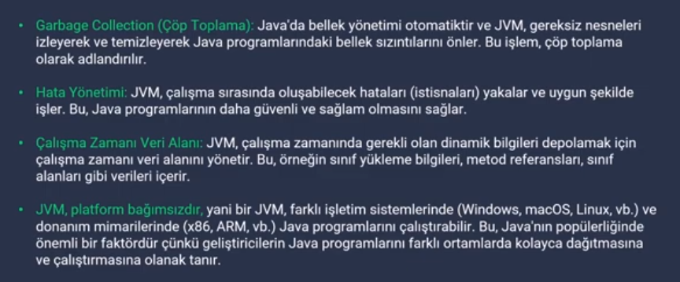
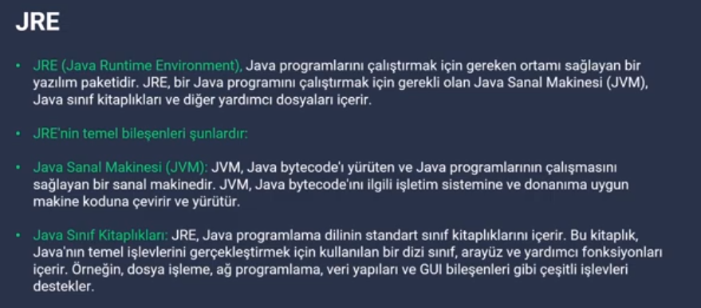
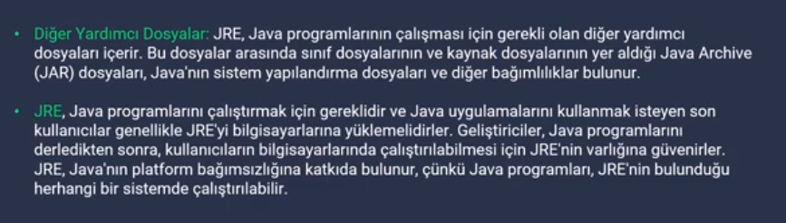
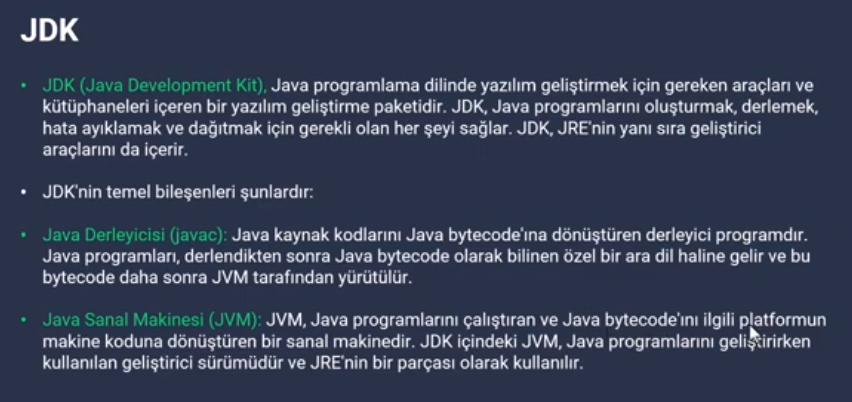
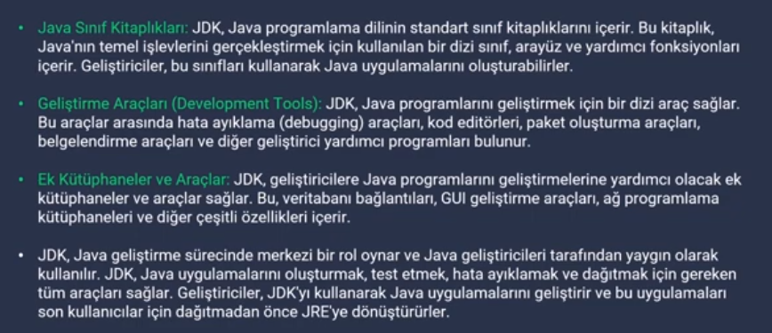
