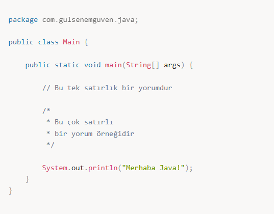
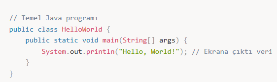
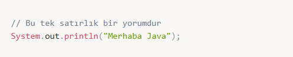
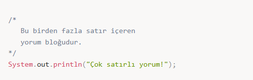
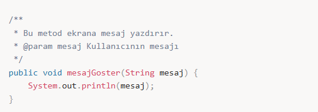

# 👋 Hello World ve Yorum Satırı

---

## ☕ Java ile İlk Program

---

### 📦 package

package :  
Uygulamanın kaynak kodlarını organize etmemize ve sınıflara kimlik kazandırmamıza yarayan dizinler olarak düşünebiliriz

---

### 🧱 class

class :  
Nesne tabanlı bir programlama dili olan Java’da herşey bir class ile ilişkilendirilmek zorundadır.  
Class gerçek dünyayı yazılımda modellememize yarayan en önemli bileşendir.

---

### ⚙️ method

method :  
Bir sınıf içerisinde yer almak zorunda olan metodlar yazılıma davranış kazandırırlar.

---

## 🖥️ Hello World Programı

---

### 🔍 Kod Açıklamaları

- `public class HelloWorld` → Sınıf tanımı  
- `public static void main(String[] args)` → Java’nın başlangıç noktası (main metodu)  
- `System.out.println("Hello, World!");` → Ekrana yazdırma komutu  

---

## 💬 Java Yorum Satırları

Java’da **3 tür yorum satırı** vardır:

---

### 📝 Tek Satır Yorum (`//`)

---

### 📝 Çok Satırlı Yorum (`/* ... */`)

---

### 📝 Javadoc Yorumları (`/** ... */`)

(Java dokümantasyonu için kullanılır)

---

## 📝 Özet

- `//` → Tek satır  
- `/* ... */` → Çok satır  
- `/** ... */` → Javadoc (API dokümantasyonu için)
