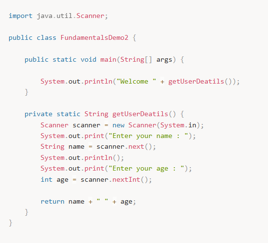

# 🧭 Koşul Yapıları

Karar mekanizmaları ve döngüler uygulama içindeki akışı kontrol etmek için kullanılır.  
Kimi zaman bazı koşullar altında bir kod parçasının çalıştırılmasını isterken, kimi zaman da o koşulun gerçek olmaması durumunda başka kod parçalarının çalıştırılmasını isteriz.  

İşte bu durumda yardımımıza **if**, **if-else** ve **switch** ifadeleri yetişir.

Bazen ise bir kod parçasının defalarca çalıştırılması gerekir, bu durumda ise **for** ve **while** döngü ifadeleri istediğimiz kadar tekrarlı kod çalıştırmamızı sağlar.

---

## 🧾 Konsoldan Scanner Yardımıyla Input Alma

Karar mekanizmaları ve döngü ifadeleri örneklerini zenginleştirmek için konsoldan değer okuma işleminin **Scanner** sınıfı ile nasıl yapıldığına bakalım.



### 📤 Output

```text
Enter your name : Huseyin

Enter your age : 33
Welcome Huseyin 33

Örnekte Scanner sınıfından bir obje yarattık
(Obje ve sınıf kavramlarına daha sonra değineceğiz).

Scanner sınıfına, klavyeden girilen değerleri okuması için
System.in input stream objesini verdik.

scanner.next() → konsoldan girilen kelimeyi okur ve String döner

scanner.nextInt() → girilen sayıyı okur ve int döner

Böylece kullanıcı ile etkileşim kurmuş oluruz.

---

✅ if-else İfadesi

✅ if – else İfadesi

if ifadesi belirli bir koşul altında program akışının hangi yöne devam edeceğini belirler.

Belirtilen şart true ise, if bloğu çalıştırılır

Aksi takdirde, else bloğu çalıştırılır

import java.util.Scanner;

public class FundamentalsDemo3 {

    public static void main(String[] args) {

        Scanner scanner = new Scanner(System.in);
        System.out.print("Enter your age : ");
        int age = scanner.nextInt();
        System.out.println("Your availability for driving licence : " + isEligibleToHaveADrivingLicence(age));
    }

    public static boolean isEligibleToHaveADrivingLicence(int age) {

        if(age < 18) {
            System.out.println("It's too early to drive !!!");
            return false;
        }

        return true;
    }
}

📤 Output

Enter your age : 11
It's too early to drive !!!
Your availability for driving licence : false

---

🔁 else İfadesi

else ifadesi ise if koşulu gerçekleşmemesi durumda,
yani if ifadesi içinde yer alan koşul false dönmesi durumunda,
program akışının gideceği yönü belirlemeye yarar.

import java.util.Scanner;

public class FundamentalsDemo4 {

    public static void main(String[] args) {

        Scanner scanner = new Scanner(System.in);
        System.out.print("What is the time : ");
        int time = scanner.nextInt();

        if (time < 18) {
            System.out.println("Good day.");
        } else {
            System.out.println("Good evening.");
        }
    }
}

📤 Output
What is the time : 19
Good evening.

🔗 if - else if İfadesi

if-else-if ifadesi, if koşulu gerçekleşmediği taktirde
ikinci bir koşulu test etmeye yarar.
Örneğin;

import java.util.Scanner;

public class FundamentalsDemo5 {

    public static void main(String[] args) {

        Scanner scanner = new Scanner(System.in);
        System.out.print("What is the temperature today : ");

        int temperature = scanner.nextInt();

        if (temperature < 20) {
            System.out.println("A little bit cold.");
        } else if (temperature < 25) {
            System.out.println("It's cool.");
        } else {
            System.out.println("It's warm, drink water.");
        }
    }
}

📤 Output

What is the temperature today : 23
It's cool.

İstediğimiz kadar if-else-if ifadesini zincirleme kullanabiliriz,
if-else-if ifadeleri yukarıdan aşağıya doğru teker teker çalıştırılır
ve bize istediğimiz kadar farklı koşulu test etme imkanı sunar.

Fakat if-else-if ifadesi ne kadar çok kullanılırsa kodun okunabilirliği o kadar azalır.

---

🔀 switch İfadesi

Birden fazla koşulu kontrol etmek için kullanılır,
ancak daha fazla alternatif durumu kontrol etmek için switch yapısı kullanılır.

switch ifadenin sonucu birden fazla case ile karşılaştırılır.

break komutu: case bloğundan çıkmak için kullanılır.
Eğer break kullanılmazsa, bir sonraki case bloğu çalışır
(bu duruma fall-through denir).

default: Hiçbir case değeriyle eşleşmeyen durum için kullanılır.

Bir değere bağlı olarak birden fazla koşul ve kod akışı olasılığı söz konusu olduğu durumlarda
switch ifadesi kullanılabilir.

Bu değer byte, short, int, char ya da String tipinde olabilir.
Örneğin;

import java.util.Scanner;

public class FundamentalsDemo6 {

    public static void main(String[] args) {

        Scanner scanner = new Scanner(System.in);
        System.out.print("Enter the number of the day : ");

        int numberOfTheDay = scanner.nextInt();

        System.out.println("Today is " + getDayNameOfWeek(numberOfTheDay));
    }

    public static String getDayNameOfWeek(int dayOfTheWeek) {

        String nameOfTheDay;

        switch (dayOfTheWeek) {
            case 1:
                nameOfTheDay = "Monday";
                break;
            case 2:
                nameOfTheDay = "Tuesday";
                break;
            case 3:
                nameOfTheDay = "Wednesday";
                break;
            case 4:
                nameOfTheDay = "Thursday";
                break;
            case 5:
                nameOfTheDay = "Friday";
                break;
            case 6:
                nameOfTheDay = "Saturday";
                break;
            case 7:
                nameOfTheDay = "Sunday";
                break;
            default:
                nameOfTheDay = "Unknown";
        }

        return nameOfTheDay;
    }
}

📤 Output

Enter the number of the day : 3
Today is Wednesday

switch ile test ettiğimiz değer hiçbir case ifadesi ile eşleşmezse
default ifadesi altında yer alan kod çalıştırılır.

Burada default ifadesi opsiyoneldir,
eğer default olarak çalıştırmak istediğimiz bir kod yoksa
switch ifadesine eklenmeyebilir.

break ifadesi eşleşen case ifadesinin işletilmesinden sonra
switch ifadesinden kod akışının çıkmasını sağlar.

switch ifadesi bizim için birden fazla koşuldan
herhangi birinin gerçekleşmesi durumunda
aynı kod akışının işletilmesine olanak sağlar.

import java.util.Scanner;

public class FundamentalsDemo7 {

    public static void main(String[] args) {

        Scanner scanner = new Scanner(System.in);
        System.out.print("Year : ");

        int year = scanner.nextInt();
        System.out.print("Month : ");

        int month = scanner.nextInt();

        System.out.println("Number of Days = " + getNumberOfDays(year, month));
    }

    public static int getNumberOfDays(int year, int month) {
        int numDays = 0;

        switch (month) {
            case 1: case 3: case 5:
            case 7: case 8: case 10:
            case 12:
                numDays = 31;
                break;
            case 4: case 6:
            case 9: case 11:
                numDays = 30;
                break;
            case 2:
                if (((year % 4 == 0) &&
                        !(year % 100 == 0))
                        || (year % 400 == 0))
                    numDays = 29;
                else
                    numDays = 28;
                break;
            default:
                System.out.println("Invalid month.");
                break;
        }

        return numDays;
    }
}

📤 Output

Year : 2000
Month : 2
Number of Days = 29

Bu örnekte switch ifadesinde test edilen değişkenin hangi case durumu ile eşleştiyse o case'den itibaren altındaki tüm caselerin break ifadesi ile karşılaşıncaya kadar işletildiğine dikkat edelim.

---

❓ Ternary Operator (Koşul Operatörü)

if-else yapısının kısa bir versiyonudur.
Koşul doğruysa bir değer, yanlışsa başka bir değer döndürür.

Kullanım:  sonuç = (koşul) ? değer1 : değer2;

---

📌 Koşul Yapıları ile Önemli Noktalar

Koşul ifadeleri (if, switch) genellikle boolean değer döndüren bir ifadenin sonucuna göre değerlendirilir.

📌 if / else ve switch arasındaki farklar:

if ile daha karmaşık koşul ifadeleri yazılabilirken,
switch yalnızca belirli veri türleri ile
(genellikle int, char, String) çalışabilir.

Daha fazla durum kontrolü:
switch yapısı çok sayıda farklı durumu kontrol etmek için idealdir.
Ancak, if-else daha esnek koşullar sunar.

Koşul yapıları, kodun işleyişini yönlendirmek için temel yapı taşlarıdır
ve çok çeşitli kullanım durumlarında oldukça faydalıdır.