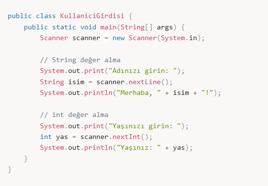

# 🧑‍💻 Kullanıcıdan Değer Alma

---

Kullanıcıdan değer almak için Java'da genellikle **Scanner** sınıfı kullanılır.  
Bu sınıf, kullanıcıdan girdi almayı sağlar.

---

## 📌 Kullanıcıdan Değer Alma Adımları

---

### 🔹 Scanner Sınıfını İçe Aktarma

Scanner sınıfını kullanabilmek için öncelikle import edilmesi gerekir.

```java
import java.util.Scanner;

---


🔹 Scanner Nesnesi Oluşturma

Kullanıcıdan değer almak için bir Scanner nesnesi oluşturulur.

Scanner scanner = new Scanner(System.in);

java.util sınıfındaki scannerı alacağız.

---

🔹 Kullanıcıdan Değer Alma

Scanner sınıfı, farklı veri tiplerini almak için çeşitli metodlara sahiptir:

nextLine() → String veri tipi için

nextInt() → Integer veri tipi için

nextDouble() → Double veri tipi için



---

🔹 Scanner Nesnesini Kapatma

Program sonlandığında Scanner nesnesinin kapatılması önerilir.
Bu, bellek yönetimini iyileştirir.


---

📝 Özet

Kullanıcıdan değer almak için Scanner sınıfı kullanılır.
Bu sınıf, metin, tam sayı ve ondalıklı sayı gibi çeşitli veri türlerini
kullanıcıdan almak için farklı metodlar sağlar.
