# 🧩 Metotlar

---

Metotlar , javada aynı işlemi yapan kod bloklarıdır. Program içerisinde oluşturulan bir kod bloğunun birkaç kez kullanılması gerektiği durumlarda metotlardan faydalanılır. Kod tekrarını önlemeyi ve temiz kod yazmayı sağlar. Bir metot, bir veya birden fazla parametre alabilir, bir değer döndürebilir ya da hiçbir şey döndürmeyebilir. Metotlar, kodun tekrar kullanılabilirliğini ve okunabilirliğini artırır.

---

## ♻️ Dry prensibi:

DRY (Don't Repeat Yourself) prensibi, yazılım geliştirmede tekrarı önlemeyi amaçlayan bir yaklaşımdır. Temel ilke, aynı kod parçasının birden fazla yerde tekrarlanmasının yerine, ortak işlevlerin tek bir yerde tanımlanması ve gerektiğinde o yerden çağrılmasıdır. Bu sayede kodun bakımı kolaylaşır, hataların tekrar etmesi engellenir ve yazılımın genel kalitesi artar.

Özetle: DRY, aynı kodu birden çok kez yazmaktan kaçınıp, her işlevi yalnızca bir kez yazarak kodun daha temiz, sürdürülebilir ve hatasız olmasını sağlar.

---

metot=foksiyon

Aynı class içerisine birden fazla metot tanımlayabiliriz.

Metotlar bize hizmet eden kod bloklarıdır. Bir kere yazarız her yerde kullanabiliriz.

(metotların içine debugger koyarız)

---

## ✅ Metot Tanımlama ve Kullanma

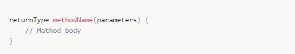

returnType: Metodun döndüreceği veri türü (örn. int, String, void).  
methodName: Metodun adı.  
parameters: Metoda gönderilecek parametreler. Parametreler, veri türü ile birlikte sıralanır.

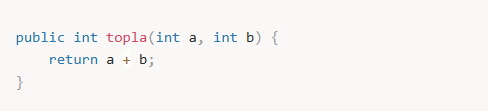

Bu metodun yaptığı şey, iki tamsayıyı toplamak ve sonucu döndürmektir.

Metotlar parametreli ve parametresiz metotlar olarak ikiye ayrılır.

---

## 🚫 Parametresiz ve geriye değer döndürmeyen metot:

Void Metotlar (Döndürülen Değer Olmayan Metotlar)

Bir metodun döndürdüğü değer olmayabilir. Bu tip metotlar `void` ile tanımlanır. Bu metotlar sadece işlem yapar ama bir değer döndürmez.

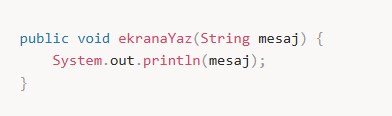

---

## 🧾 Parametreli metot:

Metotlar, dışarıdan parametre alabilir. Bu parametreler, metot çalıştırıldığında metodun içine aktarılır ve metot içindeki işlemlerde kullanılır.

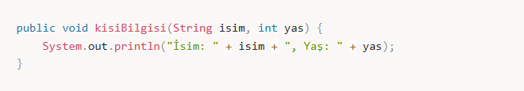

---

## ❓ neden metotları kulanıyoruz?

**dry prensibi :** kendini tekrar etme

fonksiyon yazarak kendizmizi tekrarlamayı engelliyoruz.

**Camel Casing :** Javada metot, fonksiyon isimleri camel case e göre yazılır.

örn: sayiBulmaca

Değişkenler tanımlandığı blokta geçerlidir.

return: Bir değeri döndürmek için kullanılır.

Bir metodu sonlandırmak için kullanılır.(return yazıldığı yerden sonra altındaki hiçbir kod çalışmaz.)

---

## 🔢 Variable Arguments

Variable Arguments (Varargs), Java'da bir metoda değişken sayıda parametre geçirmemizi sağlayan bir özelliktir. Java 5 ile birlikte gelen varargs, aynı türden birden fazla argüman almak için kullanılır ve üç nokta (...) sembolü ile belirtilir.

📌 Varargs Kullanımı  
Sözdizimi:

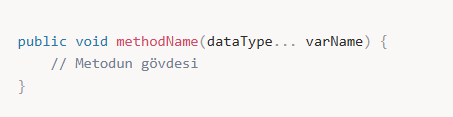

**dataType...** ifadesi, belirtilen veri tipinde sınırsız sayıda argüman alabileceğimizi ifade eder.  
**varName** ise değişken adıdır ve dizi gibi davranır.

📌 Örnek 1: Varargs ile Toplama İşlemi

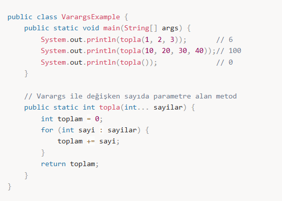

Çıktı:  
6  
100  
0

📌 Özet  
✔ Varargs, bir metoda değişken sayıda parametre göndermeyi sağlar.  
✔ Varargs aslında bir dizi (array) gibi çalışır.  
✔ Sadece bir tane varargs olabilir ve en sonda olmalıdır.  
✔ Karmaşık overload işlemlerini azaltır ve kodu daha esnek hale getirir.

---

## 🧠 Varargs ile Mülakat Soruları

1️⃣ Varargs ile normal parametre arasındaki fark nedir?  
Cevap:

Normal parametreler, belirli bir sayıda argüman alır.  
Varargs, değişken sayıda argüman alabilir.  
Varargs her zaman en sonda olmalıdır.

2️⃣ Varargs nasıl çalışır?  
Cevap:

Varargs aslında bir dizidir (array) ve arka planda Java, varargs'ı bir diziye dönüştürerek işler.  
Örneğin, public void method(int... numbers) çağrıldığında, numbers değişkeni aslında bir int[] dizisidir.

3️⃣ Bir metotta birden fazla Varargs kullanılabilir mi?  
Cevap:

Hayır, bir metodun sadece tek bir varargs parametresi olabilir ve bu parametre en sonda olmalıdır.

---

## 🧩 Metodlar

Daha önce instance değişkenlerini ve bu değişkenlere ilk değerlerini vermek için kullanılan constructor kavramını görmüştük şimdi ise bu değişkenler üzerinde işlem yapmak için kullanılan metod kavramına bakacağız. Metodların genel yapısı aşağıdaki gibidir;

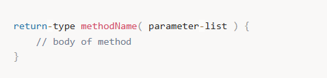

Burada methodName metodun ismini temsil etmektedir ve daha sonra bu metoda erişmek için bu metod ismi kullanılır. parameter-list ise metodun kabul ettiği argüman listesini temsil etmektedir. Son olarak return-type metod işletildiği zaman metodun çağırıldığı yere hangi tipte bir veri döneceğini belirtir. Return tipi bir primitive tip olabileceği gibi bir class da olabilir(yani metod bu class'dan üretilmiş bir obje de dönebilir). Bazı durumlarda bir metod hiçbir değer de dönmeyebilir, yine de bu durumda metodun dönüş tipini özel bir kelime ile belirtmek gerekir; void

Şimdi daha önce yarattığımız Vehicle sınıfına bir metod ekleyelim.

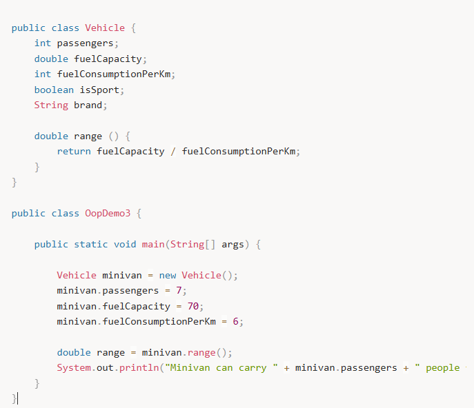

Output :  
Minivan can carry 7 people for 11.666666666666666 km

Burada range() metodunun fuelCapacity ve fuelConsumptionPerKm değerlerine obje ismi kullanmadan eriştiğine dikkat edelim. Ayrıca metoddan çıkmak ve değer dönmek için return ifadesinin kullanıldığını da gözden kaçırmayalım.

Aşağıdaki örnekte return ifadesi ve farklı tipte değer return etme örnekleri verilmiştir;

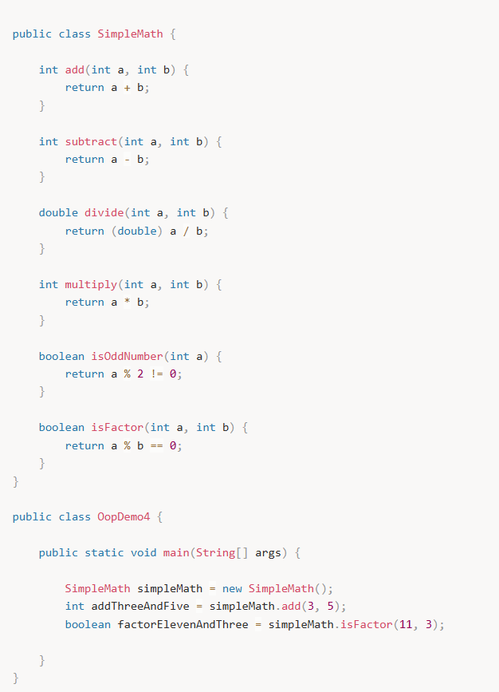

---

## 🧱 Metot Overloading (Aşırı Yükleme)

Java'da aynı isimle birden fazla metot tanımlanabilir, fakat her birinin parametre türü ya da sayısı farklı olmalıdır. Bu özellik metot aşırı yükleme (overloading) olarak bilinir.

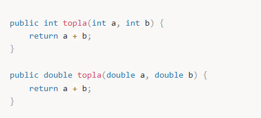

Burada, iki farklı topla metodu vardır. Birisi int türünde, diğeri ise double türünde parametreler alır.

---

## 🧱 Metot Overriding (Aşırı Yazma)

Metot override işlemi, bir alt sınıfın (subclass) üst sınıftan (superclass) devraldığı bir metodu kendi ihtiyacına göre değiştirmesidir. Bu, kalıtım yoluyla yapılır ve genellikle polimorfizm sağlamak için kullanılır.

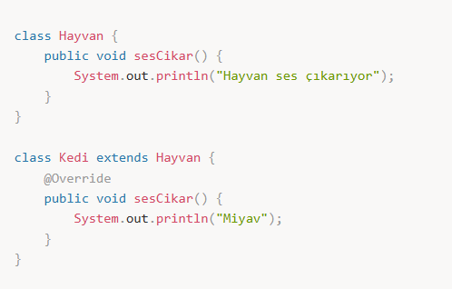

Burada, Kedi sınıfı Hayvan sınıfından miras alır ve sesCikar metodunu kendi şekilde değiştirir.

---

## 🔁 Return (Dönüş) ve Döndürülen Değerler

Bir metodun, işlevini tamamladıktan sonra bir değer döndürmesi mümkündür. Bu değer, metodun dönüş türüne göre belirlenir.

**Dönüş Tipi void Olmayan Metotlar:** Eğer bir metot değer döndürecekse, bu değer metodun dönüş tipiyle uyumlu olmalıdır (örneğin int, String, vb).

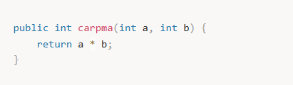

Bu metot, iki sayıyı çarpar ve sonucu döndürür.

**return Anahtar Kelimesi:** return ifadesi, metodun çalışmasını sonlandırır ve belirli bir değer döndürür.

---

## 🔁 Rekürsif (Recursive) Metotlar

Bir metodun, kendi kendini çağırmasına rekürsiyon (recursive) denir. Rekürsiyon genellikle belirli bir problemin küçük alt problemlere bölünerek çözüldüğü durumlarda kullanılır.

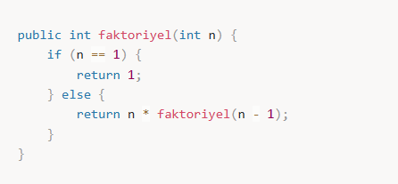

Bu metot, bir sayının faktoriyelini hesaplamak için kendisini tekrar tekrar çağırır.

---

## 🔢 Varargs (Değişken Sayıda Parametre)

Java, bir metot tanımlanırken parametre sayısının değişken olmasına imkan tanır. Bu, varargs (variable arguments) özelliği ile yapılır.

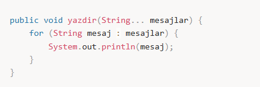

Bu metot, değişken sayıda String parametre alabilir ve her birini ekrana yazdırır.

---

## 🧷 Static ve Instance Metotlar

Metotlar statik ya da örnek (instance) olabilir.

**Statik Metotlar (static):** Bu metotlar sınıfın bir örneği oluşturulmadan çağrılabilir. Sadece sınıf adı ile erişilebilirler.  
**Örnek Metotlar:** Bu metotlar sınıfın bir örneği üzerinden çağrılır.

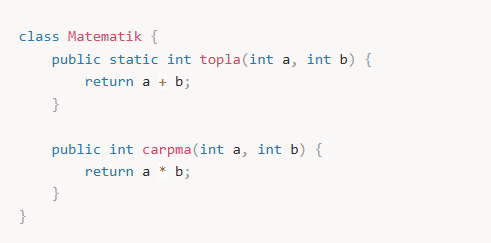

Statik metotlar sınıf adı ile doğrudan çağrılabilirken, örnek metotlar bir nesne üzerinden çağrılır.

---

### **Özetle**:

Java'da metotlar, kodu modüler hale getirip tekrar kullanılabilirlik sağlar. Metotlar, parametre alabilir, değer döndürebilir, aşırı yüklenebilir ve başka sınıflardan override edilebilir. Ayrıca, değişken sayıda parametre alabilen metotlar (`varargs`) ve rekürsiyon gibi gelişmiş özellikler ile genişletilebilir.
