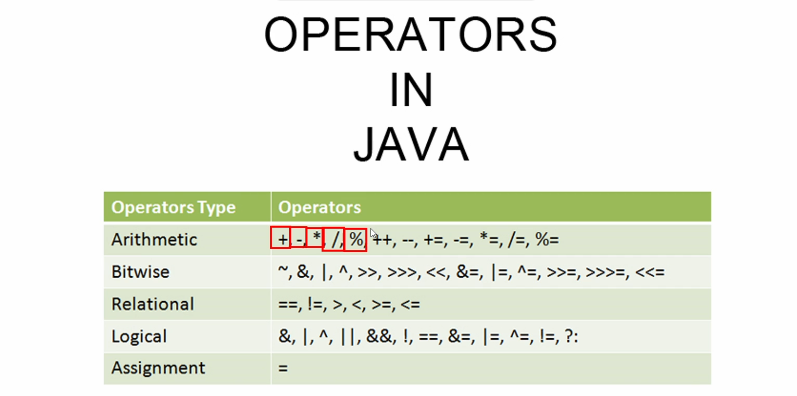
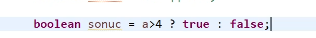
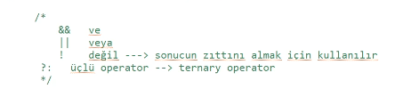
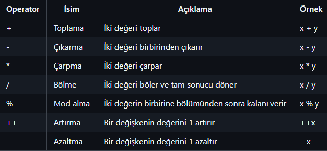
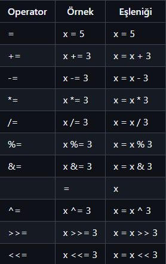
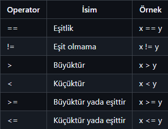
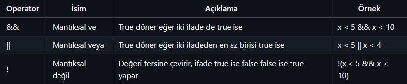

# Operatörler

Operatörler; değişkenler ve değerler üzerinde işlem yapmaya yarar.

a , 4 ten büyükse true değilse false olur.

Eşitliğin her iki tarafıda aynı veri tipinde olması lazım.

Değişkenin kapsam alanı bulunduğu parantez içerisinde geçerlidir.

Classın parantezleri içerisnde tanımlarsak bu değişkenler her yerden erişilebilir.

Aritmetik operatörler

Matematiksel işlemler yapar.

Atama operatörleri

Karşılaştırma operatörleri

Koşulları kontrol eder, true/false döndürür.

Mantıksal operatörler

Koşullu ifadeleri kontrol eder.

### **Özet:**

- **Aritmetik Operatörler:** `+`, , , `/`, `%`
- **Atama Operatörleri:** `=`, `+=`, `=`
- **Karşılaştırma Operatörleri:** `==`, `!=`, `>`, `<`
- **Mantıksal Operatörler:** `&&`, `||`, `!`
- **Artırma/Azaltma Operatörleri:** `++`, `-`
- **Bitwise Operatörler:** `&`, `|`, `^`, `~`, `<<`, `>>`

**Java'da operatörler, değişkenler üzerinde işlem yapmak için kullanılır ve farklı amaçlara sahiptir.**