# 🔤 Stringler

---

## 📌 String Nedir?

Stringler bir karakter dizisidir.

Java'da String veri tipi, metinleri saklamak için kullanılır.  
Stringler, karakterlerden oluşan ve değiştirilemez (**immutable**) nesnelerdir.

Java **case sensitive** (büyük–küçük harf duyarlı) bir dildir.

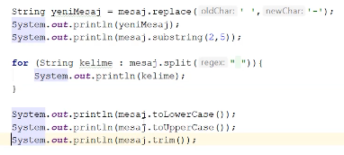

---

## 🔧 String Operasyonları

- `charAt` : String'in belirtilen indeksindeki karakteri döndürür.
- `concat` : Mevcut String'e belirtilen String'i ekler.
- `length` : String'in uzunluğunu döndürür.
- `startWith` : String'in belirtilen alt string ile başlayıp başlamadığını kontrol eder.
- `endWith` : String'in belirtilen alt string ile bitip bitmediğini kontrol eder.
- `getChars` : String'deki belirtilen aralıktaki karakterleri bir char dizisine kopyalar.
- `indexof` : İlk bulunan alt string'in başlangıç indeksini döndürür.
- `lastindexof` : Son bulunan alt string'in başlangıç indeksini döndürür.
- `replace` : String'deki eski karakteri yeni karakterle değiştirir.
- `substring` : String'in belirtilen aralıktaki kısmını döndürür.
- `split` : String'i belirtilen ayırıcıya göre böler ve bir dizi döndürür.
- `toLoweCase` : String'i küçük harflerle döndürür.
- `toUpperCase` : String'i büyük harflerle döndürür.
- `trim` : String'in başındaki ve sonundaki boşlukları kaldırır.
- `equals` : String'in başka bir String ile tam olarak eşit olup olmadığını kontrol eder.
- `contains` : String'in içinde belirtilen alt string'in olup olmadığını kontrol eder.

---

## 🧵 String Tanımlama

String değişkeni, bir metin değeri saklamak için kullanılır.

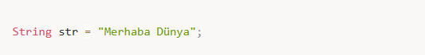

---

## 🧠 String Sınıfı ve Başlıca String İşlemleri

String Java geliştiricilerin günlük hayatta en çok kullandığı veri tiplerinden birisidir.  
Günlük hayatta programlama yaparken pek çok veriyi tutmak için kullanıldığı gibi,  
firmalar tarafından da mülakatlarda bu konuda çok fazla soru karşımıza gelmektedir.

Pek çok programlama dilinde stringler karakter arrayi olarak tutulurken  
javada string bir objedir.

---

## ❓ String Tipinde Objeleri Nasıl Yaratabiliriz?

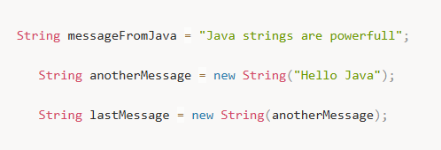

---

## 🧩 String Literal vs String Obje

Aşağıdaki resimde de görüldüğü gibi literal string ifadeleri hafızada  
**string pool** denilen özel bir alanda tutulur.

Aynı değere sahip yeni bir string literal yaratıldığında,  
string poolda yeni bir obje oluşturulmaz,  
mevcut objeye referans verilir.

Bu Java programlama dilinde performans kazanımı için gerçekleştirilmiş bir optimizasyondur.

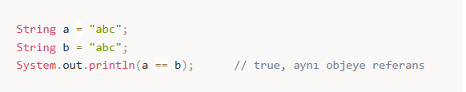

String objeleri ise hafızada **Heap** adı verilen özel bölmede saklanır.

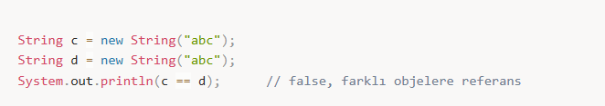
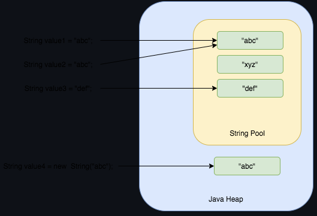

---

## 🔍 String Karşılaştırma

String veri tipi üzerinde en çok yapılan işlemlerden biri karşılaştırmadır.

String tipi bir class olduğundan:
- değerlerin eşitliği
- referansların eşitliği  

ayrı ayrı değerlendirilmelidir.

### Output

user1 == user2 : true
user2 == user3 : true
user3 == user4 : false
user1.equals(user2) : true
user2.equals(user3) : true
user3.equals(user4) : true

Objelerin karşılaştırılmasında:
- `==` → referans karşılaştırması
- `equals()` → değer karşılaştırması yapılır.

---

## 🔹 Diğer String İşlemleri

### length()

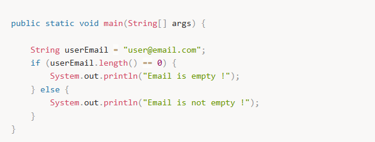

---

### isEmpty()

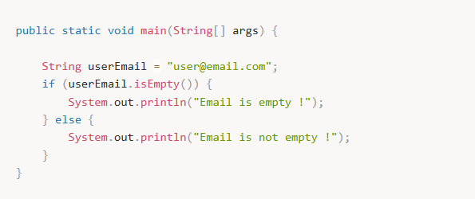

---

### charAt()

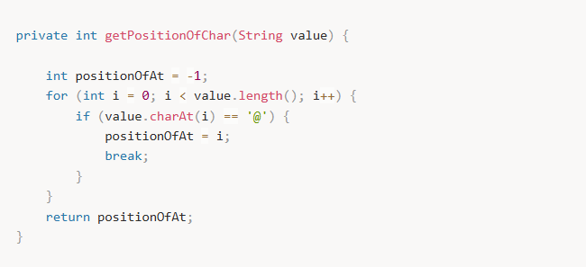

**Önemli Not:**  
Yanlış indeks verilirse `StringIndexOutOfBoundsException` fırlatılır.

---

### indexOf()

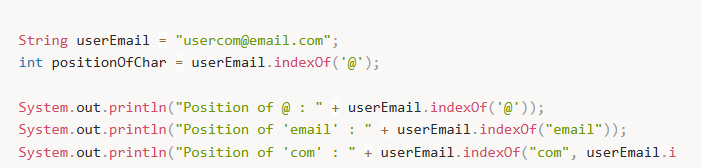

**Output**

Position of @ : 7
Position of 'email' : 8
Position of 'com' : 14

---

### replace()

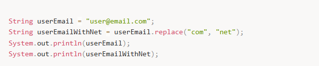

**Output**

user@email.net

---

### split()

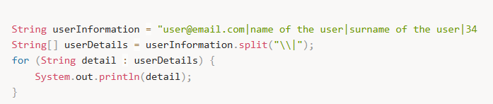

**Output**

user@email.com
name of the user
surname of the user
34

---

### compareToIgnoreCase()

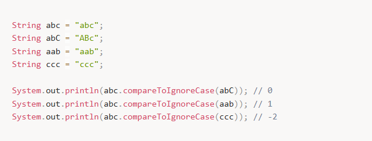

---

### startsWith(), contains(), endsWith()

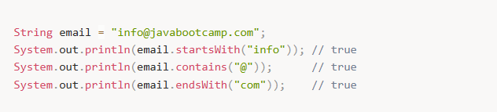

---

### join()

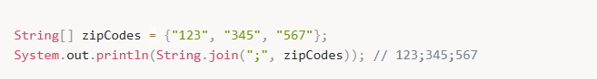

---

### concat()

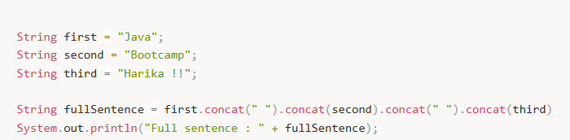

---

## 🧰 StringBuilder ve StringBuffer

Stringler immutable olduklarından her değişiklikte yeni String oluşturulur.  
Bu durum performans sorunlarına yol açabilir.

Bu gibi durumlarda:

- **StringBuilder**
- **StringBuffer**

kullanılır.

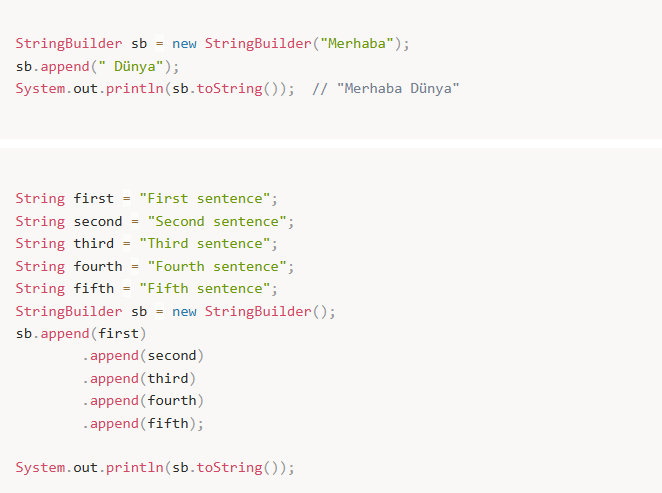

---

## 🎯 String Formatlama

### String.format ve printf

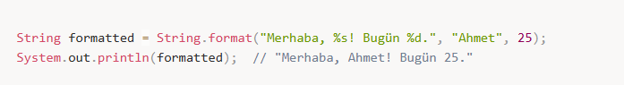
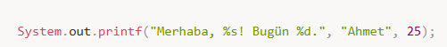

---

## 🔗 String Join

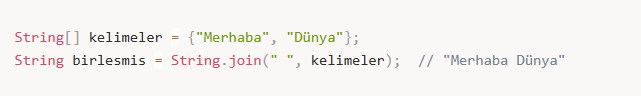

---

## 📅 Tarih İşlemleri (java.time)

### LocalDate

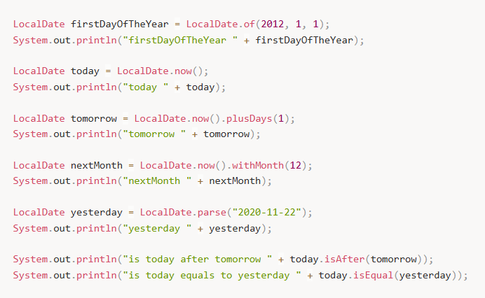

**Output**

firstDayOfTheYear 2012-01-01
today 2020-11-23
tomorrow 2020-11-24
nextMonth 2020-12-23
yesterday 2020-11-22
is today after tomorrow false
is today equals to yesterday false

---

### LocalTime

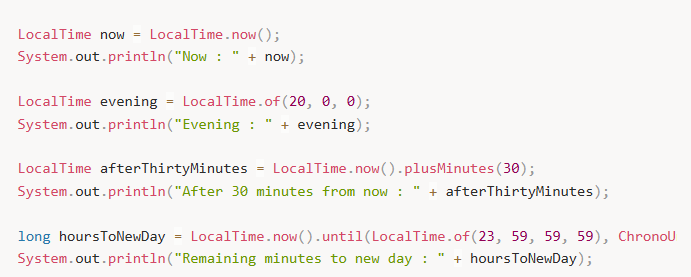

**Output**

Now : 23:39:39.211
Evening : 20:00
After 30 minutes from now : 00:09:39.217
Remaining minutes to new day : 20

---

### LocalDateTime

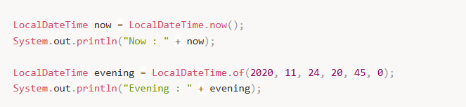

---

### DateTimeFormatter

LocalDateTime now = LocalDateTime.now();
System.out.println("Default format : " + now);

String formattedDateTime = now.format(DateTimeFormatter.ofPattern("dd-MM-yyyy HH:mm:ss"));
System.out.println("Custom format : " + formattedDateTime);

String date = "11-24-2020 10:12:00";
LocalDateTime parsedDate = LocalDateTime.parse(date, DateTimeFormatter.ofPattern("MM-dd-yyyy HH:mm:ss"));
System.out.println("Custom format parsed : " + parsedDate);

**Output**

Default format : 2020-11-24T23:06:41.127
Custom format : 24-11-2020 23:06:41
Custom format parsed : 2020-11-24T10:12

---

### Duration

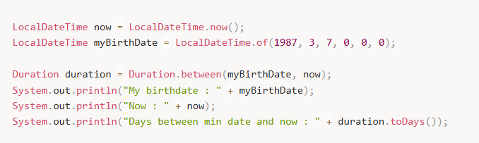

---

## 📝 Özet

- **String:** Metin veri tipi, değiştirilemez (immutable).
- **String metotları:** length(), charAt(), equals(), toLowerCase(), substring()
- **StringBuilder / StringBuffer:** Mutable string yapılarıdır.
- **String.format() / printf():** Formatlı çıktılar oluşturur.
