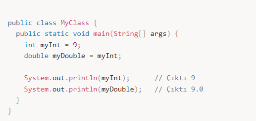
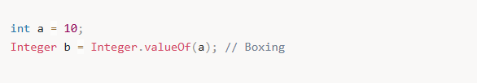
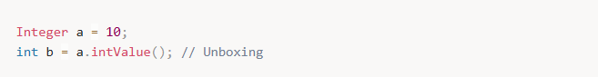
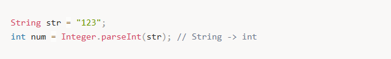

# 🔄 Tip Dönüştürme (Type Casting)

---

Herhangi bir tipte tanımlanmış bir değişkene kendi tipinde olmayan başka bir değerin atanması durumudur.  
Bu işlem yapılırken dikkatli olunmalıdır. Sadece birbiri ile ilişkili tipler arası dönüşüm yapılabilir.

Java'da iki tür dönüşüm vardır:

- **Otomatik (implicit) tür dönüşümü**
- **Manuel (explicit) tür dönüşümü**

---

## 🔹 Otomatik Tip Dönüştürme (Implicit Casting)

Küçük boyutlu bir değerin daha büyük boyutlu bir tipte tanımlanmış değişkene atanmasıdır.  
Bu dönüşüm kayıpsızdır çünkü daha geniş bir veri tipi daha küçük olanı kabul edebilir.

byte -> short -> char -> int -> long -> float -> double

---

## 🔹 Manuel Tip Dönüştürme (Explicit Casting)

Büyük boyutlu bir değerin daha küçük boyutlu bir tipte değişkene atanmasıdır.  
Dikkatli olunmalıdır, işlem yapılan veride değer kaybı yaşanabilir.

double -> float -> long -> int -> char -> short -> byte

![alt text]images/(image-66.png)

---

## ⚠️ Önemli Noktalar

- **Veri kaybı riski:**  
  Manuel dönüşümde (narrowing), daha büyük veri türü küçük veri türüne dönüştürülürken değer kaybı yaşanabilir.
- **Türün uygunluğu:**  
  Otomatik dönüşümde Java, türlerin birbirine uygun olup olmadığını kontrol eder.  
  Manuel dönüşümde, bu türler arasında uyumsuzluk varsa hata meydana gelir.

---

## 📦 Wrapper Class Dönüşümü (Boxing ve Unboxing)

---

### 🔸 Boxing (Kapsülleme)

Temel türün (primitive type) nesneye dönüştürülmesi işlemidir.

- Örneğin, `int` türündeki bir değeri `Integer` nesnesine dönüştürmek:

---

### 🔸 Unboxing (Çözme)

Wrapper class nesnesinin, temel türüne dönüştürülmesi işlemidir.

Örneğin, `Integer` nesnesini `int`'e dönüştürmek:

---

## 🔤 String ile Tür Dönüşümü

String'ler, genellikle sayılara dönüştürülür.  
Bu işlemde parse metotları kullanılır.

### Örnek: String'den int türüne dönüşüm

---

### 🔹 Dönüşüm İşlemleri

- `Integer.parseInt(String s)`
- `Double.parseDouble(String s)`
- `Float.parseFloat(String s)`

---

### ⚠️ Önemli Nokta

String'den dönüşüm yaparken geçerli bir sayı olmasına dikkat edilmelidir.  
Eğer geçersiz bir String ile dönüşüm yapılmaya çalışılırsa  
`NumberFormatException` hatası alınır.

---

## ❗ Tip Dönüşümünde Sık Karşılaşılan Hatalar

- **Veri kaybı:**  
  Büyük bir veri tipi küçük bir tipe dönüştürülürse sayı kaybı olabilir  
  (örneğin, double'ı int'e dönüştürmek).
- **Hata durumu:**  
  Yanlış türde bir veri ile dönüşüm yapılmaya çalışıldığında  
  `ClassCastException` hatası alınır.

---

## 📝 Özet

- **Otomatik dönüşüm:**  
  Küçük veri türlerinden büyük veri türlerine dönüşüm, Java tarafından otomatik yapılır.
- **Manuel dönüşüm:**  
  Büyük veri türlerinden küçük veri türlerine dönüşüm, el ile yapılmalıdır ve veri kaybı olabilir.
- **Boxing / Unboxing:**  
  Temel türlerle nesneler arasında dönüşüm yapılabilir.
- **String dönüşümü:**  
  `parse` metodları ile String'den temel türlere dönüşüm yapılabilir,  
  ancak geçersiz String'ler hata verebilir.
