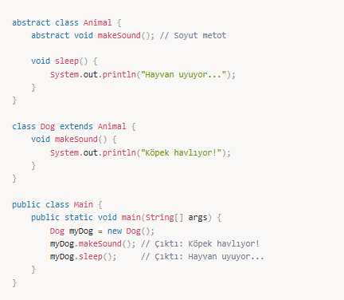
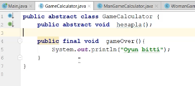
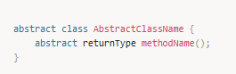
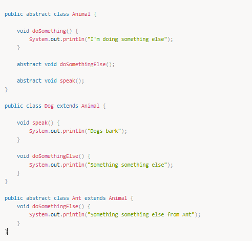

# Abstract Class (Soyut Sınıf)

## 📌 Abstract Class Nedir?

Abstract class, **nesne oluşturulamaz** ama **miras alınabilir** sınıflardır.

Nedir, ne için kullanılır, gerçek hayatta nasıl kullanılır, örnek ver.

Classlardan bir farkı yoktur, sadece kullanım farkı vardır.

Bir sınıf sadece bir tane sınıfı miras alabilir.

---

📌 Örnek:  

- *GameCalculator’ı kim kullanıyorsa `gameOver`’ı olduğu gibi kullanmak zorunda.*
- *Benim bir tane operasyonum var, birden fazla da olabilir. Onun içerisini base sınıfta belirlemek istemiyorum ama bunu kim inherit ediyorsa `hesapla` metodunu override etmek zorunda yani kendi kodunu yazmak zorunda. Benim zorunlu kıldığım tek şey bu: `hesapla` operasyonu mutlaka olacak.*

- *Abstract’lar base’i gizlemek istediğimiz zamanda kullanılır.*
- Abstract sınıflar asla `new`’lenemez. `new`’lenebilmesi için operasyonlarının override edilmesi gerekir.

---

## Abstract Method ve Abstract Class

Daha önce kalıtım yardımıyla bir alt sınıfın üst sınıftan kalıtımla aldığı metotları nasıl yeniden implemente ettiğini ve buna **method overriding** denildiğini görmüştük. Burada overriding işlemine alt sınıf kendisi karar veriyordu.

Bazı durumlarda ise üst sınıf bu metod implementasyonunu kendisi yapmak yerine bunu tamamıyla alt sınıflara bırakmak ister. Kendisi sadece metod imzasını verir ve metod implementasyonu için alt sınıfları zorlar. Bu tarz metodlara **abstract metod** adı verilir ve abstract metod barındırmak isteyen sınıflar da **abstract** olmak zorundadır.

Bunu yapmak istemesindeki temel neden, abstract bir sınıfı extend eden diğer sınıflar ile olan iletişimin belli bir şekilde gerçekleşmesini garanti altına almaktır. Bu önemli bir noktadır ve bunun detaylarına interface konusunda daha detaylı değineceğiz.

Abstract metod tanımlaması aşağıdaki gibi yapılır:

Burada önemli olan abstract metodların alt sınıflar tarafından implemente edilmesi gerektiğidir. Eğer alt sınıf da implementasyonu yapmak istemez ise bu durumda kendisi de abstract class olmak zorunda ve implementasyonu kendi alt sınıflarına bırakmak zorundadır.

Ayrıca abstract metodların yalnızca abstract sınıf içinde yer alabileceğini unutmayalım. Abstract sınıflar abstract metodların yanında başka metod implementasyonları da içerebilir ve bu metodları alt sınıflarına kalıtım yoluyla aktarabilir.

Yukarıdaki örnekte:

- `Dog` sınıfı, `Animal` sınıfı tarafından tanımlanan tüm abstract metodları implemente etmek zorundadır.
- `Ant` sınıfı ise abstract olduğu için `Animal` tarafından tanımlanan tüm abstract metodları implemente etmek zorunda değildir.

Abstract sınıflardan `new` operatörü yardımıyla obje yaratılamayacağını unutmayalım. Abstract sınıflar sadece kalıtım için kullanılabilir.

Peki kalıtımı ve abstract sınıfları nerelerde kullanmalıyız?  
Bu sorunun cevabını ve en doğru kullanım senaryolarını ilerleyen kısımlarda **“Composition over Inheritance”** konseptini anlatırken vereceğiz.

---

## 🎯 Mülakat Soruları ve Cevapları (Abstract Class)

### 1️⃣ Abstract class nedir?

**Cevap:**
- ✔ Soyut sınıflar nesne oluşturulamaz.
- ✔ Soyut metotlar içerebilir.
- ✔ Miras alındığında, soyut metotlar override edilmelidir.

### 2️⃣ Abstract class mı Interface mi kullanmalıyım?

**Cevap:**
- ✔ Eğer bazı metotların gövdesi olacaksa → **Abstract Class** kullan.
- ✔ Eğer sadece imza tanımlayacaksan → **Interface** kullan.
