# Classlara Giriş (OOP)

## Nesne Yönelimli Programlama Nedir?

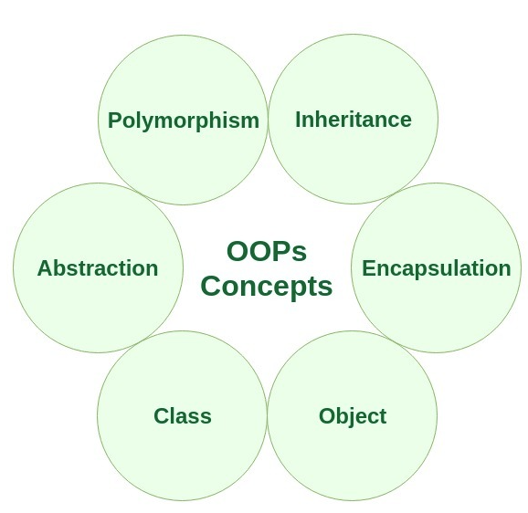

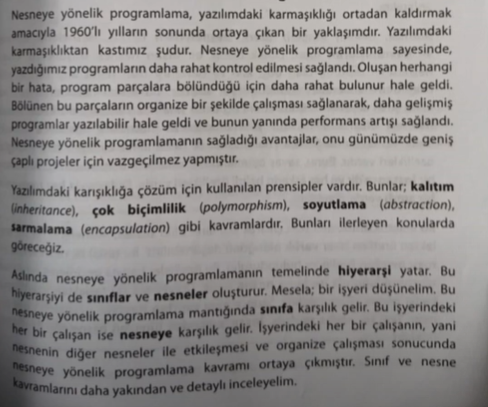

Nesne (object) Java dilinin özüdür temelde. Nesneler sınıflardan (class) üretilir ve sınıf kavramı Java dilinin temel yapı taşıdır. Bu nedenle Java dilini anlamak için sınıf, nesne ve referans kavramlarını çok iyi anlamak gerekir.

Etrafımızda gördüğümüz her şey bir nesne olarak modellenebilir. Nesneye dayalı programlamanın gücü de buradan gelir. Gerçek hayatı modellemek için iyi bir araçtır.

---

## Class Nedir?

Sınıf, nesne tabanlı programlamada (OOP) bir şablon veya mavi yazıdır. Sınıflar, nesneleri yaratmak için kullanılan yapıları tanımlar. Sınıflar veri (özellikler) ve işlev (metotlar) içerir. Bir sınıf, belirli bir türdeki nesnelerin özelliklerini ve davranışlarını tanımlar.

Javada bütün olay sınıfların içinde döner, aslında eğitimin başından beri sınıfları çokça kullandık fakat oldukça basit sınıflardı bunlar ve Java tarafından bize sağlanan sınıflardı.

Bir sınıf çeşitli türden veriler ve bu veriler üzerinde işlem yapmaya yarayan metodlar içerir. Bu haliyle sınıf nesneler için bir şablon görevi görür, yani tek başına sınıf bir işe yaramaz. Onun hafızada bir yer kaplaması ve programın döngüsüne katılabilmesi için kendisinden nesneler yaratılmalıdır.

Sınıfın içinde bulunan verilere ve metodlara sınıfın üyeleri adı verilir. Sınıfın içinde bulunan verilere tek başına instance variable da denir.

Classların ilk ve temel özelliği gruplama yapmaktır.

Classlar referans tipidir.

Classların bir diğer özelliği ise attribute (özellik) / field tutmaktır.

Bir class, metot sadece bir işi yapar. Örneğin product classı hem attribute tutup hem de operasyonları içermemeli.

Bir sınıf var, biz bir sınıfın içindeki değişkenlere erişebilmek için o classtan nesne türetmemiz gerekiyor.

---

## Sınıfların Özellikleri ve Davranışları

**Özellikler (Attributes / Fields):**  
Sınıfın sahip olduğu veriler. Her nesne bu verilere sahip olabilir.

**Davranışlar (Methods):**  
Sınıfın gerçekleştirdiği işlemler veya fonksiyonlar. Bu, nesnenin hareket etmelerini sağlayan fonksiyonlardır.

Bir sınıf hem veri hem metod barındırabileceği gibi bunlardan sadece birini de barındırabilir. Bir sınıfın genel tanımı aşağıdaki gibidir:

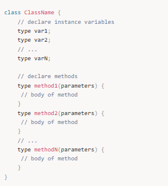

Bir sınıfı tanımlarken burada önemli olan sınıfın birbiri ile alakalı bilgiler içeriyor olmasıdır. Örneğin bir stok yönetimi uygulamasında bir kullanıcı sınıfı tanımlıyorsak içine kullanıcı adı, email adresi gibi bilgiler koyarken stok bilgisi ile alakalı detayları doğrudan koymaktan kaçınmalıyız.

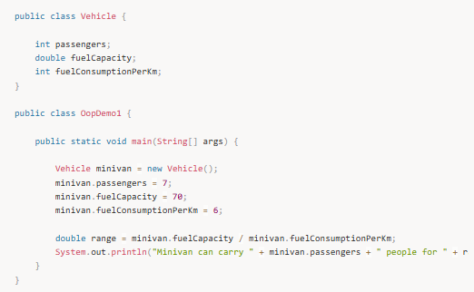

Output:

Minivan can carry 7 people for 11.666666666666666 km

---

## Sınıf ve Nesne Arasındaki Farklar

- **Sınıf:** Bir nesnenin şablonudur.  
- **Nesne:** Sınıfın somut örneğidir.

---

## Sınıf Oluşturma

Bir sınıf oluştururken aşağıdaki temel yapıyı kullanırız:

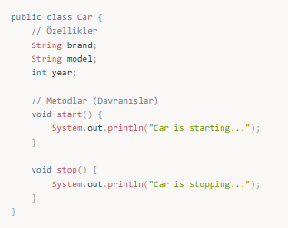

---

## Classlardan Obje / Referans Oluşturma

- değişken - field - property  
- Bir sınıfımız var. Biz bir sınıfın içindeki değişkenlere erişebilmek için o classtan nesne türetmemiz lazım. `new` anahtar kelimesi ile o sınıftan nesne türetiyoruz. Nesne türetince artık o sınıfın içindeki değişkenlere erişebiliyoruz.

---

## Nesne (Object) Nedir?

Sınıf, bir nesne yaratmak için bir şablondur. Bir nesne, sınıfın bir örneğidir ve sınıfın tüm özelliklerini ve metodlarını taşır.

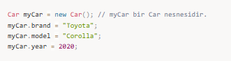

Bir classı oluşturabilmek için onun newlenmiş olması gerekiyor.

Classların bir diğer özelliği ise ortak operasyonları tutmaktır.

---

## Instance Variables

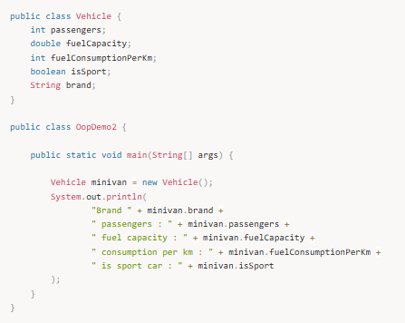

Output:

Brand null passengers : 0 fuel capacity : 0.0 consumption per km : 0 is sport car : false

---

## JVM Memory (Stack & Heap)

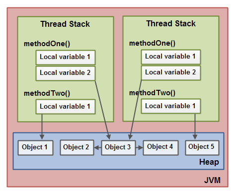

---

## new ve this Anahtar Kelimeleri

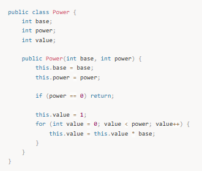

---

## Pass by Value / Pass by Reference

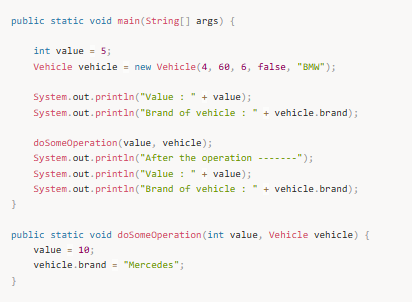

Output:

Value : 5
Brand of vehicle : BMW
After the operation -------
Value : 5
Brand of vehicle : Mercedes

---

## Garbage Collector

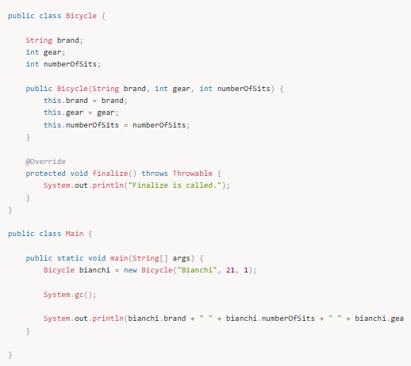

---

## static Anahtar Kelimesi

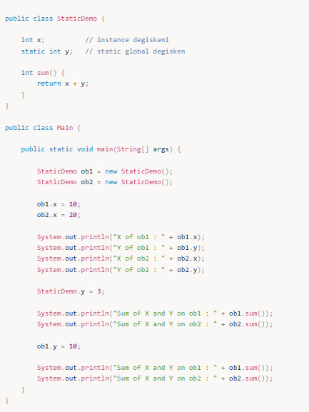

Çıktı:

X of ob1 : 10
Y of ob1 : 0
X of ob2 : 20
Y of ob2 : 0
Sum of X and Y on ob1 : 13
Sum of X and Y on ob2 : 23
Sum of X and Y on ob1 : 20
Sum of X and Y on ob2 : 30

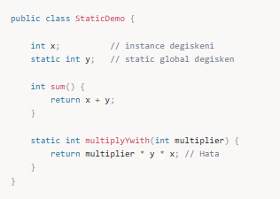

---

## static Blok

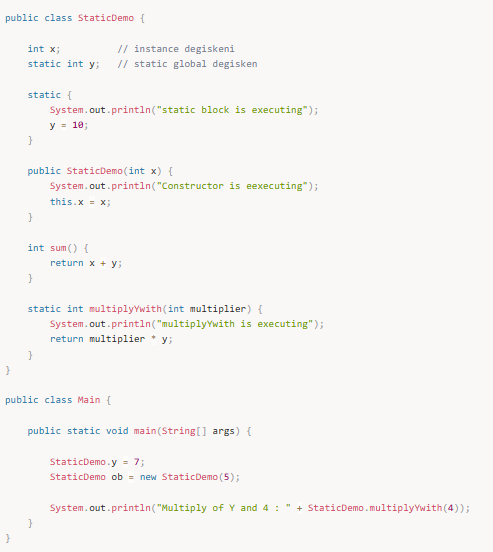

---

## Mülakat Soruları

### 1. Sınıf nedir? Bir sınıf ile nesne arasındaki farklar nelerdir?

### 2. Constructor nedir?

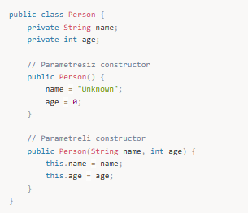

### 3. Static anahtar kelimesi ne işe yarar?

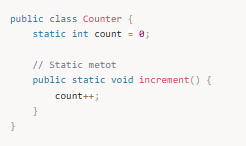

### 4. Erişim Belirleyiciler (private / public)

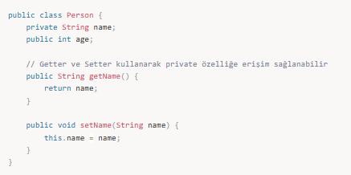

