# Constructor

## Yapıcı Metot (Constructor)

Bir clastan nesne ürettiğimiz zaman o aslında önce constructor a gidiyor. Her sınıfın bir constructorı vardır. Bir sınıfın constructorının geriye dönüş tipi olmaz. Constructor bir sınıftan nesne türetildiği zaman ilk constructorı çalıştırılır işi bittikten sonra gelir nesnesini türetir ve yoluna bakar. Bu constructorda birçok işlem yapılabilir. veri gönderilebilir, veri tabanı işlemleri yapılabilir.Bir sınıftan nesne türetildiği zaman o sınıfın önce constructorı çalışır işini bitirdikten sonra geri gelir ve nesnesini türetir yoluna devam eder. Constructor parametre alabilir. Her sınıfın bir constructarı vardır.

this : şu an üzerinde çalıştığım class.

Constructor (yapıcı metot), bir nesne oluşturulduğunda otomatik olarak çalışan özel bir metottur.  
✔️ Nesneye ilk değerleri atar.  
✔️ Metodun adı, sınıf adıyla aynı olmalıdır.  
✔️ Geri dönüş tipi (return type) OLMAZ!

---

## 1️⃣ Constructor Tanımlama ve Kullanımı

📌 Örnek:

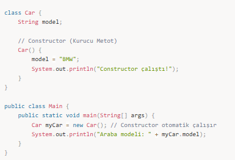

📌 Çıktı:  
Constructor çalıştı!  
Araba modeli: BMW

🔹 new Car(); ifadesi çalışınca Car() constructor'ı otomatik çalışır.  
🔹 model değişkeni ilk değer olarak "BMW" alır.

---

## 2️⃣ Constructor Türleri

### 📌 1. Parametresiz Constructor (Default Constructor)

Eğer bir sınıf için constructor yazılmazsa, Java otomatik olarak boş bir constructor oluşturur.

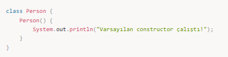

### 📌 2. Parametreli Constructor (Parameterized Constructor)

Parametre alarak nesneyi oluştururken özel değerler vermemizi sağlar.

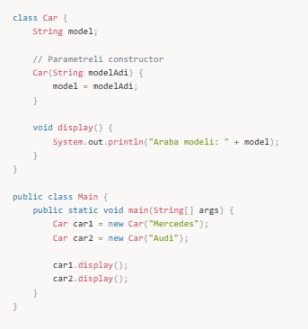

📌 Çıktı:  
Araba modeli: Mercedes  
Araba modeli: Audi

🔹 Nesne oluşturulurken model adı belirleniyor.  
🔹 new Car("Mercedes") çağrıldığında, "Mercedes" parametresi model değişkenine atanıyor.

### 📌 3. Constructor Overloading (Aşırı Yükleme)

Bir sınıf içinde birden fazla constructor tanımlanabilir.

📌 Çıktı:  
Araba: Bilinmiyor, Yıl: 0  
Araba: Toyota, Yıl: 2020  
Araba: Honda, Yıl: 2022

🔹 Aynı isimde farklı constructor’lar tanımlandı.  
🔹 Parametre sayısına göre hangi constructor çalışacaksa o çağrıldı.

---

## 3️⃣ this() ve super() Kullanımı

### **📌 this() – Aynı Sınıf İçindeki Constructor’ı Çağırmak**

this() ile aynı sınıf içindeki başka bir constructor çağrılabilir.

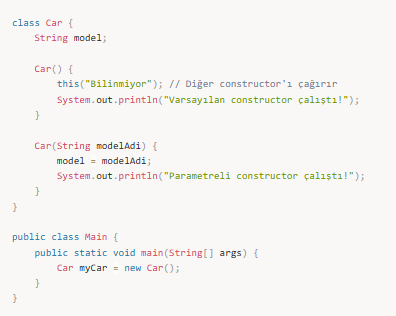

📌 Çıktı:  
Parametreli constructor çalıştı!  
Varsayılan constructor çalıştı!

### 📌 super() – Üst Sınıfın Constructor’ını Çağırmak

super() ile üst sınıftaki constructor çağrılabilir.

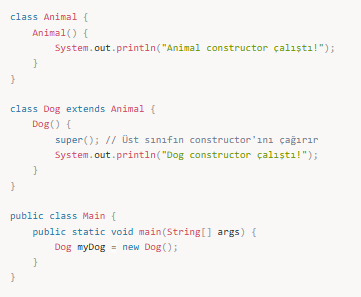

📌 Çıktı:

Animal constructor çalıştı!  
Dog constructor çalıştı!

---

## Metot Overloading

Metot overloading olması için ya parametere sayısı farklı olacak, ya da parametre tipleri farklı olacak.

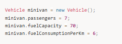

---

Daha önceki örneklerimizde yukarıdakine benzer objenin değişkenlerine değer atama işlemleri görmüştük. Profesyonel bir uygulamada buna benzer değer atama işlemlerini göremeyiz, bunun yerine değişkenlerin ilk değerlerini atamak için constructor dediğimiz yapıları kullanırız.

Constructorlar ait oldukları class ile aynı ismi taşırlar ve bir dönüş değerleri yoktur. Bir constructorun içinde instance variablelara ilk değer atama işlemi yapılırken ayrıca objenin tam olarak işlevini yerine getirmesini sağlayacak diğer konfigürasyon işlemleri de yer alabilir.

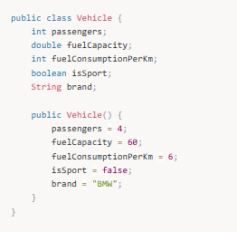

Burada görülen constructor hiç bir parametre almazken içinde bütün instance değişkenlerine default değerler hard-coded olarak atanmıştır.

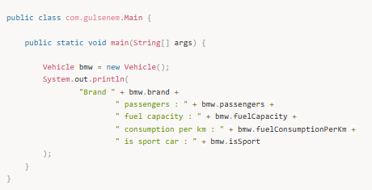

Output:

Brand BMW passengers : 4 fuel capacity : 60.0 consumption per km : 6 is sport car : false

Constructorlar aynı zamanda bütün bu değerleri dışarıdan argüman olarak da alabilir, bu durumda ilk değerleri set etme görevi objeyi yaratan kod parçasına düşer.

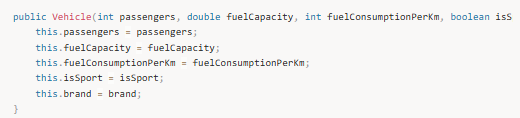

Vehicle bmw = new Vehicle(4, 75, 7, false, "Volkswagen");

Eğer hiç bir constructor eklemezsek bir sınıfa, bu durumda jvm otomatik olarak default constructoru ekler (hiçbir parametre almayan constructor) ve değişkenler ait oldukları tipe göre default değerlerini alır.

---

## Erişim Belirleyiciler Public ve Private

### Erişim Belirleyiciler (Acces Modifiers)

- **public:** Her yerden erişilebilir kısıtlama yok.  
- **private:** Sadece bulunduğu class içerisinden erişilebilir.  
- **protected:** Bulunduğu class içinden ve o classı miras alan alt classlardan erişilebilir.

---

## 🎯 Mülakat Soruları ve Cevapları

### 1️⃣ Constructor nedir? Ne işe yarar?

Cevap:  
Constructor (kurucu metot), nesne oluşturulduğunda otomatik olarak çalışan özel bir metottur.  
✔ Nesnenin ilk değerlerini ayarlar.  
✔ Metodun adı, sınıf adıyla aynı olmalıdır.  
✔ Return type (dönüş tipi) yoktur.

### 2️⃣ Constructor Overloading (Aşırı Yükleme) nedir?

Cevap:  
Aynı sınıfta, aynı isimde ama farklı parametreli birden fazla constructor tanımlanmasına denir.

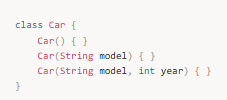

### 3️⃣ Java'da Constructor Overriding (Geçersiz Kılma) mümkün mü?

Cevap:  
🔴 HAYIR! Constructor, override edilemez çünkü miras alınsa bile aynı sınıfta tanımlı olamaz.

### 4️⃣ this() ile super() arasındaki fark nedir?

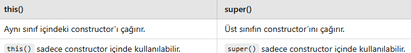

### 5️⃣ Java'da Default Constructor nedir?

Cevap:  
Eğer bir sınıf için constructor yazılmazsa, Java otomatik olarak boş bir constructor ekler.

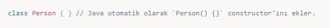

---

📌 Özet:

✅ Constructor, nesne oluşturulurken otomatik çalışan özel bir metottur.  
✅ Return type OLMAZ ve sınıf ismiyle aynı olmak zorundadır.  
✅ Constructor Overloading mümkündür.  
✅ this() → Aynı sınıftaki başka constructor’ı çağırır.  
✅ super() → Üst sınıfın constructor’ını çağırır.
