# Encapsulation

**Kapsülleme(getter-setter)**

## **Kapsülleme Nedir?**

Encapsulation, nesne yönelimli programlamada (OOP) en önemli kavramlardan biridir. Veriyi ve o veriye erişimi sağlayan metotları tek bir birimde (sınıfta) toplayarak, doğrudan erişimi kısıtlamak ve dış dünyadan korumaktır.

Kullanıcıya herhangi bir alanı kısatlamak için kullanılır.

Bir değişkenimizi public tanımlayıp her yerden erişilmesini sağlamaktansa o değişkenimizi private olarak tanımlayıp onu belirli kriterlere sokup verinin güvenliğini sağlamak, saçma verinin gelmesini engellemek bir değişkeni saklayıp belirli kriterlerden süzüp değerini atayıp o şekilde kullanmak. Amacımız verinin , değişkenin güvenliğini sağlamak her yere açık olmasını engellemektir.

Değişkeni private ile sakladım.set metoduyla(set edilen değer parametre olarak verilmeli-sette this demeyi unutma  ya da base pactice olarak private a _id de this vermeyi unutursan sorun olmaz.) erişşip değer atadım . get metodu kullanarak değerine eriştim.

Private tanımlarsak sadece tanımlandığı blokta geçerli demektir.

Değişkeni private ile sakladım , set metoduyla erişip değer atadım , get metodu kullanarak değerine eriştim.

ctrl-alt-s yapıp otomatik getter setterları generete edebilirim.

---

## **Encapsulation’ın Amaçları**

**Veri Güvenliği Sağlamak →** Dışarıdan doğrudan erişimi engelleyerek yanlış veya yetkisiz erişimlerin önüne geçer.  
**Kodun Kontrolünü Kolaylaştırmak →** Değişkenlere erişim, sadece belirlenen metotlarla yapılır, böylece istenmeyen değişiklikler engellenir.  
**Kodun Yeniden Kullanılabilirliğini Artırmak →** Encapsulation sayesinde kod daha düzenli, okunaklı ve modüler hale gelir.

---

## **Nasıl Uygulanır?**

Sınıfın değişkenlerini private yaparak doğrudan erişimi engellemek  
Değişkenlere erişim için getter ve setter metotları oluşturmak  
Sınıf dışından yalnızca belirlenen metotlarla erişimi sağlamak

---

## **Encapsulation**

Şuana kadar örneklerimizde sadece 1-2 sınıftan oluşan basit kod parçaları gördük fakat gerçek hayatta yazılımlar çok daha karmaşık olabilmekte. Bir yazılım içinde onlarca, yüzlerce, binlerce hatta milyonlarca sınıf bulunabiliyor. Bunun üzerine yazılımınız tarafından kullanılan kütüphaneleri de eklediğimiz zaman ortaya çok karmaşık bir yapı çıkmakta. Ve uygulamada bazı bilgilerin diğer sınıf/objelerin erişiminden saklanması ihtiyacı ortaya çıkıyor. Java dili bize bu gizlenmeyi ve beraberinde güvenliği sağlama noktasında bir kaç adımdan oluşan güçlü bir mekanizma sunuyor. Şimdi bu adımlarda kullanmamız gereken bileşenlere göz atalım:

---

## **Package kavramı**

Package dediğimiz kavram aslında dosya sisteminde dizin (folder) den ibarettir ve kaynak kodları organize etmeye yarar. Mantıksal olarak birlikte bulunması gereken sınıfları package yardımıyla birlikte gruplayabiliriz. Paket kavramının bir diğer önemli görevi ise sınıflara unique'lik kazandırmasıdır, compiler her sınıfa paket ismi ve sınıf ismini birlikte kullanarak erişir. Bu da aynı isme sahip sınıflar için erişim karmaşasını önler. Son olarak paketler erişim kontrol mekanizmasında önemli bir rol oynar. Şimdi paketlerin nasıl tanımlandığına ve kullanıldığına göz atalım.

Javada paketler **src** dizininin altında yer alır. Eğer uygulamada hiçbir paket yaratmazsak ve sınıflarımızı doğrudan src dizinine koyarsak java bizim için default paketi kullanır.

Bir paket yaratılırken isimlendirmeye dikkat etmek gerekir. Javada paket isimleri case sensitive dir, yani büyük küçük harfe duyarlıdır. Pratikte paket oluştururken vereceğimiz ismin her bir kelimesi için bir dizin oluşturulur ve tamamen küçük harfler tercih edilir. Kütüphaneler aracılığıyla uygulamaya eklenen başka sınıflar ile isim karışıklığı olmaması için genelde paket ismi olarak uygulamanın sahibi olan kişi yada kurumun web sitesine ait domain ismi kullanılır.

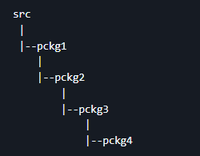

Bir sınıfın hangi pakete ait olduğunu öğrenmek için o sınıfın ilk satırına bakarız, paket bilgisi aşağıdaki gibi tanımlanır.

package pckg1.pckg2.pckg3.pckg4;

Başka bir pakette tanımlanmış bir sınıfa başka bir pakette tanımlanmış bir sınıftan erişmek istersek o sınıfı paket bilgisi ile birlikte import etmemiz gerekir. Aksi durumda paketler içinde barındırdığı sınıfları izole edecek ve paket dışından erişimini engelleyecektir.

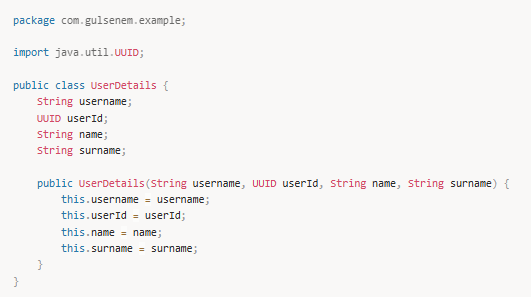

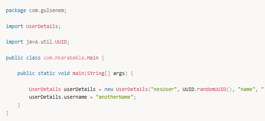

Yukarıdaki örnekte görüldüğü gibi UserDetails objesini yaratabiliyor ve constructor unu kullanarak instance değişkenlerine değer atayabiliyoruz. Ayrıca tek tek değişkenlerine obje üzerinden doğrudan erişip değer ataması yapabiliyoruz. Bu ilk bakışta çok normal ve sorunsuz görünse de aslında güvenli bir yöntem değildir. Çünkü objenin state i obje dışından doğrudan değiştiriliyor ve objenin bunun üzerinde hiçbir kontrolü yok. Bu durumu güvenli bulmadığımız için nasıl engelleyebiliriz ?

---

## **Access Modifiers (Erişim belirleyiciler)**

Önceki bölümde gördüğümüz gibi paketler birtakım kodları ve bilgileri saklamakta bize yardımcı oluyor fakat tek başına yeterli değil. Kod erişimini farklı seviyelerde engelleyen bir de erişim belirleyiciler vardır. Java dilinde 4 adet erişim belirleyici vardır : public, protected, private ve default. İlk üç erişim belirleyiciyi kullanmazsak otomatikman default erişim belirleyici atanır.

Şuana kadar hep default erişim belirleyiciyi ve public ifadesini kullandık. Şimdi bunların detaylarına bakalım :

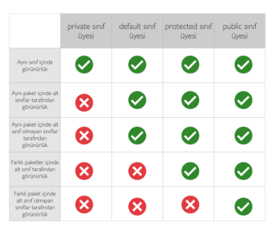

Bu tablodaki kurallar sadece sınıf içindeki değişken ve metodlar için geçerlidir.

Default erişim belirleyiciye sahip değişken ve metodlar sadece aynı paket içinde bulunan diğer sınıf ve metodlar tarafından erişilebilir. Bu nendenle bu erişim belirleyciye 'package access modifier' yani paket seviyesinde erişim belirleyici de denir.

Public erişim belirleyici en geniş erişim hakkı sunun ifadedir. Aynı pakette olsun olmasın tüm sınıf ve metodlar tarafından erişilebilir.

Private erişim belirleyici sadece sınıf içi erişim hakkı verir, paket ve subclass ilişkilerine bakmaksızın.

Protected ifadesi ise kendisi ile aynı pakette bulunan diğer kodlara ve diğer paketlerde bulunan sadece alt sınıflarına erişim hakkı verir.

Söz konusu class olduğunda ise kullanabileceğimiz sadece 2 tane erişim belirleyici vardır; default ve public. Bir class public olarak tanımlanırsa bu durumda tüm uygulama tarafından erişilebilir aynı sınıf bileşenlerinde olduğu gibi. Default olarak tanımlanır ise bu durumda sadece tanımlandığı paketteki sınıflar tarafından erişilebilir.

---

## **getter ve setter metodlar**

Her ne kadar encapsulation yardımı ile bazı sınıfları ve sınıf bileşenlerini saklasak da bazı pek çok durumda yarattığımız sınıfa ve o sınıfın bileşenlerine bir noktada erişim yetkisi vermek zorundayız. Fakat bu demek değil ki tüm kontrolü dışarıya verelim.

Bazı ihtiyaç durumlarında bir sınıfın değişkenin alacağı değerin belli şartlara uyması gerekir, örneğin int bir değişken için değerin 0 ile 10 arasında olması ihtiyacı gibi. Yada bir değişkenin değerini değiştirirken başka bir işlem de yapılması gerekmesi gibi.

Bazı durumlarda ise değişkenin sadece obje yaratıldığı anda değer almasını daha sonra değiştirilmemesini isteyebiliriz.

Yada bir değişkenin değerini dönerken değişken değerini direk dönmek yerine o değerin kopyasını dönmek isteyebiliriz.

Bütün bu senaryoları düşündüğümüzde yardımımıza getter ve setter metodları yetişiyor. Genellikle bir best practice olarak sınıf değişkenlerinin private tanımlanması ve o değişkene değer atamak ve değeri okumak için özel metodların kullanılması önerilir.

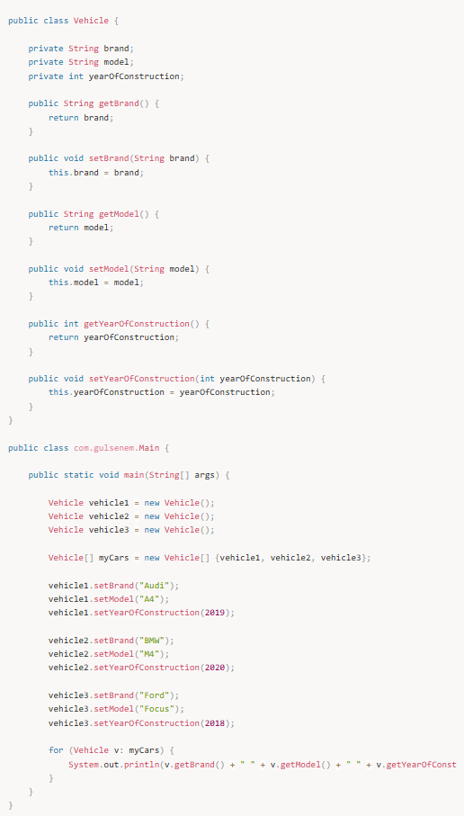

Output :

Audi A4 2019  
BMW M4 2020  
Ford Focus 2018  

---

## **Encapsulation Örneği:**

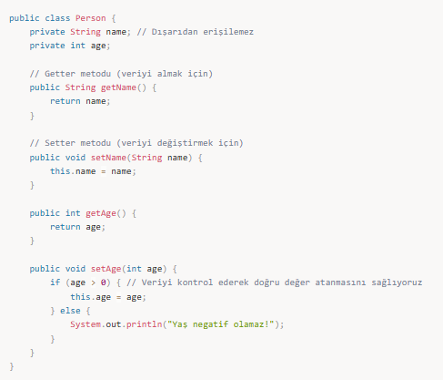

---

## **Encapsulation ile İlgili Önemli Noktalar:**

✅ Getter ve Setter metotları sayesinde kontrollü erişim sağlanır.  
✅ Doğrudan erişim (public) engellenerek veri korunur.  
✅ Kullanıcılar veriyi nasıl yöneteceğini bilemez, sadece verilen metotları kullanır.  
✅ Kodun yönetimi ve geliştirilmesi kolaylaşır.

---

## **Encapsulation’ın Faydaları:**

**Güvenliği Artırır 🛡️ →** Doğrudan erişimi kapatarak yetkisiz işlemleri engeller.  
**Kodun Bakımını Kolaylaştırır 🔄 →** Verilere erişim sadece belirlenen metotlar üzerinden olduğu için değişiklik yapmak kolaydır.  
**Modülerliği Artırır 🏗️ →** Bir sınıfın iç yapısını değiştirdiğinizde, diğer kodlardan bağımsız kalmasını sağlar.

---

## **Encapsulation ile İlgili Mülakat Soruları ve Cevapları**

### 1️⃣ Encapsulation (Kapsülleme) nedir?

Cevap:  
Encapsulation, bir sınıfın içindeki değişkenleri dış erişime kapatarak sadece belirlenen metotlarla erişime izin verme prensibidir. private değişkenler kullanarak veriyi gizleriz ve getter-setter metotlarıyla kontrollü erişim sağlarız.

### 2️⃣ Encapsulation’ın avantajları nelerdir?

Cevap:

Veri güvenliği sağlar → Değişkenler dış dünyaya kapalıdır, sadece belirli metotlarla değiştirilebilir.  
Kodun yönetimini kolaylaştırır → Değişkenlerin nasıl değiştirileceği metotlar içinde kontrol edilebilir.  
Kodun modülerliğini artırır → Bir sınıfın iç yapısı değiştiğinde diğer kodlardan bağımsız olarak düzenlenebilir.  
Hata yakalamayı kolaylaştırır → Hatalı veri girişlerini setter metotlarında engelleyebiliriz.

### 3️⃣ Encapsulation olmadan değişkenleri neden public yapmamalıyız?

Cevap:  
Eğer tüm değişkenleri public yaparsak, sınıf dışındaki herhangi bir kod, verileri doğrudan değiştirebilir. Bu da istenmeyen durumlara yol açar. Örneğin:

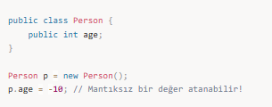

Bu tür doğrudan erişimleri önlemek için private kullanılır ve setter metoduyla kontrollü değişim sağlanır.

### 4️⃣ Encapsulation ile Abstraction arasındaki fark nedir?

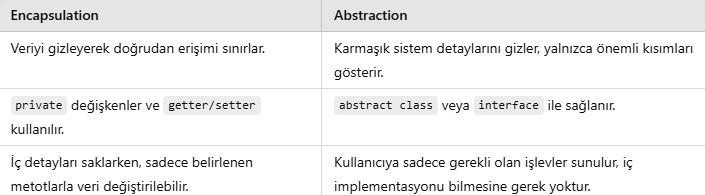

### 5️⃣ Getter ve Setter kullanmadan Encapsulation yapılabilir mi?

Cevap:  
Evet, ancak bu durumda sınıfın içinde başka metotlar tanımlayarak veri kontrolü sağlamamız gerekir. Örneğin, public metotlar oluşturup değişkenlere doğrudan erişim yerine sadece belirli işlemleri yaptırabiliriz. Ancak genel olarak getter ve setter metotları en yaygın çözümdür.

### 6️⃣ Java’da sadece getter metodu kullanarak Encapsulation sağlayabilir miyiz?

Cevap:  
Evet. Eğer değişkenin dışarıdan değiştirilememesini ama okunabilmesini istiyorsak sadece getter metodu kullanabiliriz. Örneğin:

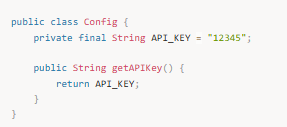

Burada API_KEY değeri private olduğu için dışarıdan değiştirilemez ama getter sayesinde okunabilir.

### 7️⃣ private, protected, default ve public erişim belirleyicileri arasındaki farklar nelerdir?

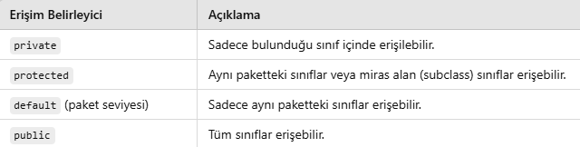

### 8️⃣ Static değişkenler Encapsulation’a aykırı mı?

Cevap:  
Hayır. static değişkenler sınıf seviyesinde tanımlandığı için bir nesneye bağlı olmadan erişilebilir. Ancak bunları da private yaparak Encapsulation uygulanabilir:

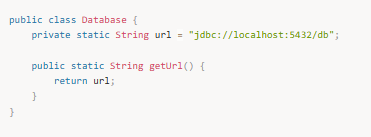

Burada url değişkeni private olduğu için doğrudan değiştirilemez, sadece getUrl() metodu ile erişilebilir.

### 9️⃣ Encapsulation hangi tasarım desenleriyle ilişkilidir?

Cevap:

Singleton Pattern → Nesnenin tek bir örneğinin olmasını sağlamak için private constructor ve static getter kullanır.  
Factory Pattern → Nesnelerin oluşturulmasını kontrol ederek dış dünyaya direkt nesne oluşturmaya izin vermez.  
Builder Pattern → Nesnelerin adım adım oluşturulmasını sağlarken Encapsulation’ı korur.

---

### **🔹 Genel Özet:**

✅ **Encapsulation**, değişkenleri `private` yaparak doğrudan erişimi engeller.

✅ **Getter ve Setter** metotlarıyla veriyi kontrollü bir şekilde alıp değiştirmemizi sağlar.

✅ **Kodun güvenliğini, okunabilirliğini ve yönetilebilirliğini artırır.**

✅ **Static değişkenler de Encapsulation ile korunabilir.**

✅ **Abstraction ile karıştırılmamalıdır, çünkü Encapsulation veri saklarken, Abstraction sadece önemli detayları gösterir.**
