# 📌 1. Enum (Numaralandırma) Nedir?

Enum, belirli ve sabit bir değer kümesini temsil eden özel bir veri tipidir.  
✔ Sabit değerler içerir.  
✔ Kullanıcı tanımlı veri tipidir.  
✔ Kodun okunabilirliğini ve güvenliğini artırır.  

---

## 📌 2. Enum Nasıl Tanımlanır?

Enum’lar, Java'da bir sınıf gibi tanımlanır ve `enum` anahtar kelimesi kullanılır.

📌 Temel Enum Tanımı:

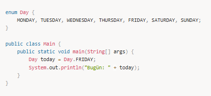

✅ Çıktı: Bugün: FRIDAY  

---

## 📌 3. Enum'un Kullanım Avantajları

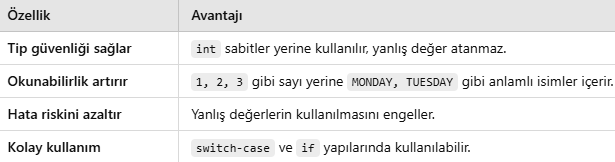

---

## 📌 4. Enum İçinde Metot Tanımlama

Enum’lar normal sınıflar gibi constructor, metot ve değişken içerebilir.

📌 Örnek:

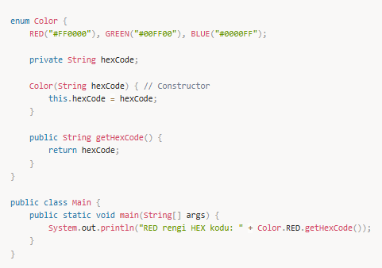

✅ Çıktı: RED rengi HEX kodu: #FF0000  

---

## 📌 5. Enum Kullanımı

Enum’lar aşağıdaki şekillerde kullanılabilir:

### 1️⃣ Enum ile Switch-Case Kullanımı

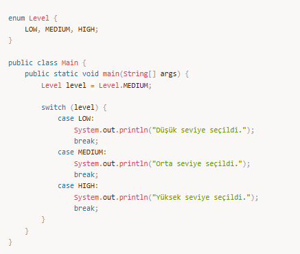

✅ Çıktı: Orta seviye seçildi.  

### 2️⃣ Enum İçinde Abstract Metot Kullanımı

Eğer her enum sabitinin **kendine özgü bir davranışı** olması gerekiyorsa, `abstract` metot tanımlanabilir.

📌 Örnek:

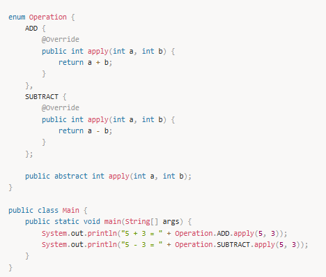

✅ Çıktı:  
5 + 3 = 8  
5 - 3 = 2  

### 3️⃣ Enum İçinde Static Metot Kullanımı

Eğer enum değerleri içinde **genel bir işlem yapmak istiyorsanız**, `static` metot kullanabilirsiniz.

📌 Örnek:

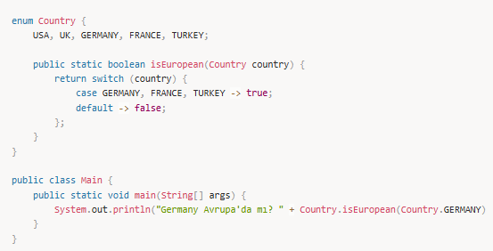

✅ Çıktı: Germany Avrupa'da mı? true  

---

## 📌 6. Enum Kullanım Alanları

✔ Gün ve ay isimleri (Day, Month)  
✔ Durum yönetimi (OrderStatus, TrafficLight)  
✔ Hata kodları (ErrorType)  
✔ Yetki seviyeleri (UserRole: ADMIN, USER, GUEST)  

---

## Enum Sınıf Tipi ve Kullanım Alanları

Enum sınıf tipi bir sabit değişken listesinden yeni bir veri tipi yaratmak için kullanılır.

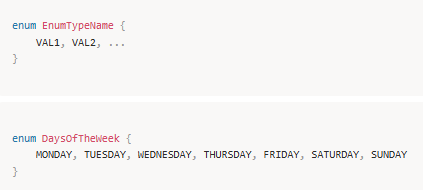

DaysOfTheWeek today = DaysOfTheWeek.TUESDAY;

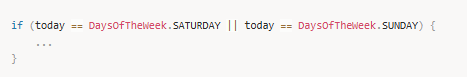

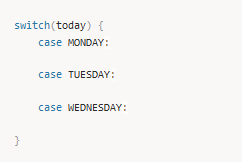

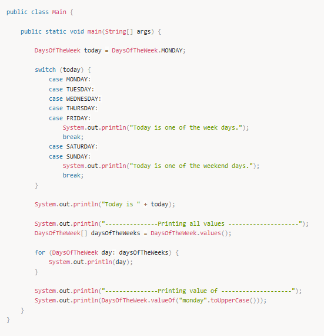

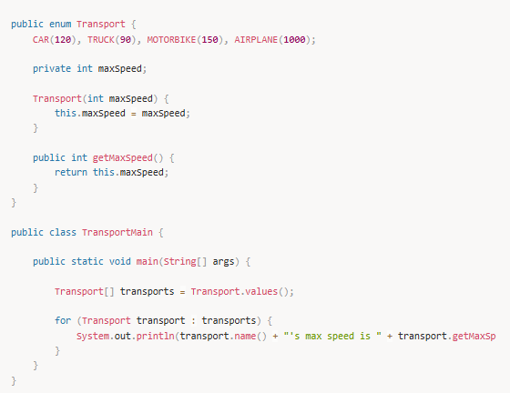

---

## Recursion

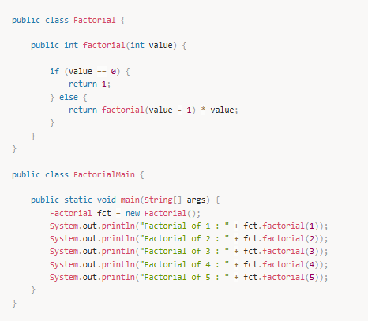

---

## 🎯 Mülakat Soruları ve Cevapları (Enum)

### 1️⃣ Enum nedir ve neden kullanılır?

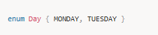

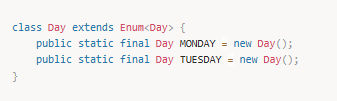

### 3️⃣ Enum'lar nesne yönelimli programlamada nasıl kullanılır?

✔ Factory pattern  
✔ Singleton pattern  
✔ State management  

### 4️⃣ Enum ile Interface birlikte kullanılabilir mi?

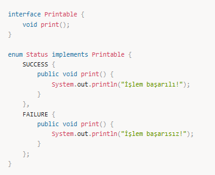

---

## 📌 Özet

✅ Enum, sabit değerleri temsil eden özel bir veri tipidir.  
✅ Metot, constructor ve abstract metotlar içerebilir.  
✅ İçinde switch-case, static metot ve interface kullanılabilir.  
✅ Tip güvenliği, okunabilirlik ve bakım kolaylığı sağlar.
