# 📌 1. Generics (Jenerikler) Nedir?

**Generics**, **Java'da veri tipini belirtmeden, esnek ve güvenli kod yazmamıza olanak sağlayan** bir mekanizmadır.

✔ **Kod tekrarını azaltır.**  
✔ **Tip güvenliğini sağlar.**  
✔ **Derleme zamanında hataları yakalamamıza yardımcı olur.**

Java hangi tiple çalıştığını bilmek ister.

Generic farklı tiplerle çalışmamızı sağlayan bi classtır.

Genericler bize tip güvenli çalışma sağlar.

Genericler ile birlikte birbirine benzeye operasyonları aynı tip güvenli şekilde yazmayı sağlıyoruz.

*Tasarım Deseni Nedir?  
Repository tasarım deseni: Genellikle vt işlemleri için kullanılır.

generic constraints  
validator : bir nesnenin kurallara uygun olup olmadığını anlamak için kullanırız.

generic metotlar - generic classlar

---

## 📌 2. Neden Generics Kullanırız?

📌 Tip Güvensizliği Örneği:

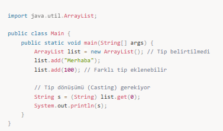

📌 Generics Kullanımı:

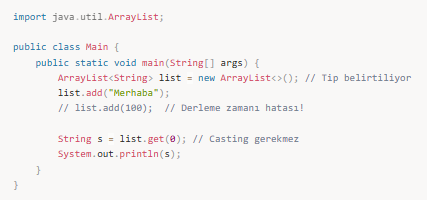

---

## 📌 3. Generics ile Sınıf Tanımlama

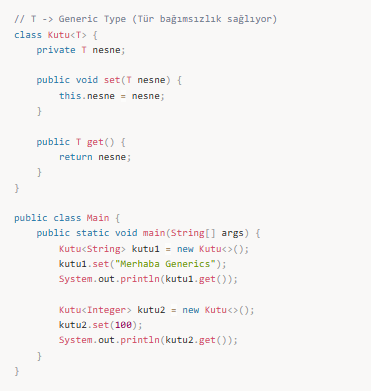

---

## 📌 4. Generics ile Metot Tanımlama

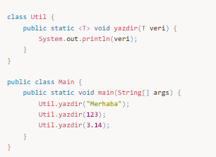

---

## 📌 5. Birden Fazla Generic Parametre

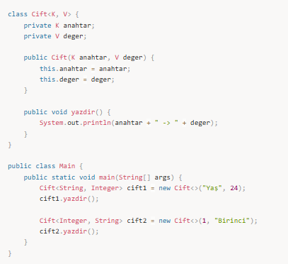

---

## 📌 6. Bounded Type (Üst Sınır)

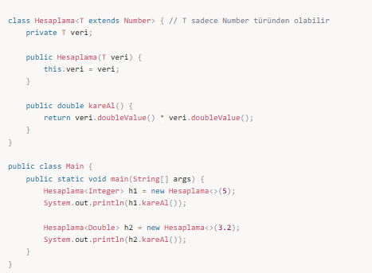

---

## Jenerikler – Teorik Anlatım

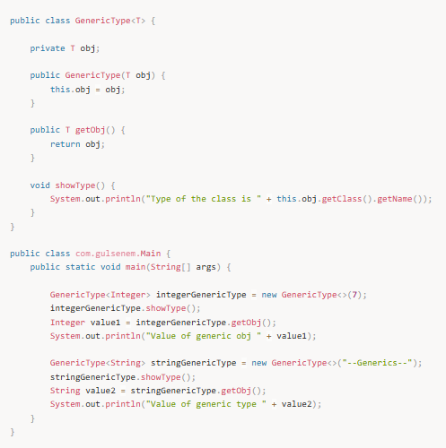

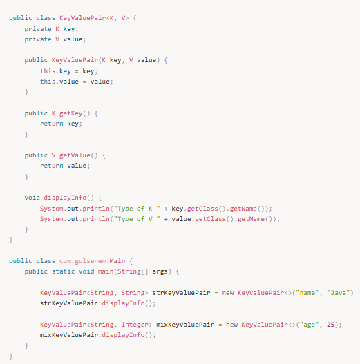

---

## Sınırlandırılmış Jenerikler

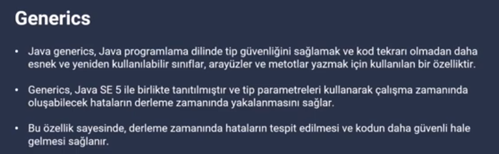  
  
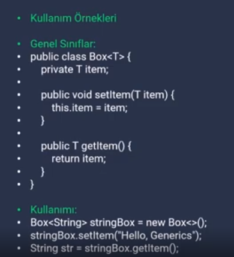  
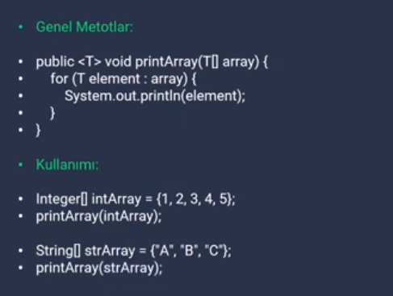

---

## Wildcard Kullanımı

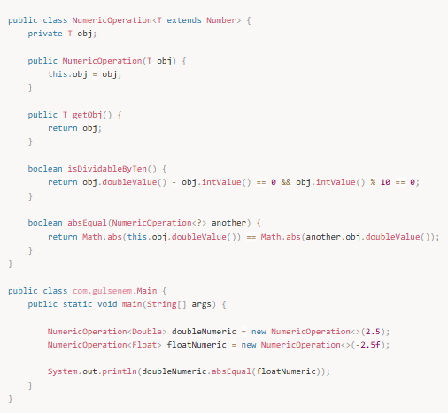

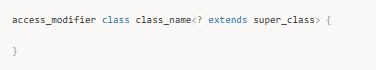

---

## Jenerik Metotlar

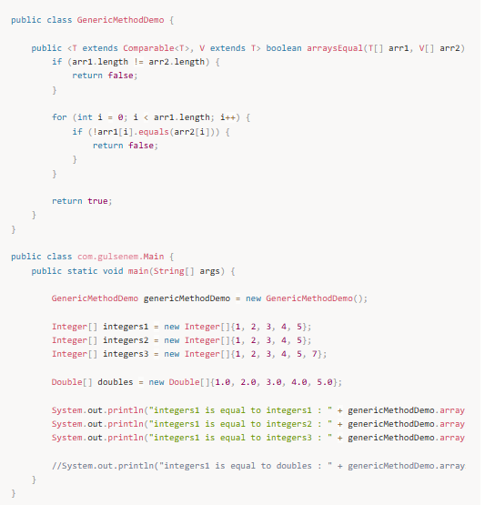

---

## Jenerik Interface

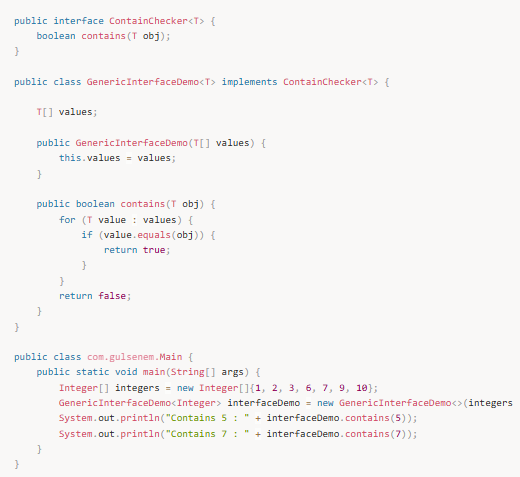

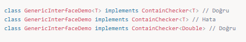

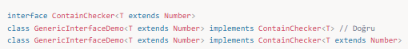

---

## 🎯 Mülakat Soruları

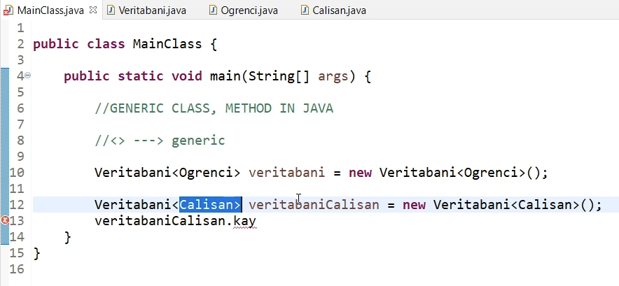  
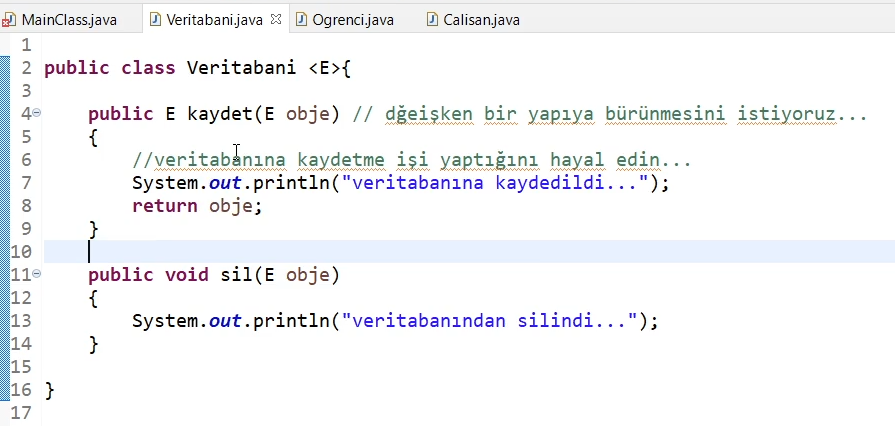  
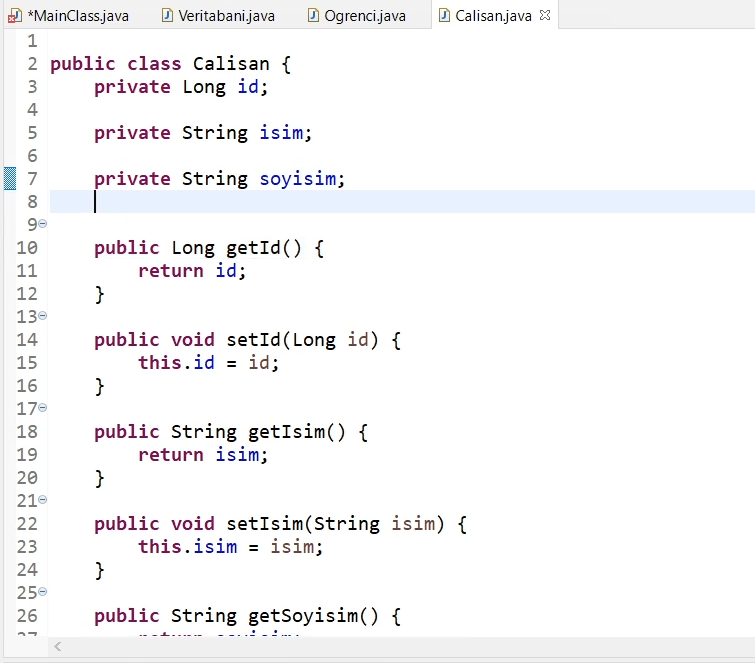

---

## Generic Metot Kullanımı

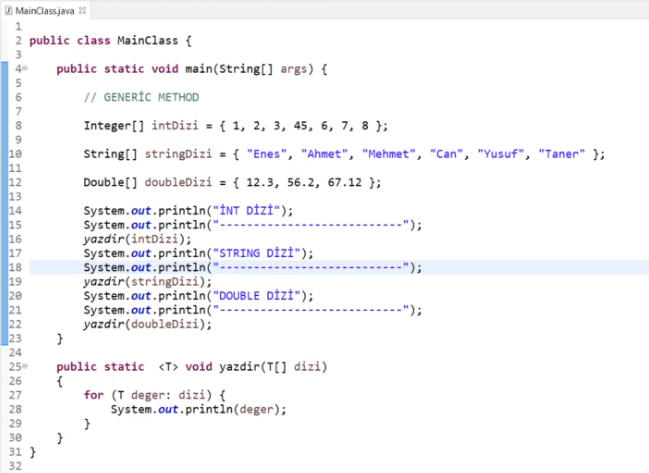

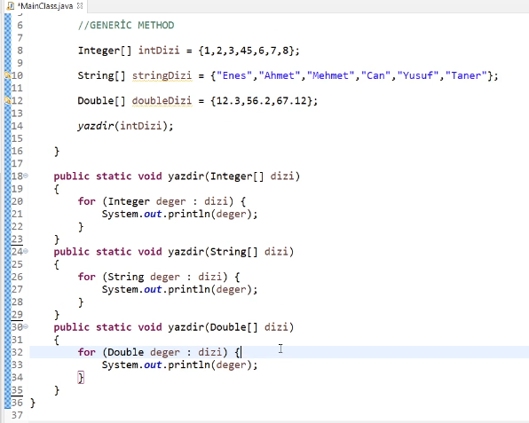

---

## Generic Interface Kullanımı

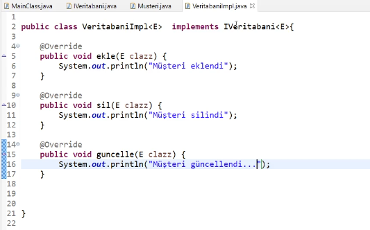

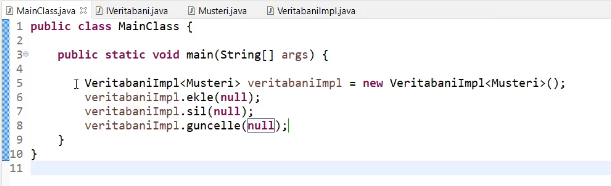
