# Inheritance (Kalıtım)

## Inheritance Nedir?

Inheritance, **bir sınıfın başka bir sınıfın özelliklerini ve metotlarını miras almasını sağlayan** nesne yönelimli programlama (OOP) kavramıdır.

Inheritance, OOP’nin üç temel bileşeninden biridir ve sınıflar arasında hiyerarşi kurmayı sağlar. Ortak özellikler üst sınıfta (superclass) toplanır, alt sınıflar (subclass) bu özellikleri miras alır ve kendi özel davranışlarını ekler.

📌 Amaçlar:
- Kod tekrarını azaltmak  
- Daha düzenli ve sürdürülebilir yapı kurmak  
- Polymorphism’i desteklemek  

Kalıtım için Java’da `extends` anahtar kelimesi kullanılır.

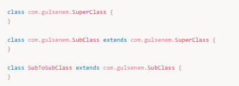

Bir subclass yalnızca **bir** superclass’ı extend edebilir. Java’da class’lar için **multiple inheritance yoktur**.

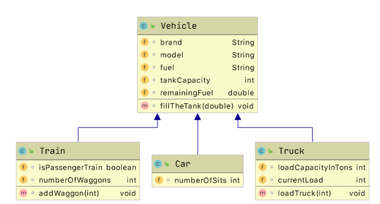

Örnek tasarımın kod karşılığı:

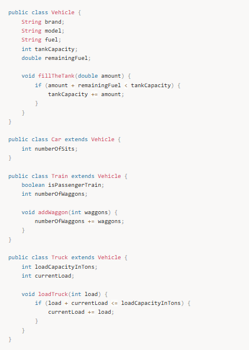

---

## Inheritance Temelleri

### Syntax

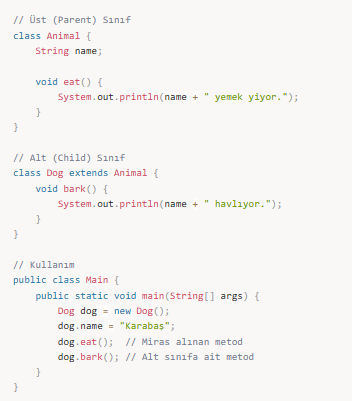

Çıktı:
Karabaş yemek yiyor.
Karabaş havlıyor.

- Animal → Üst sınıf  
- Dog → Alt sınıf  

---

## Inheritance Türleri

### 1️⃣ Single Level Inheritance

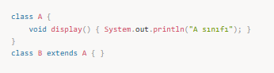

### 2️⃣ Multilevel Inheritance

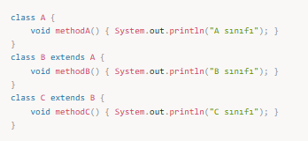

### 3️⃣ Multiple Inheritance (Java’da yok)

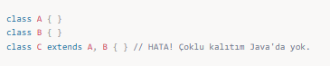

💡 Çözüm: Interface

### 4️⃣ Hierarchical Inheritance

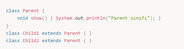

---

## Protected Erişim Belirleyicisi

- `protected` → Aynı sınıf + alt sınıflar erişebilir.
- Bir class birçok class tarafından extend edilebilir, fakat yalnızca bir class’ı extend edebilir.

---

## Constructor Çalışma Sırası

Alt sınıftan nesne üretildiğinde:

1. En üst superclass constructor’ı çalışır  
2. Aşağıya doğru sırasıyla devam eder  

`this` → Bulunduğum sınıf  
`super` → Üst sınıf  
`super()` → Üst sınıfın constructor’ı  

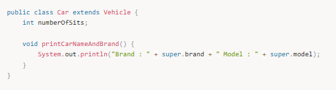

Üst sınıf metoduna erişim:

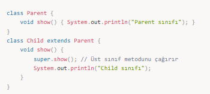

Üst sınıf constructor’ına erişim:

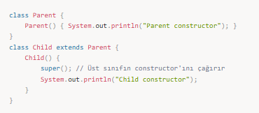

---

## Method Overriding

Alt sınıf, üst sınıf metodunu **aynı imza ile** yeniden yazar.

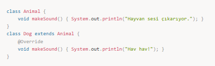

Kullanım:

---

## Overriding vs Overloading

### Overriding

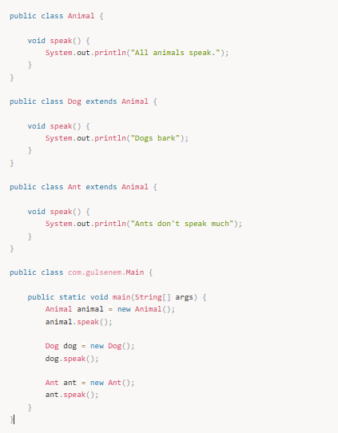

Output:

All animals speak.
Dogs bark
Ants don't speak much

### Overloading

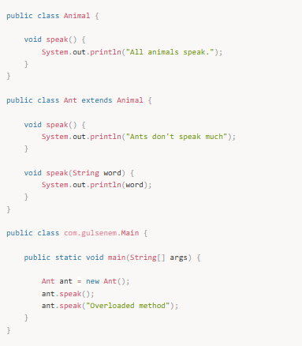

Output:
Ants don't speak much
Overloaded method

- Overriding → Kalıtım şart, imza aynı  
- Overloading → Kalıtım şart değil, imza farklı  

---

## Variable Hiding

Alan değişkenlerinde overriding olmaz, **hiding** olur. Referans tipine göre erişim belirlenir, metodlarda ise runtime polymorphism vardır.

---

## Constructor ve Inheritance

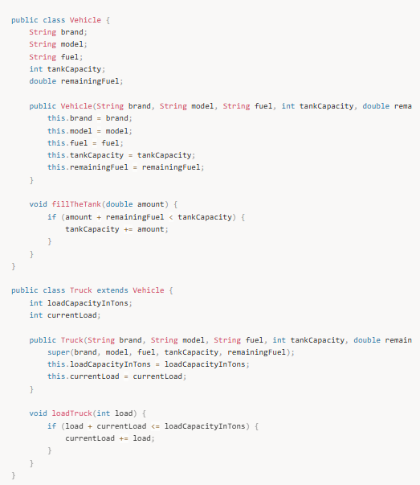

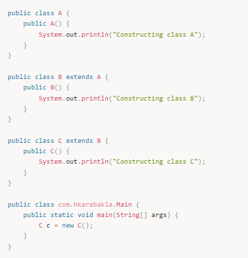

Output:

Constructing class A
Constructing class B
Constructing class C

Üst sınıf constructor’ı her zaman ilk çalışır.

---

## Üst Sınıf Referansı Alt Sınıf Nesnesini Tutabilir

Üst sınıf referansı → Alt sınıf nesnesini tutabilir  
Alt sınıf referansı → Üst sınıf nesnesini tutamaz

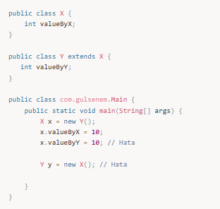

---

## 🎯 Mülakat Soruları

### 1️⃣ Inheritance nedir?

Kalıtım, bir sınıfın başka bir sınıftan özellik ve davranışları miras almasıdır. Kod tekrarını azaltır, hiyerarşi kurar.

### 2️⃣ Java’da neden çoklu kalıtım yok?

Diamond Problem nedeniyle belirsizlik oluşur. Bunun yerine interface kullanılır.

### 3️⃣ this ve super farkı

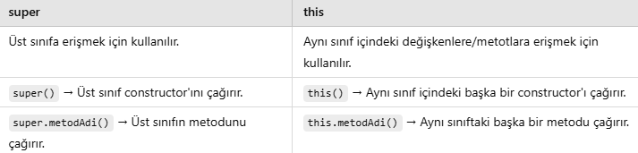

### 4️⃣ Overriding – Overloading farkı

### 5️⃣ Kalıtımın Dezavantajları

- Sıkı bağımlılık (Tight Coupling)  
- Gereksiz hiyerarşi  
- Bakım zorluğu  

---

## 📌 Özet

✅ Kod tekrarını azaltır  
✅ Hiyerarşik yapı sağlar  
✅ Polymorphism’i mümkün kılar  
✅ Java’da class için tekli kalıtım vardır  
✅ `super` anahtar kelimesi üst sınıfa erişimi sağlar  

