# Interface

## 📌 Interface Nedir?

Interface, **sadece metot imzalarını içerir, gövde içermez**.

Uygulamalarda bağımlılıkları yönettiğimiz temel birimlerden bir tanesidir  
(Classlar – Abstract Classlar – Interfaceler).

- Interfaceler referans tutabilir.
- Interfaceler `new` ile nesne üretilemez.
- Bir class birden fazla interface’i **implements** edebilir.
- Bir class sadece bir class’ı **extends** edebilir.
- Interface, onu implemente eden class’ın referansını tutabilir (**polymorphism**).
- Operasyonu zorunlu kılmak istediğimiz durumlarda kullanılır.

📌 Katmanlı Mimari:
- Arayüz → İş Katmanı → Data Access  
Bu katmanlar arası geçiş genellikle **interface** ile sağlanır.

---

## Extends ve Implements Farkı

- `extends` → class → class
- `implements` → class → interface
- Bir class birden fazla interface implement edebilir.
- Bir class sadece bir class extend edebilir.

---

## Interface ve Abstract Class Farkı

Abstract Class:
- Hem gövdeli hem gövdesiz metot içerebilir.
- Instance variable tutabilir.
- Constructor içerir.

Interface:
- Java 8 öncesi sadece metot imzası vardı.
- Java 8 sonrası:
  - default metot
  - static metot
  - sabit değişken (public static final) içerebilir.
- Sadece referans görevi görür.

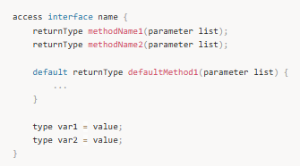

---

## Interface Tanımı

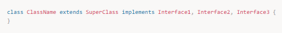

Kurallar:
- Interface sadece `public` veya `default` olabilir.
- İçindeki tüm değişkenler otomatik olarak:
  `public static final`
- İçindeki tüm metotlar otomatik olarak:
  `public abstract` (default ve static hariç)

---

## Birden Fazla Interface Implement Etme

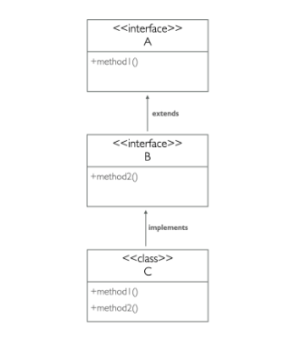
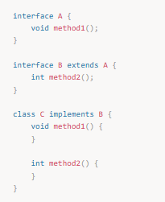

Bir sınıf birden fazla interface’i implemente ederse:
- Tüm metotları override etmek zorundadır.
- Etmezse sınıf `abstract` olmak zorundadır.

---

## Interface Extend Etme

Bir interface başka bir interface’i extend edebilir.

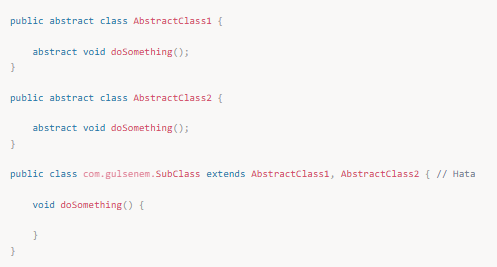

---

## Multiple Inheritance Problemi

Java’da bir class birden fazla class’ı extend edemez.

Sebep:
Aynı imzaya sahip iki metot hangisi çalışacak bilinemez.

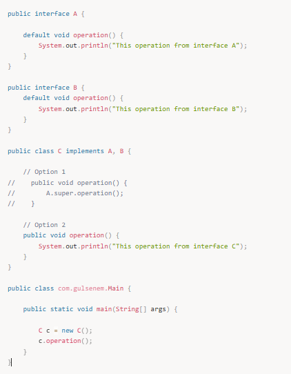

Java 8 sonrası interface’lerde default metotlar geldi.
Eğer iki interface aynı default metodu içerirse:
- Class override etmek zorundadır.

Çağırma şekli:

`InterfaceAdi.super.methodAdi()`

---

## Abstraction

Abstraction:
- Gerekli olanı göster,
- Detayı gizle.

Interface ve abstract class abstraction sağlar.
Üst seviye kod, alt seviye implementasyonu bilmez.

---

## final Anahtar Kelimesi

### 1. final Class

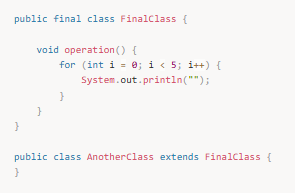

Final class extend edilemez.

### 2. final Method

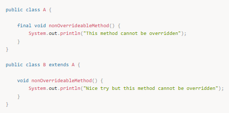

Final metot override edilemez.

### 3. final Değişken

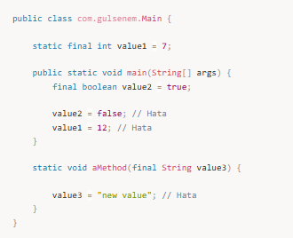

Final değişken bir kez atanır, değiştirilemez.

---

## Interface vs Abstract Class

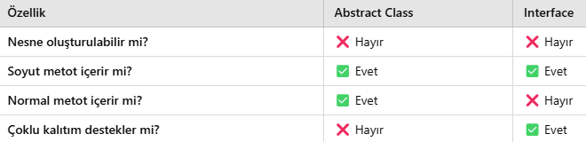

---

## Interface İçinde Değişken

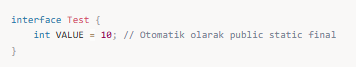

Tüm değişkenler:
`public static final`

---

## Polymorphism ve Interface

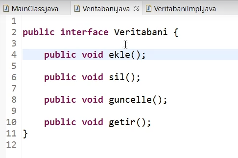
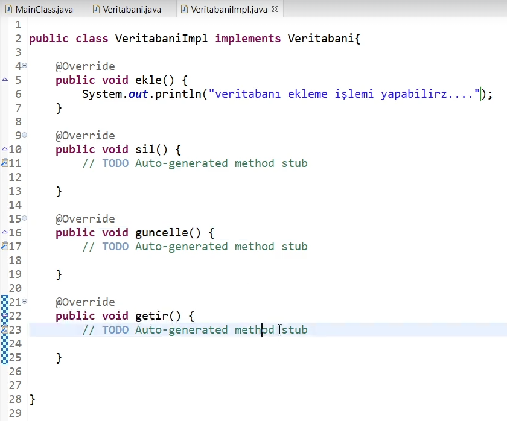

Bir interface referansı,
onu implemente eden tüm class’ları tutabilir.

---

## İsimlendirme

Genellikle interface isimleri:

`ICustomerService`  
`IProductRepository`  

şeklinde başına **I** konularak yazılır.

---

## Performans ve Avantaj

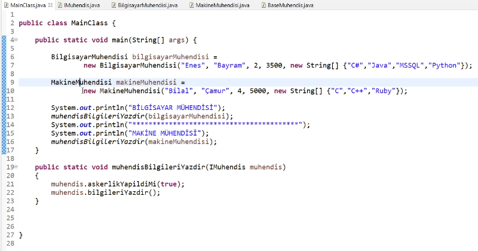

Interface referansı ile:

- Gevşek bağlılık (Loose Coupling)
- Yüksek esneklik
- Daha temiz mimari
- Test edilebilirlik
- Performans avantajı

sağlanır.

---

## 📌 Özet

✅ Interface sadece sözleşmedir, implementasyon içermez.  
✅ Bir class birden fazla interface implement edebilir.  
✅ Polymorphism en güçlü şekilde interface ile sağlanır.  
✅ Katmanlı mimaride bağımlılıkları kırmak için kullanılır.  
✅ Java’da çoklu kalıtım interface + default metotlarla mümkündür.
