# Lambda İfadeleri ve Fonksiyonel İnterface

## 📌 1. Lambda İfadeleri Nedir?

Lambda ifadeleri (Lambda Expressions), Java'da fonksiyonel programlamayı destekleyen bir yapıdır.  
- Kod tekrarını azaltır.  
- Daha okunaklı ve kısa kod yazmayı sağlar.  
- Anonim (ismi olmayan) fonksiyonlar gibi çalışır.  

Lambda ifadeleri, özellikle fonksiyonel arayüzlerle kullanılır.

---

## 📌 2. Lambda İfadelerinin Sözdizimi

Lambda ifadesinin temel formatı:

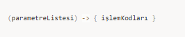

- Tek parametre varsa parantez kullanılmayabilir.  
- Tek satırlık işlem varsa süslü parantez ve `return` gerekmez.

📌 Örnek:

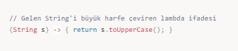

Tek satır dönüş:

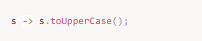

---

## 📌 3. Fonksiyonel Arayüz (Functional Interface)

Fonksiyonel arayüz, **sadece tek bir abstract metodu olan interface**’tir.  
- Lambda ifadeleri ile birlikte kullanılır.  
- `@FunctionalInterface` anotasyonu ile işaretlenir.

📌 Örnek:

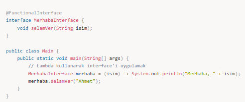

---

## 📌 4. Java’daki Hazır Fonksiyonel Arayüzler

`java.util.function` paketi altında bulunur:

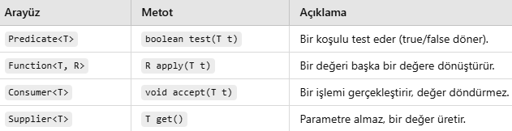

### Predicate<T>

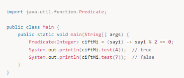

### Function<T, R>

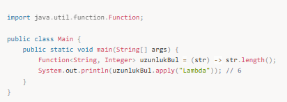

### Consumer<T>

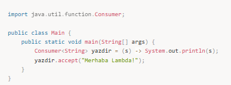

### Supplier<T>

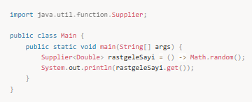

---

## 📌 5. Lambda ile Koleksiyon İşlemleri

---

## Lambda ve Fonksiyonel Programlama Mantığı

Lambda ifadeleri `->` operatörü ile yazılır.  
Sol taraf parametreler, sağ taraf işlemdir.

Örnek:

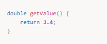

Lambda ifadeleri tek başına anlamlı değildir, mutlaka bir fonksiyonel interface ile eşleşmelidir.

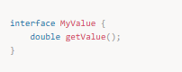  

İmza uyumu zorunludur.

---

## Birden Fazla Lambda Kullanımı

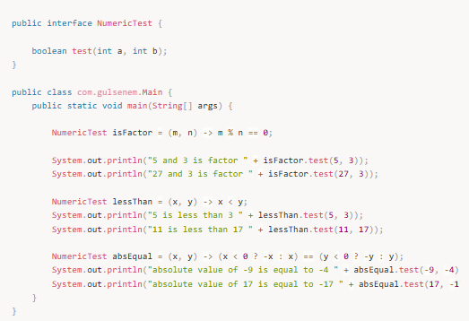

---

## Blok Lambda (Çok Satırlı)

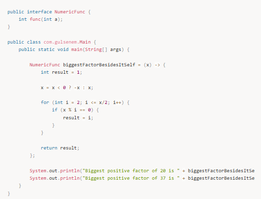

---

## Lambda'nın Metoda Parametre Olarak Gönderilmesi

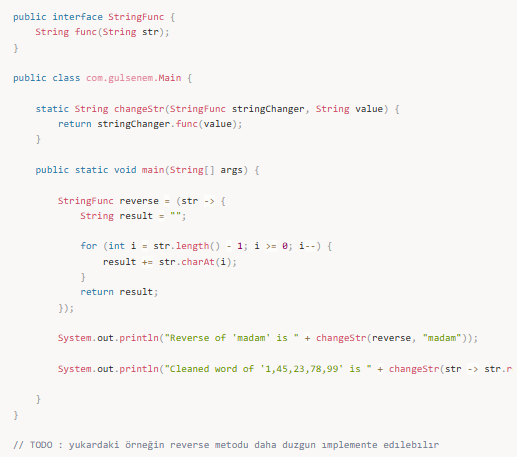

---

## Jenerik Lambda ve Fonksiyonel Interface

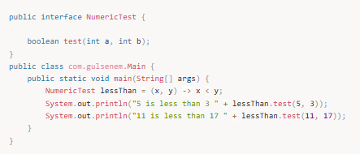  
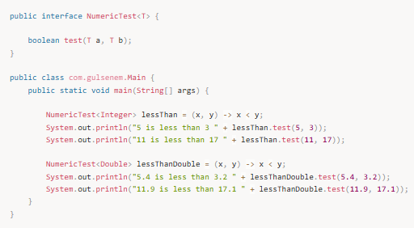

---

## Variable Capture (Dış Değişken Kullanımı)

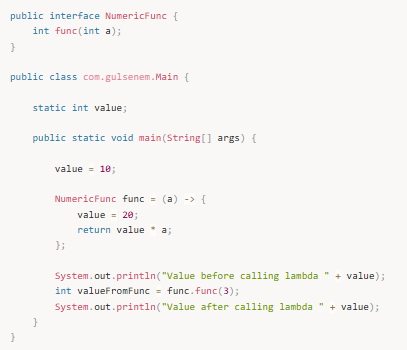  
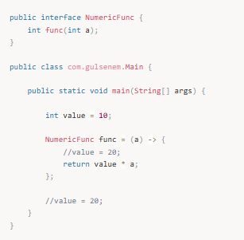  
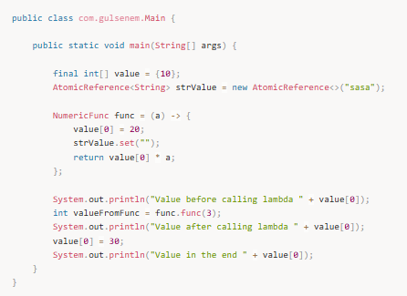

---

## Lambda ve Exception

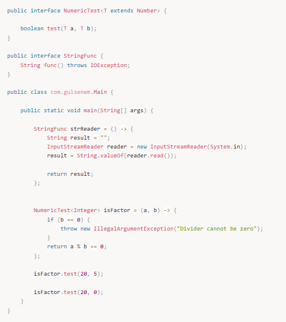

---

## Method Reference

### Static Metot Referansı

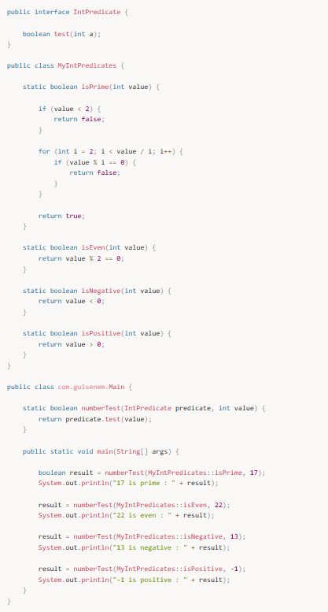

### Nesne Üzerinden Metot Referansı

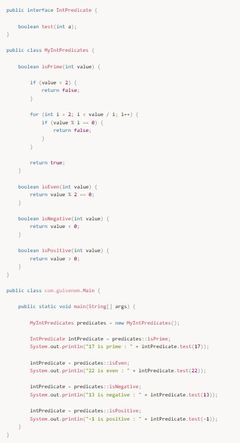

### Constructor Referansı

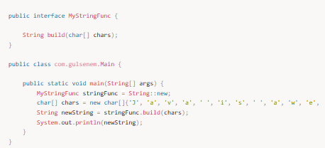

---

## Java’nın Hazır Fonksiyonel Interfaceleri

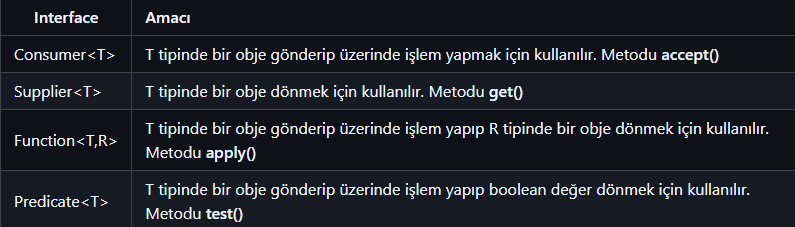  
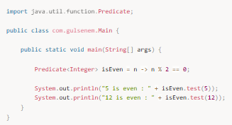

---

## 🎯 Mülakat Soruları

### 1️⃣ Lambda nedir?
- Anonim fonksiyon yapısıdır.  
- Java 8 ile gelmiştir.  
- Fonksiyonel arayüzlerle kullanılır.

### 2️⃣ Fonksiyonel Interface nedir?
- Tek bir abstract metodu olan interface.

### 3️⃣ Hazır arayüzler

### 4️⃣ Çok satırlı lambda

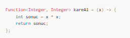

---

## 📌 Özet

✅ Lambda ifadeleri kısa ve okunaklı kod sağlar.  
✅ Fonksiyonel interface ile birlikte çalışır.  
✅ Predicate, Function, Consumer, Supplier gibi hazır yapılar vardır.  
✅ Stream API ve koleksiyon işlemlerinde yoğun kullanılır.
