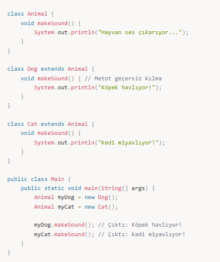
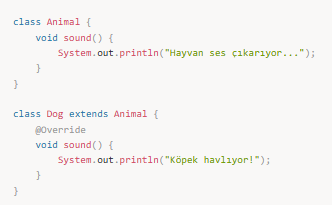
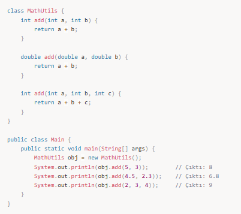
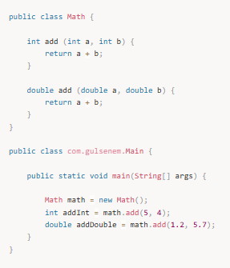
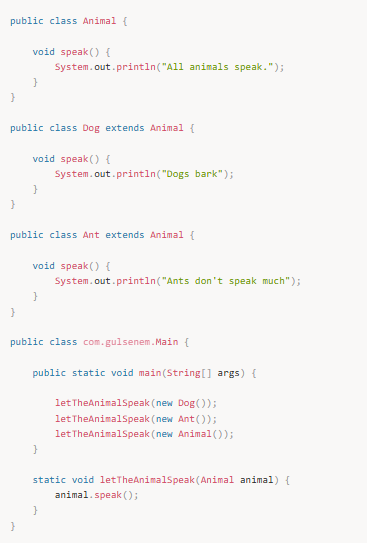
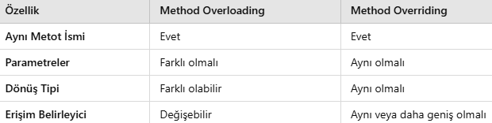

# Polymorphism (Çok Biçimlilik)

## 📌 Polymorphism Nedir?

Polymorphism, **aynı işlemi farklı yollarla gerçekleştirme yeteneğidir**.

✔ Method Overriding (Metot Geçersiz Kılma)  
✔ Method Overloading (Metot Aşırı Yükleme)

Aralarında kalıtım olmayanlar arasında polymorphism olamaz.

Java dilinde iki tip polymorphism vardır:  
- **Compile Time Polymorphism**  
- **Runtime Polymorphism**

📌 Örnek:

---

## 📌 1. Method Overriding (Metot Geçersiz Kılma)

Üst sınıfta tanımlanan bir metodu, alt sınıfta aynı isimle ama farklı şekilde yazmaktır.

Kurallar:  
✔ İsim, parametreler ve dönüş tipi aynı olmalıdır.  
✔ `@Override` annotasyonu kullanılır.  
✔ Erişim belirleyici (public, protected) genişletilebilir ama daraltılamaz.

📌 Örnek:

---

## 📌 2. Method Overloading (Metot Aşırı Yükleme)

Aynı isimde, farklı parametrelerle **birden fazla metot tanımlamaktır**.

📌 Örnek:

---

## Compile Time Polymorphism

Method overloading, derleme zamanında hangi metodun çağrılacağının belli olmasıdır.

Math sınıfı örneği:

Compiler, parametre tipine bakarak hangi metodun çalışacağını **compile time**'da belirler.  
Buna **compile time polymorphism** denir.

---

## Runtime Polymorphism

Runtime polymorphism, method overriding ile oluşur.

Üst sınıf referansının alt sınıf nesnesini tutması durumunda, hangi metodun çalışacağına JVM çalışma anında karar verir.

Burada `letTheAnimalSpeak(Animal animal)` metoduna hangi nesne gelirse, onun `speak()` metodu çalışır.  
Karar **runtime**'da verildiği için buna **runtime polymorphism** denir.

---

## 🎯 Mülakat Soruları ve Cevapları

### 1️⃣ Polymorphism nedir?

Polymorphism (çok biçimlilik), **aynı kodun farklı davranışlar sergileyebilmesidir**.

✔ Method Overloading → Aynı isim, farklı parametre  
✔ Method Overriding → Üst sınıf metodunun alt sınıfta değiştirilmesi

---

### 2️⃣ Overloading ve Overriding Arasındaki Fark

