# Static Değişken ve Metot

## Static Değişken ve Metotlar (Static Variables & Methods)

Java'da `static` anahtar kelimesi, sınıf seviyesinde bir değişken veya metot oluşturmak için kullanılır. Nesneye bağlı değil, sınıfa bağlıdır.

---

## Static Değişken Kullanımı

Bir sınıfın içindeki değişkenlere ve metotlara o sınıftan nesne türetmeden, oluşturmadan direkt class ismi üzerinden erişebilmemize olanak sağlayan anahtar kelimeye static denir.

Static değişkenler bütün nesneler için ortak olur ve hafızada yalnızca bir kopya bulunur.

🔹 Tanımlama:

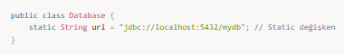

🔹 Kullanımı:

### 📌 Static Değişkenlerin Avantajları

✅ Bellekte sadece **tek bir kopya** bulunur → **Daha az bellek tüketimi** sağlar.  
✅ **Ortak bir veri** saklamak için kullanılır. (Örn: sayaç, konfigürasyon değerleri)  
✅ **Her nesne için aynı değeri korur**, değiştirildiğinde tüm nesneler değişikliği görür.

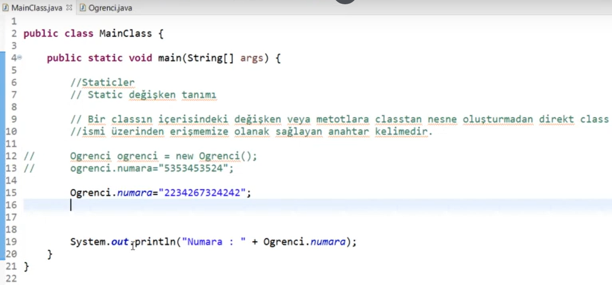  
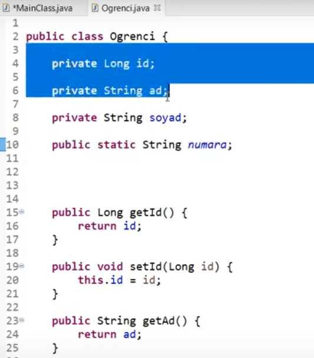

---

## Static Metot Kullanımı

Bir static metodun içinde static olmayan bir şey kullanamayız (değişken, metot).  
Ama static olmayan bir metot içinde her şeye erişebiliriz.

Static metotlar, nesne oluşturmadan çağrılabilen metotlardır.

🔹 Tanımlama:

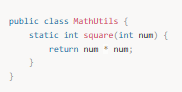

🔹 Kullanımı:

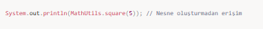

### 📌 Static Metotların Özellikleri

✅ Nesne oluşturmaya gerek kalmaz.  
✅ Sınıf adıyla doğrudan çağrılır.  
✅ Sadece static değişkenleri ve static metotları kullanabilir.

🔴 Hata Örneği:

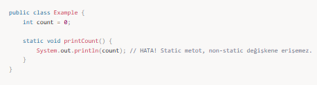

💡 Çözüm: `count` değişkenini static yapmak!

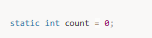  
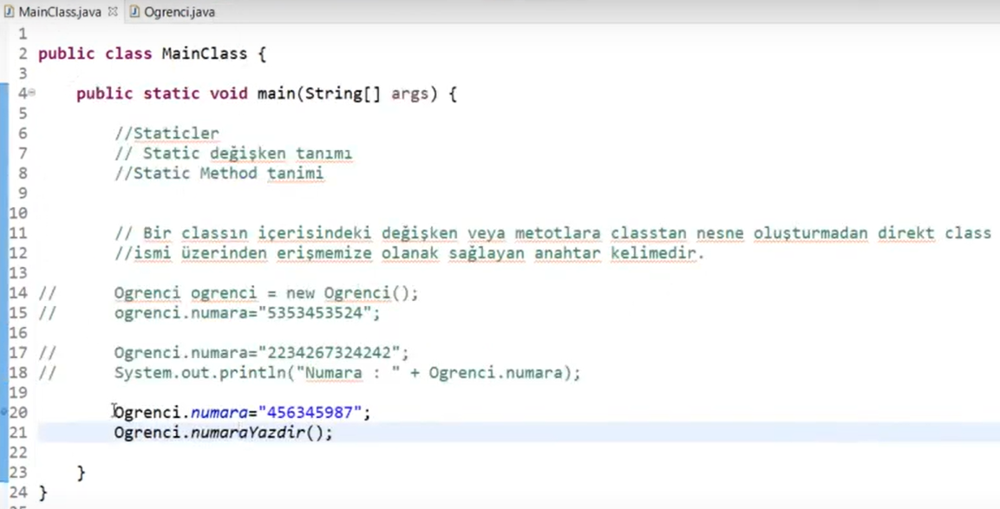  
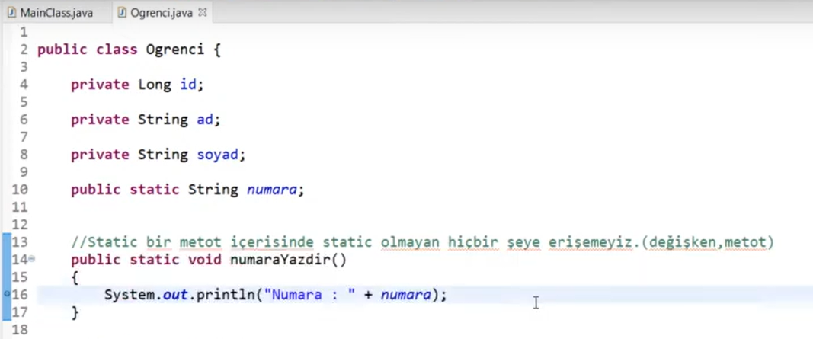

---

## Static ile İlgili Önemli Ayrıntılar

- Static olmayan değişkenler nesneye özeldir.  
- Static olan değişkenler sınıfa aittir ve herkes aynı veriyi görür.

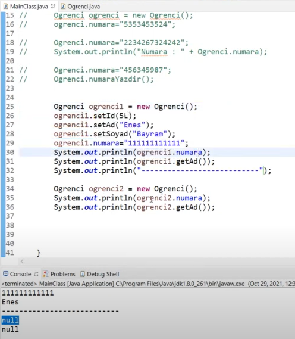

---

## Static Blok (Static Block)

Eğer bir static değişkenin ilk değerini belirlemek istiyorsak, static blok kullanabiliriz.

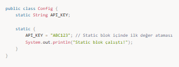

⏳ **Ne zaman çalışır?**

- Sınıf belleğe yüklendiğinde **sadece bir kez** çalışır.

🔹 Kullanımı:

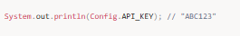

---

## Static Inner Class (Static İç Sınıf)

Bir sınıfın içinde static bir iç sınıf tanımlayabiliriz.

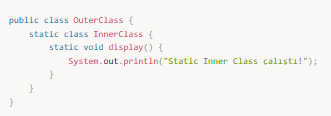

🔹 Kullanımı:

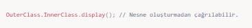

---

## Static Final Kullanımı

Eğer bir static değişkenin değeri değişmemesi gerekiyorsa `final` ile birlikte kullanılır.

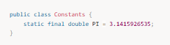

🔹 Kullanımı:

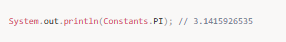

---

## 🎯 Mülakat Soruları ve Cevapları

### 1️⃣ Static değişken nedir?

Static değişkenler, sınıfa ait değişkenlerdir ve tüm nesneler tarafından paylaşılır. Bellekte yalnızca bir kopyası bulunur.

---

### 2️⃣ Static metot ile instance metot farkı

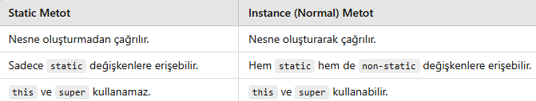

---

### 3️⃣ Static blok nedir?

Static blok, sınıf belleğe ilk yüklendiğinde bir defa çalışır ve static değişkenlere ilk değer atamak için kullanılır.

---

### 4️⃣ Static değişkenlerin dezavantajları

🔴 Bellekte sürekli yer kaplar  
🔴 Nesne bazlı özelleştirme yapılamaz  
🔴 Aşırı kullanım OOP prensiplerini zayıflatır

---

### 5️⃣ Static metotlarda neden this ve super kullanılamaz?

Çünkü `this` ve `super` nesneye aittir, static metotlar ise nesne oluşturmadan çalışır.

---

### 6️⃣ Static ne zaman kullanılmalı?

✅ Ortak veriler (sayaç, URL, sabitler)  
✅ Tek kopya olması gereken değerler (PI, API_KEY)

---

### 7️⃣ Singleton Pattern ve Static

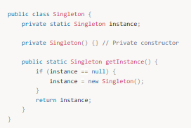

🔹 Kullanımı:

---

## 🔹 Genel Özet

✅ Static değişkenler sınıfa aittir, tek kopyadır.  
✅ Static metotlar nesnesiz çağrılır.  
✅ Static blok sınıf yüklenirken çalışır.  
✅ Singleton gibi tasarım desenlerinde kullanılır.  
⚠ Aşırı static kullanımı OOP yapısını zayıflatır.
